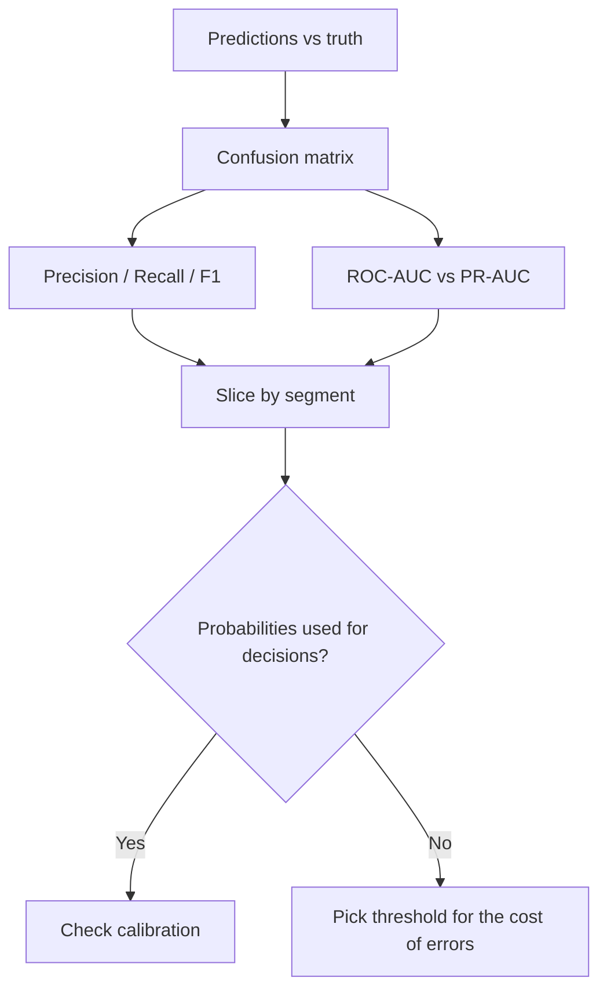

# Evaluation Metrics Cheatsheet

## Intuition

The metric is the contract between your model and the business. Pick the wrong one and you optimize
the wrong thing while every dashboard looks green. The right metric reflects the cost of each error
type for this specific decision.

## Explanation

Classification, from the confusion matrix (TP, FP, TN, FN):

- **Precision** = TP / (TP + FP): of the things you flagged, how many were right. Use when false
  positives are costly (spam moving real mail to junk).
- **Recall** = TP / (TP + FN): of the real positives, how many you caught. Use when misses are costly
  (cancer screening, fraud).
- **F1** = harmonic mean of precision and recall: when you need balance.
- **ROC-AUC:** ranking quality across all thresholds; can look optimistic on heavy imbalance.
- **PR-AUC:** better than ROC-AUC when positives are rare.

Regression: **RMSE** (penalizes large errors), **MAE** (robust to outliers), **R2** (variance
explained). Ranking: **NDCG**, **MAP**, **recall@k**. Generation: human preference, faithfulness,
**BLEU/ROUGE** as proxies, perplexity for language modeling.

## Why It Matters

A 99 percent-accurate model on a 1 percent-positive problem can have near-zero recall. Calibration
matters too: if you act on probabilities (expected value, thresholds), a miscalibrated 0.9 that is
really 0.6 leads to bad decisions.

## Key Reference

| Situation | Metric |
| --- | --- |
| Rare positives, misses costly | Recall, PR-AUC |
| False alarms costly | Precision |
| Need a single balance number | F1 |
| Compare rankers | ROC-AUC, NDCG |
| Probabilities feed a decision | Calibration (reliability curve, Brier) |
| Regression with outliers | MAE over RMSE |

## Example

A loan-default model outputs probabilities used to set interest rates. ROC-AUC is 0.85, but the
probabilities are overconfident. After isotonic calibration, AUC is unchanged but the predicted
default rates match reality, so pricing decisions stop losing money. The lesson: ranking metrics and
calibration measure different things.

## Interview Angle

Expect "precision vs recall and when to favor each", "why ROC-AUC can mislead", "what is
calibration". Always anchor to the cost of FP versus FN for the given product.

## Common Mistakes

- Reporting accuracy on imbalanced data.
- Using ROC-AUC when positives are very rare instead of PR-AUC.
- Optimizing a single aggregate without slicing by segment.
- Ignoring calibration when probabilities drive decisions.
- Comparing models at different thresholds.

## Mini Exercise

For a fraud system that auto-blocks transactions, state which metric is primary, which is a guardrail,
what threshold logic you would use, and one segment you would always check for hidden failure.

## Diagram

---
## Navigation

[⬅ Previous](04-classical-ml-cheatsheet.md) | [🏠 Home](../README.md) | [➡ Next](06-feature-engineering-cheatsheet.md)
