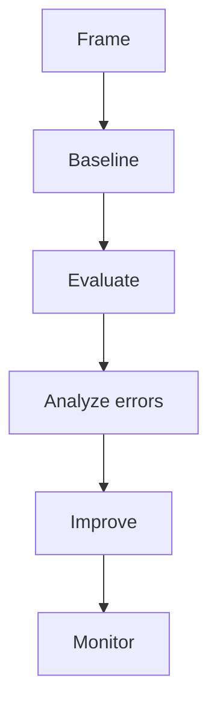

# Feature Engineering Cheatsheet

## When to Use This Cheatsheet

Use this page during revision, project planning, or interview warmups. It compresses the key ideas,
but it is not a replacement for understanding the longer lessons.

## Core Ideas

| Concept | What It Means | What to Check |
| --- | --- | --- |
| Problem framing | Convert a vague goal into a measurable task | User, decision, label, metric |
| Baseline | Simplest useful reference system | Beats naive or rule-based approach |
| Generalization | Works beyond training examples | Proper split and realistic test data |
| Error analysis | Learn from wrong predictions | Segment, severity, root cause |
| Production readiness | Reliable under real constraints | Monitoring, rollback, ownership |

## Practical Checklist

- State the objective in one sentence.
- Name the input data and output.
- Choose a simple baseline.
- Choose one primary metric and two guardrail metrics.
- Check for leakage, bias, missing values, and distribution shift.
- Explain the tradeoff between quality, latency, cost, and interpretability.
- Decide what should happen when confidence is low.

## Interview Phrases That Signal Clarity

- "I would start by defining the decision this model supports."
- "Before using a complex model, I would build a baseline."
- "The split should match deployment time to avoid leakage."
- "I would inspect false positives and false negatives separately."
- "I would monitor both model metrics and business outcomes."

## Common Mistakes

- Memorizing formulas without knowing when assumptions fail.
- Using one aggregate metric for a high-stakes or imbalanced problem.
- Forgetting calibration, confidence thresholds, and human escalation.
- Treating offline evaluation as proof of production quality.

## Diagram

---
## Navigation

[⬅ Previous](05-evaluation-metrics-cheatsheet.md) | [🏠 Home](../README.md) | [➡ Next](07-deep-learning-cheatsheet.md)
