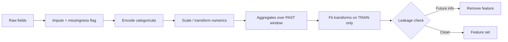

# Feature Engineering Cheatsheet

## Intuition

Features are how you encode domain knowledge so the model does not have to rediscover it. On tabular
problems, good features usually beat a fancier model. The discipline is turning raw fields into
signals while never leaking information the model would not have at prediction time.

## Explanation

- **Numeric:** scale (standardize or min-max) for distance and linear models; log-transform skewed
  values; bin when the relationship is nonlinear.
- **Categorical:** one-hot for low cardinality; target or frequency encoding for high cardinality
  (fit on train folds only to avoid leakage); embeddings for very high cardinality.
- **Missing values:** impute (median, model-based) and add a "was missing" indicator.
- **Dates:** extract day-of-week, month, hour, holidays, and time since last event.
- **Aggregates:** counts, means, and recency per entity (user, item) computed over a past window.
- **Interactions:** ratios and products that encode known relationships.

## Why It Matters

The single most common production bug in ML is **leakage**: a feature that secretly contains the
label or future information. It inflates offline scores and then the model fails live. Fitting
scalers or target encoders on the full dataset before splitting is leakage too.

## Key Rules

| Rule | Why |
| --- | --- |
| Fit transforms on train only | Prevents leakage into val/test |
| Use past windows for aggregates | No future data at prediction time |
| Add missingness indicators | Missing is often informative |
| Target-encode inside CV folds | Avoids label leakage |
| Match train and serve features | Training/serving skew kills models |

## Example

A churn model includes "number of support tickets in the last 90 days". If you accidentally include
tickets filed after the churn date, the model "predicts" churn from a consequence of churn. Offline
AUC is 0.98, production AUC is 0.6. The fix is a strict time cutoff: only features known at the
prediction timestamp.

## Interview Angle

Expect "how do you handle high-cardinality categoricals", "what is data leakage and how do you
prevent it", "how do you encode dates". Show that you reason about what is known at prediction time.

## Common Mistakes

- Fitting scalers or encoders before the train/test split.
- Target encoding on the full dataset (label leakage).
- Aggregates that include future events.
- Dropping rows with missing values instead of modeling missingness.
- Training/serving skew: features computed differently online and offline.

## Mini Exercise

For a model that predicts next-week purchases, list five features, mark each as known or unknown at
prediction time, and flag any leakage. Then describe how you would compute one aggregate feature with
a correct time window.

## Diagram

---
## Navigation

[⬅ Previous](05-evaluation-metrics-cheatsheet.md) | [🏠 Home](../README.md) | [➡ Next](07-deep-learning-cheatsheet.md)
