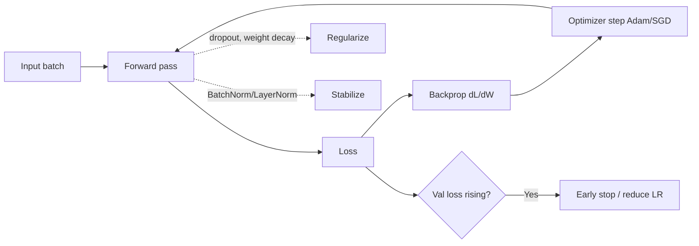

# Deep Learning Cheatsheet

## Intuition

A neural network is a stack of differentiable layers trained by gradient descent. Forward pass makes
a prediction, the loss measures error, backpropagation computes gradients, and the optimizer nudges
weights. Most of deep learning practice is making that loop train stably and generalize.

## Explanation

- **Activations:** ReLU is the default (cheap, avoids saturation); sigmoid/tanh saturate and cause
  vanishing gradients; softmax for class probabilities.
- **Optimizers:** SGD with momentum generalizes well; Adam adapts per-parameter learning rates and is
  the safe default.
- **Normalization:** BatchNorm stabilizes training (depends on batch stats); LayerNorm is standard in
  transformers and works per-sample.
- **Regularization:** dropout, weight decay (L2), early stopping, data augmentation.
- **Architectures:** CNNs for images (local weight sharing), RNN/LSTM for sequences (now largely
  replaced), transformers for sequences via attention.

## Why It Matters

Training failures have a small set of causes: learning rate too high (loss diverges) or too low (no
progress), vanishing/exploding gradients, bad initialization, no normalization, or a data bug.
Knowing the symptom-to-cause map is what separates someone who can debug a model from someone who
only runs notebooks.

## Key Reference

| Symptom | Likely cause | Fix |
| --- | --- | --- |
| Loss is NaN | LR too high, bad data | Lower LR, clip gradients, check inputs |
| Loss flat | LR too low, dead ReLUs | Raise LR, check init, use LeakyReLU |
| Train good, val bad | Overfitting | Dropout, weight decay, more data, augment |
| Deep net will not learn | Vanishing gradients | Residual connections, normalization |
| Unstable across batches | Internal covariate shift | BatchNorm / LayerNorm |

## Example

A 20-layer network barely trains: validation loss stays flat. Adding residual connections and
LayerNorm lets gradients flow through the depth, and the model starts learning. The cause was
vanishing gradients, and the fix came from architecture, not more epochs.

## Interview Angle

Expect "why ReLU over sigmoid", "Adam vs SGD", "what does BatchNorm do", "how do residual
connections help", "why does dropout reduce overfitting". Pair each with the gradient-flow or
regularization reason.

## Common Mistakes

- Forgetting to scale or normalize inputs.
- Using a learning rate that is orders of magnitude off.
- Leaving BatchNorm in train mode during inference.
- Applying dropout at test time.
- Blaming the model when the data pipeline has a bug.

## Mini Exercise

You train a CNN and the loss goes to NaN on step 50. List three plausible causes and the check or fix
for each. Then explain how you would tell overfitting apart from underfitting from the loss curves.

## Diagram

---
## Navigation

[⬅ Previous](06-feature-engineering-cheatsheet.md) | [🏠 Home](../README.md) | [➡ Next](08-transformers-cheatsheet.md)
