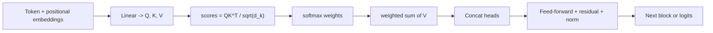

# Transformers Cheatsheet

## Intuition

A transformer processes a whole sequence at once and lets every token look at every other token
through attention. Instead of passing information step by step like an RNN, it computes, for each
token, a weighted blend of all tokens where the weights say "how relevant is this token to me". That
parallel, content-based mixing is why transformers scale and dominate modern NLP and beyond.

## Explanation

Self-attention, the core operation:

`Attention(Q, K, V) = softmax(QK^T / sqrt(d_k)) V`

- **Q, K, V** are linear projections of the input (query, key, value).
- `QK^T` scores how much each token attends to each other token.
- Dividing by `sqrt(d_k)` keeps the scores from saturating softmax.
- The softmax weights are applied to V to produce the output.

Surrounding machinery:

- **Multi-head attention:** run attention h times in parallel subspaces, then concatenate, so the
  model attends to different relationships at once.
- **Positional encoding:** attention has no built-in order, so add positional signals (sinusoidal,
  learned, or rotary/RoPE).
- **Feed-forward + residual + norm:** each block is attention then an MLP, each wrapped with a
  residual connection and LayerNorm.
- **Variants:** encoder-only (BERT, classification/embeddings), decoder-only (GPT, generation),
  encoder-decoder (T5, translation/seq2seq).

## Why It Matters

Cost is the catch. Attention is `O(n^2 * d)` in sequence length `n`, so long context is expensive in
compute and memory. This drives the whole optimization landscape: KV caching for fast decoding, flash
attention, and sparse or linear attention variants. Interviewers probe whether you understand the
quadratic cost and how serving systems work around it.

## Key Reference

| Concept | Point to remember |
| --- | --- |
| Attention complexity | O(n^2 d) in sequence length |
| Why divide by sqrt(d_k) | Stops dot products from saturating softmax |
| Multi-head | Parallel attention in different subspaces |
| Positional encoding | Restores order; RoPE is common in modern LLMs |
| KV cache | Stores past keys/values so decoding is O(n) per token |
| Encoder vs decoder | BERT (bidirectional) vs GPT (causal/masked) |

## Example

During generation, a decoder-only model would recompute attention over the whole prefix for every new
token, which is wasteful. The **KV cache** stores the keys and values of previous tokens, so each new
token only computes attention against the cache. That turns per-token cost from quadratic to linear
and is why production inference servers track cache memory carefully.

## Interview Angle

Expect "write the attention equation", "why multi-head", "why positional encodings", "encoder vs
decoder", "what is the complexity and how do you handle long context". Strong answers connect the math
(`softmax(QK^T/sqrt(d_k))V`) to a serving consequence (quadratic cost, KV cache).

## Common Mistakes

- Forgetting the `sqrt(d_k)` scaling and why it exists.
- Saying transformers have built-in order (they need positional encodings).
- Confusing encoder-only and decoder-only use cases.
- Ignoring the quadratic memory cost when asked about long documents.
- Describing multi-head as "bigger attention" rather than parallel subspaces.

## Mini Exercise

Write the scaled dot-product attention equation from memory and label each term. Then explain in two
sentences why a 32k-token context is expensive and one concrete technique that mitigates it.

## Diagram

---
## Navigation

[⬅ Previous](07-deep-learning-cheatsheet.md) | [🏠 Home](../README.md) | [➡ Next](09-nlp-cheatsheet.md)
