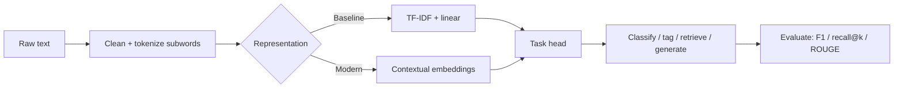

# NLP Cheatsheet

## Intuition

NLP turns text into numbers a model can use, then maps those numbers to a task: classify, tag,
extract, retrieve, or generate. The history is a steady move from counting words, to learned word
vectors, to contextual transformer representations.

## Explanation

The representation ladder:

- **Bag-of-words / TF-IDF:** count term frequency, downweight common words. Strong, fast baseline.
- **Word embeddings (word2vec, GloVe):** dense vectors where similar words are close, but one vector
  per word regardless of context.
- **Contextual embeddings (BERT and friends):** the vector for "bank" differs in "river bank" vs
  "bank account".
- **Tokenization:** subword methods (BPE, WordPiece, SentencePiece) handle rare words by splitting
  them into pieces, so vocabulary stays bounded.

Core tasks: text classification, named-entity recognition (NER), sequence labeling, question
answering, summarization, translation, and retrieval.

## Why It Matters

Most "LLM" products are still NLP pipelines underneath: clean text, tokenize, embed, retrieve,
classify, or generate, then evaluate. Knowing the classical ladder helps you pick a cheap baseline
(TF-IDF + logistic regression) before reaching for a large model.

## Key Reference

| Need | Approach | Metric |
| --- | --- | --- |
| Topic/intent classification | TF-IDF + linear, or fine-tuned encoder | F1, accuracy |
| Entity extraction | Sequence labeling (BIO tags) | Entity-level F1 |
| Semantic search | Sentence embeddings + ANN | Recall@k, MRR |
| Summarization | Seq2seq / decoder LLM | ROUGE + human |
| Translation | Encoder-decoder | BLEU + human |

## Example

For support-ticket routing, a TF-IDF plus logistic-regression model reaches 0.88 macro-F1 in minutes
and is trivial to explain. A fine-tuned transformer pushes it to 0.92 but costs more to serve. The
right interview answer ships the baseline first and justifies the upgrade with the measured gain.

## Interview Angle

Expect "TF-IDF vs embeddings", "why subword tokenization", "how would you build text classification",
"contextual vs static embeddings". Show that you start with a cheap baseline and that you understand
why subwords solve the out-of-vocabulary problem.

## Common Mistakes

- Reaching for a large model when TF-IDF would answer the question.
- Ignoring tokenization details (it affects cost and rare-word handling).
- Using BLEU/ROUGE as the only judge of generation quality.
- Forgetting class imbalance in classification metrics.
- Evaluating retrieval with accuracy instead of recall@k or MRR.

## Mini Exercise

You must classify 50k support emails into 12 categories. Write your baseline, the metric (and why
macro vs micro F1), one tokenization concern, and what evidence would justify moving to a transformer.

## Diagram

---
## Navigation

[⬅ Previous](08-transformers-cheatsheet.md) | [🏠 Home](../README.md) | [➡ Next](10-mlops-cheatsheet.md)
