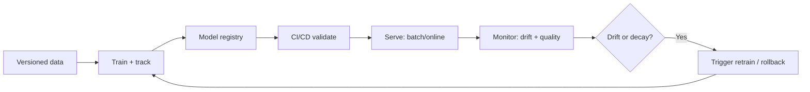

# MLOps Cheatsheet

## Intuition

MLOps is what keeps a model useful after the notebook. A model is not done when it trains well; it is
done when it can be reproduced, deployed, monitored, and retrained safely. The recurring theme is
versioning everything (data, features, code, model) so any prediction can be traced and any
regression can be rolled back.

## Explanation

The lifecycle and its tools:

- **Data versioning (DVC, lakeFS):** snapshot the exact data a model saw.
- **Experiment tracking (MLflow, Weights and Biases):** log params, metrics, and artifacts.
- **Feature store:** serve the same feature logic offline (training) and online (serving) to kill
  training/serving skew.
- **Model registry:** versioned, stage-gated models (staging, production, archived).
- **CI/CD for ML:** automated tests, data validation, training, and deployment.
- **Serving:** batch (scheduled scoring), online (low-latency endpoint), or streaming.
- **Monitoring:** operational health, data drift, concept drift, and quality when labels arrive.

## Why It Matters

Models decay. The world shifts, inputs change, and yesterday's accuracy is no guarantee. Without
drift monitoring and a retraining trigger, you find out from angry users, not dashboards. Without
versioning, you cannot reproduce or roll back. These gaps are where real systems fail.

## Key Reference

| Need | Tool/pattern |
| --- | --- |
| Reproduce a run | Pin data + code + config versions |
| Same features online/offline | Feature store |
| Track experiments | MLflow / W&B |
| Promote a model | Model registry with stages |
| Catch input shift | Data drift monitor (PSI, KS test) |
| Catch quality drop | Delayed-label evaluation |
| Recover from a bad model | Versioned rollback / canary |

## Example

A demand-forecasting model degrades after a holiday season. Input distributions shifted (data drift)
and the relationship between features and demand changed (concept drift). Because features came from a
feature store and the model was in a registry, the team caught the PSI alert, rolled back to the prior
version, and triggered a retrain on recent data, all without a code change.

## Interview Angle

Expect "how do you monitor a model in production", "data drift vs concept drift", "batch vs online
inference", "what is a feature store and why". Strong answers name the failure mode and the specific
control that catches it.

## Common Mistakes

- Treating deployment as the finish line, with no monitoring.
- No data or model versioning, so nothing is reproducible.
- Training/serving skew from features computed differently in two places.
- Retraining on a schedule with no trigger or validation gate.
- No rollback plan when a new model underperforms.

## Mini Exercise

For a recommendation model retrained weekly, design the pipeline: what you version, what you monitor,
what alert triggers a retrain, what gate must pass before promotion, and how you roll back.

## Diagram

---
## Navigation

[⬅ Previous](09-nlp-cheatsheet.md) | [🏠 Home](../README.md) | [➡ Next](11-llm-cheatsheet.md)
