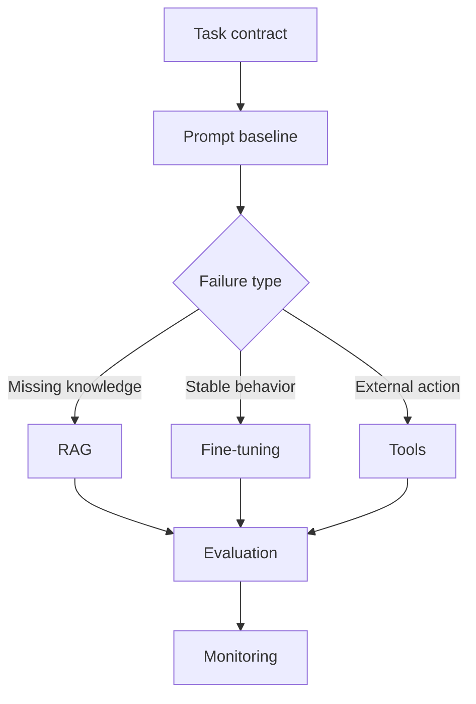

# LLM Cheatsheet

## Intuition

An LLM is a probabilistic text model that becomes useful only when wrapped in a clear task contract,
context strategy, evaluation loop, and production control system. In interviews, do not treat the
model as the product. Treat it as one component in a workflow.

## Explanation

Use this page to revise the major LLM decisions:

- **Prompting:** best first step for task framing, formatting, examples, and simple behavior changes.
- **RAG:** best when answers depend on external or changing knowledge.
- **Fine-tuning:** useful for stable style, format, domain behavior, or smaller-model adaptation, but
  not a substitute for live knowledge retrieval.
- **Tools:** useful when the system must query databases, call APIs, calculate, or change state.
- **Routing:** useful when different tasks need different cost, latency, or quality profiles.
- **Evaluation:** required before claiming quality improvements.

## Why It Matters

LLM systems can sound correct while being unsupported, stale, unsafe, too expensive, or too slow.
Strong engineering comes from constraining the task, measuring failures, and choosing the simplest
intervention that fixes the actual problem.

## Example

For a support assistant, start with a prompt that drafts responses from retrieved policy snippets.
Require citations, refusal when evidence is missing, and escalation for account-specific actions.
Measure answer faithfulness, edit rate, resolution rate, latency, cost, policy violations, and user
feedback.

## High-Yield Checklist

| Decision | Ask |
| --- | --- |
| Task | Is the model drafting, answering, classifying, planning, or acting through tools? |
| Context | What evidence, examples, instructions, memory, and tool outputs are allowed? |
| Baseline | Can a template, search result, smaller model, or rules solve the first version? |
| Evaluation | What hard examples, rubrics, human labels, and regression tests prove quality? |
| Safety | What should the model refuse, escalate, or ask clarification about? |
| Operations | What are the latency, cost, logging, privacy, fallback, and monitoring plans? |

## Interview Angle

Use this answer shape: define the task contract, state the baseline, choose prompt/RAG/fine-tune/tool
strategy, define evaluation, name high-risk failures, and describe monitoring.

**Strong answer pattern:** "I would not start by fine-tuning. I would first define the expected
output, create a baseline prompt or retrieval flow, build a hard-example set, measure the failure,
then choose the narrowest intervention."

## Common Mistakes

- Using a larger model as the default fix.
- Fine-tuning to memorize facts that change.
- Adding retrieval without measuring retrieval recall.
- Trusting LLM-as-judge scores without calibration or human checks.
- Allowing tool calls without schemas, permissions, and approval rules.
- Logging sensitive prompts, documents, or tool outputs unnecessarily.
- Ignoring cost and latency until after the design is chosen.

## Mini Exercise

Pick one LLM feature. Write: task contract, allowed context, baseline, improvement path, primary
metric, two hard examples, refusal rule, and fallback. Then explain why the chosen improvement is
better than a larger model.

## Diagram

---
## Navigation

[⬅ Previous](10-mlops-cheatsheet.md) | [🏠 Home](../README.md) | [➡ Next](12-rag-cheatsheet.md)
