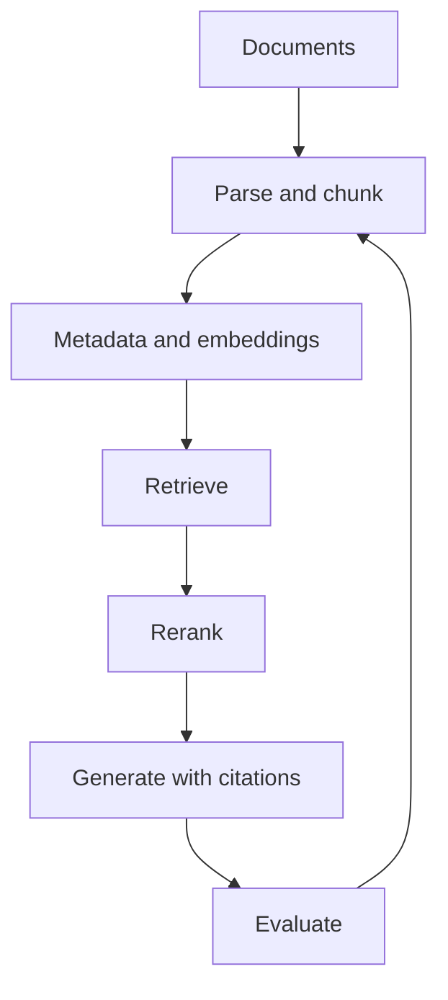

# RAG Cheatsheet

## Intuition

RAG grounds generated answers in retrieved evidence. The key interview move is to debug retrieval
and generation separately. If the right passage is missing, generation cannot reliably fix it. If the
right passage is present but the answer is wrong, the generation contract or evaluation is weak.

## Explanation

A RAG system has five main stages:

1. **Ingest:** parse documents, clean text, preserve source metadata, and handle updates or deletes.
2. **Chunk:** split content so each chunk can answer a useful question without losing context.
3. **Retrieve:** use lexical, vector, hybrid search, metadata filters, and reranking.
4. **Generate:** answer only from retrieved evidence, cite sources, and abstain when evidence is
   missing.
5. **Evaluate and monitor:** measure retrieval, answer quality, safety, cost, and latency.

## Why It Matters

RAG is often chosen because the knowledge is private, large, or changing. The system must therefore
handle freshness, permissions, source authority, prompt injection, and citation quality. A vector
database alone is not a RAG system.

## Example

For an internal policy assistant, store chunk text with document owner, department, permission,
version, date, heading, and source URL. Use permission-aware hybrid retrieval, rerank passages, and
instruct the model to answer with citations or say that the policy was not found.

## High-Yield Checklist

| Area | Strong answer includes |
| --- | --- |
| Corpus | Scope, source authority, freshness, permissions, and deletion rules |
| Chunking | Size, overlap, semantic boundaries, metadata, and parent document links |
| Retrieval | BM25 baseline, dense retrieval, filters, hybrid search, and reranking |
| Generation | Evidence-only answers, citations, abstention, and conflict handling |
| Evaluation | Recall at k, context precision, faithfulness, citation accuracy, and latency |
| Security | Access control, prompt injection defense, document poisoning, and audit logs |

## Interview Angle

Use this answer shape: define the corpus and user, design ingestion, choose baseline search, add
hybrid retrieval or reranking based on measured misses, constrain generation, evaluate components,
and monitor production failures.

**Strong answer pattern:** "I would first check whether retrieval contains the answer. If not, I
would inspect chunking, filters, lexical search, embeddings, and reranking before changing the
generator."

## Common Mistakes

- Starting with embeddings before defining corpus and permissions.
- Skipping BM25 or exact keyword baselines.
- Increasing top-k without measuring context precision or token cost.
- Measuring final answer quality only.
- Ignoring stale documents and deletion.
- Letting retrieved text override system instructions.
- Citing evidence that does not support the answer.

## Mini Exercise

Design RAG for one corpus. Write metadata fields, chunking rule, retrieval baseline, reranking plan,
answer contract, retrieval metric, answer metric, and one security test.

## Diagram

---
## Navigation

[⬅ Previous](11-llm-cheatsheet.md) | [🏠 Home](../README.md) | [➡ Next](13-vector-database-cheatsheet.md)
