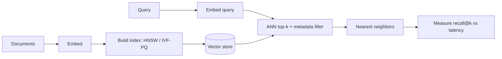

# Vector Database Cheatsheet

## Intuition

A vector database stores embeddings and finds the nearest ones to a query fast. Exact nearest-neighbor
search is too slow at scale, so these systems use approximate nearest neighbor (ANN) indexes that
trade a little recall for a large speedup. The whole job is "given this vector, return the k closest
ones, quickly, with filters".

## Explanation

Index families and their tradeoffs:

- **Flat (brute force):** exact, accurate, slow. Fine under ~100k vectors.
- **HNSW (graph):** builds a navigable small-world graph. Fast queries, high recall, higher memory,
  slower to build. The common default.
- **IVF (inverted file):** clusters vectors, searches only the nearest clusters (`nprobe` controls
  recall vs speed).
- **PQ (product quantization):** compresses vectors to cut memory, at some accuracy cost; often
  combined as IVF-PQ.

Distance metrics: **cosine** (direction, common for text embeddings), **dot product**, **Euclidean
(L2)**. Match the metric to how the embedding model was trained.

## Why It Matters

The index choice is a real engineering tradeoff between recall, latency, memory, and build time. Pick
HNSW for quality on moderate scale; IVF-PQ when memory and billions of vectors dominate. Metadata
filtering (only return docs this user can see) and freshness (handling updates and deletes) are where
naive setups break.

## Key Reference

| Index | Strength | Cost |
| --- | --- | --- |
| Flat | Exact recall | Slow at scale |
| HNSW | Fast, high recall | High memory, slow build |
| IVF | Tunable speed/recall | Needs training, tuning nprobe |
| PQ / IVF-PQ | Low memory, huge scale | Lower accuracy |

| Knob | Effect |
| --- | --- |
| HNSW efSearch | Higher = better recall, slower |
| IVF nprobe | Higher = better recall, slower |
| Metric | Must match embedding training |

## Example

A search system over 50M product embeddings runs out of RAM with HNSW. Switching to IVF-PQ cuts
memory by roughly 8x and keeps p95 latency under target, with recall@10 dropping from 0.98 to 0.94,
which is acceptable for the use case. The decision was driven by measured recall and memory, not
defaults.

## Interview Angle

Expect "how does ANN work", "HNSW vs IVF", "what metric for text embeddings", "how do you filter by
metadata", "how do you handle updates". Show you understand the recall-latency-memory triangle and
that you would measure recall@k, not assume it.

## Common Mistakes

- Using a distance metric that does not match the embedding model.
- Assuming ANN returns exact neighbors (it does not).
- Ignoring memory cost of HNSW at large scale.
- No plan for deletes, updates, or re-embedding when the model changes.
- Filtering after retrieval instead of using native metadata filters.

## Mini Exercise

You have 200M document vectors and a 50 ms latency budget. Choose an index, name the knob you would
tune, the metric you would use, and how you would measure whether recall is good enough.

## Diagram

---
## Navigation

[⬅ Previous](12-rag-cheatsheet.md) | [🏠 Home](../README.md) | [➡ Next](14-agents-cheatsheet.md)
