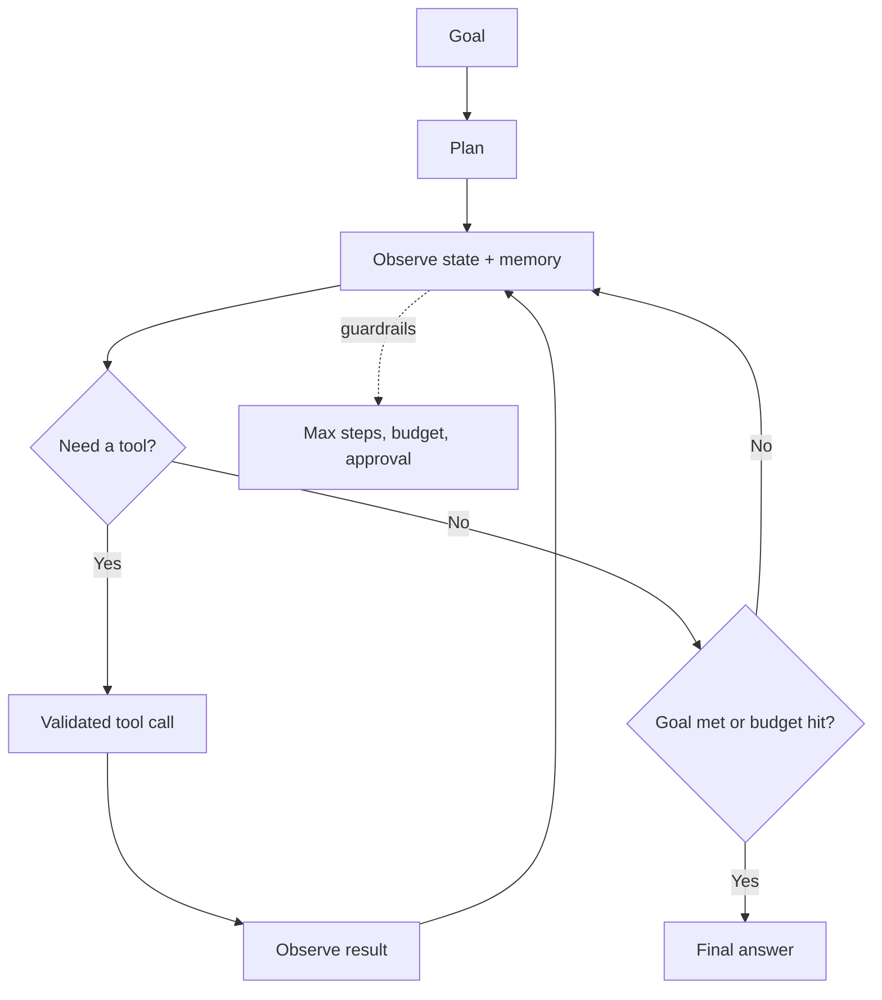

# Agents Cheatsheet

## Intuition

An agent is an LLM placed in a loop with tools and memory. Instead of answering in one shot, it
observes state, decides an action, calls a tool, observes the result, and repeats until the goal is
met or a stop condition fires. The power comes from acting in the world; the risk comes from the same
thing.

## Explanation

The agent loop and its parts:

- **Plan:** decompose the goal (ReAct interleaves reasoning and acting; plan-and-execute plans first).
- **Tools / function calling:** the model emits a structured call (name + JSON args) validated against
  a schema, the system runs it, the result returns to the model.
- **Memory:** short-term (the context window / scratchpad) and long-term (vector store or database of
  past facts).
- **Stop conditions:** goal reached, max steps, budget exhausted, or low confidence to escalate.
- **Single vs multi-agent:** one agent is simpler and easier to debug; multi-agent (planner, workers,
  critic) helps only when roles are genuinely separable.

## Why It Matters

Agents fail in ways single calls do not: they loop, they pick the wrong tool, errors compound across
steps, and an action can change real state (send email, spend money). So guardrails, step and cost
budgets, permissioned tools, and human approval for high-risk actions are not optional. Evaluation is
also harder because you must judge the trajectory, not just the final answer.

## Key Reference

| Concern | Control |
| --- | --- |
| Infinite loops | Max-step and budget limits |
| Wrong tool / bad args | Schema validation, clear tool descriptions |
| Compounding errors | Reflection / critic step, checkpoints |
| High-risk actions | Human-in-the-loop approval |
| Cost / latency | Cap tool calls, cache, route to smaller models |
| Evaluation | Trajectory + outcome metrics, not just final text |

## Example

A research agent must answer a question using web search and a calculator. It plans subqueries,
searches, reads results into memory, computes, and composes an answer with citations. Guardrails cap
it at 10 steps and a token budget; if evidence is missing it says so rather than fabricating. You
evaluate task success rate, steps per task, tool-error rate, and cost per task.

## Interview Angle

Expect "when do you need an agent vs a single LLM call", "how do you stop infinite loops", "single vs
multi-agent", "how do you evaluate an agent". The strongest answer resists agents until a single call
or a fixed workflow is proven insufficient, because agents add cost and failure modes.

## Common Mistakes

- Building a multi-agent system when one call or a fixed workflow would do.
- No step, cost, or time budget, so the agent loops.
- Tools without schemas, permissions, or validation.
- Auto-executing irreversible actions with no human approval.
- Evaluating only the final answer, ignoring the trajectory and cost.

## Mini Exercise

Design an agent that books meetings. List its tools (with one risky one), the stop conditions, which
action needs human approval, three guardrails, and the four metrics you would track in production.

## Diagram

---
## Navigation

[⬅ Previous](13-vector-database-cheatsheet.md) | [🏠 Home](../README.md) | [➡ Next](15-ai-interview-cheatsheet.md)
