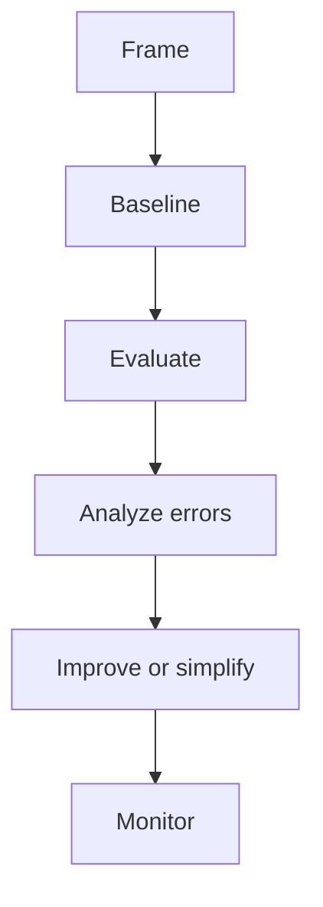

# AI Interview Cheatsheet

## Core Mental Model

Use this cheatsheet to revise AI Interview quickly. The central pattern is always the same: define the
task, choose a baseline, evaluate honestly, inspect errors, and decide whether added complexity is
worth the operational cost.

## High-Yield Checklist

| Question | What a strong answer includes |
| --- | --- |
| What problem is being solved? | User, decision, input, output, and constraints |
| What is the baseline? | A simple measurable reference such as rules, majority class, linear model, or lexical search |
| What metric matters? | A primary metric tied to the decision plus guardrails for safety, latency, cost, or fairness |
| What can go wrong? | Leakage, drift, bias, missing data, poor calibration, overfitting, or unsafe automation |
| What happens in production? | Monitoring, rollback, ownership, retraining triggers, and human escalation |

## Fast Interview Template

1. "I would first clarify the user decision and cost of errors."
2. "I would build a baseline before choosing a complex model."
3. "I would split data to match deployment and avoid leakage."
4. "I would evaluate by metric and by error segment."
5. "I would monitor inputs, outputs, latency, cost, and business impact."

## Common Traps

- Optimizing a metric that does not match the real decision.
- Comparing models on different data splits.
- Ignoring rare but high-severity failures.
- Treating LLM fluency, high accuracy, or attractive charts as sufficient proof.
- Forgetting that deployment changes the data distribution.

## Mini Exercise

Use this cheatsheet to explain AI Interview in two minutes. Record the answer and check whether it
included problem framing, baseline, metric, failure mode, and production plan.

## Diagram

---
## Navigation

[⬅ Previous](14-agents-cheatsheet.md) | [🏠 Home](../README.md) | [➡ Next](../capstone-projects/01-end-to-end-classical-ml-project.md)
