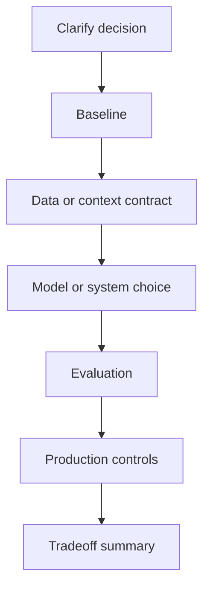

# AI Interview Cheatsheet

## Intuition

A strong AI interview answer is a structured engineering argument. It starts with the product
decision, not the model. It earns complexity by showing a baseline, evidence, tradeoffs, and
production controls.

## Explanation

Use the same spine for ML, LLM, RAG, agent, and system design prompts:

1. **Clarify:** user, decision, constraints, scale, latency, privacy, and failure cost.
2. **Baseline:** the simplest useful solution that creates a measurable reference.
3. **Data or context:** labels, documents, features, permissions, feedback, and freshness.
4. **Model or system:** why the chosen approach fits the failure mode.
5. **Evaluation:** primary metric, guardrails, slices, hard examples, and regression tests.
6. **Production:** monitoring, rollback, escalation, ownership, cost, and security.

## Why It Matters

Interviewers are looking for signal that you can be trusted with ambiguous, high-impact systems. The
best answers are not the flashiest. They are clear, measurable, careful about failure, and honest
about what evidence is still missing.

## Example

If asked to design an AI customer-support assistant, clarify whether it drafts replies or takes
actions. Start with retrieval plus templates, then add LLM drafting with citations. Evaluate
faithfulness, edit rate, resolution rate, policy violations, latency, and escalation quality. Require
human approval for account changes.

## High-Yield Checklist

| Interview signal | What to say |
| --- | --- |
| Ambiguity handling | "I would first clarify the user, action, constraints, and failure cost." |
| Baseline discipline | "The baseline is useful because it reveals data and metric problems early." |
| Metric judgment | "The primary metric is X, but I would guardrail Y and inspect Z slices." |
| Production thinking | "Offline quality is not enough; I would monitor drift, latency, cost, and failures." |
| Safety | "Low-confidence or high-risk cases should escalate instead of auto-acting." |
| Communication | "Here is the tradeoff in product terms..." |

## Interview Angle

Use this final answer shape for almost any AI prompt:

**Strong answer:** "I would clarify the decision and constraints, build a simple baseline, define
the data or context contract, choose the narrowest model or system improvement that addresses a
measured failure, evaluate with primary and guardrail metrics, and launch with monitoring, rollback,
and human escalation."

**Weak answer:** "I would use the largest model available and tune it until the score is good."

## Common Mistakes

- Starting with architecture before requirements.
- Skipping the baseline.
- Using one aggregate metric as proof.
- Ignoring data leakage, permissions, privacy, or safety.
- Forgetting latency, cost, rollback, and ownership.
- Treating demos, notebooks, or offline scores as production readiness.
- Answering follow-ups by changing assumptions silently.

## Mini Exercise

Take one prompt from `mocks/`. Write a twelve-line answer: clarify, requirements, baseline, data,
model, evaluation, monitoring, rollback, privacy, safety, tradeoff, and final recommendation. Then
practice saying it in two minutes.

## Diagram

---
## Navigation

[⬅ Previous](14-agents-cheatsheet.md) | [🏠 Home](../README.md) | [➡ Next](../capstone-projects/01-end-to-end-classical-ml-project.md)
