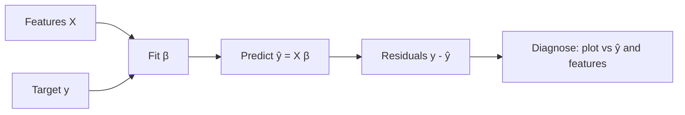

# Linear Regression

## Beginner-Friendly Intuition

Linear regression draws the best straight line (or hyperplane) through your data
and uses it to predict a continuous value. It is the simplest, most-used,
most-misunderstood model in ML. The intuition is one sentence: each feature gets
a weight, you multiply and add, and the answer is your prediction.

The reason linear regression matters even in 2026 is not that it predicts the best
numbers. It is that the model is transparent, the math is closed-form, and the
assumptions are explicit. When the assumptions hold, you get fast inference,
calibrated uncertainty, and an interpretable coefficient per feature. When they do
not hold, the residual plot tells you exactly what is wrong.

## Formal Explanation

Given features `X` (`n` rows, `p` columns) and target `y` (`n` rows), linear
regression assumes `y = X β + ε` where `β` is a `p`-vector of weights and `ε` is
noise with mean zero. The standard objective is ordinary least squares (OLS):

```
β_hat = argmin_β ||y - X β||²
```

The closed-form solution is `β_hat = (X^T X)^{-1} X^T y`. With many rows or
ill-conditioned `X`, gradient descent or QR/SVD-based solvers are used instead.

OLS is the maximum-likelihood estimator under five classical assumptions
(sometimes called the Gauss-Markov conditions plus normality):

- **Linearity.** The conditional mean of `y` given `X` is linear in the
  parameters.
- **Independent observations.** Rows are not correlated. Time-series and panel
  data violate this.
- **Homoscedasticity.** Residual variance is constant across `X`. Heteroscedastic
  errors break standard-error formulas.
- **No (perfect) multicollinearity.** Columns of `X` are linearly independent. If
  not, `X^T X` is singular and there is no unique solution.
- **Normality of residuals.** Needed for exact small-sample inference (CIs,
  t-tests). Not needed for the point estimate to be unbiased.

Quality is summarized by `R² = 1 - RSS/TSS`. **Adjusted R²** penalizes adding
features: `1 - (1-R²)(n-1)/(n-p-1)`. Use adjusted R² when comparing models with
different feature counts.

**Ridge** adds `λ ||β||²` to the loss; **Lasso** adds `λ ||β||₁`. Ridge stabilizes
ill-conditioned `X^T X` and shrinks coefficients smoothly. Lasso drives some
coefficients to exactly zero, doing implicit feature selection.

## Why It Matters in Real Jobs

Linear regression is the right baseline for almost every continuous-target
problem. It runs in milliseconds, fits closed-form, exposes one number per feature
that the business can read, and rarely overfits when regularized. Three concrete
production roles. First, the baseline before a complex model is justified;
gradient boosting often only adds 1 to 5 RMSE points over a tuned linear model on
truly tabular data. Second, the explanation tool when interpretability is
required (insurance pricing, regulated finance, A/B test analysis with CUPED).
Third, the calibration head on top of a deeper model when you need monotone,
well-behaved scores.

A senior engineer's instinct: try linear first, and only escalate to non-linear if
the residual plot reveals structure the linear model is missing.

## How It Works Step by Step

1. **Profile the target.** Plot `y`. If it is heavily skewed, consider
   `log(y)` or a different model family (Gamma, Tweedie).
2. **Profile the features.** Drop near-constant columns. Inspect pairwise
   correlations; if two columns correlate above 0.95, drop one or use ridge.
3. **Standardize numerics if you regularize.** Ridge and lasso are
   scale-sensitive; OLS without regularization is not.
4. **Fit OLS.** Use `numpy.linalg.lstsq` or `sklearn.linear_model.LinearRegression`.
   On large data, switch to SGDRegressor.
5. **Read the residuals.** Plot residuals vs predicted, vs each feature, and over
   time. A trend, a fan, or seasonal structure means the model is missing
   something.
6. **Add regularization if needed.** Cross-validate `λ` for ridge or lasso. The
   `LassoCV` / `RidgeCV` defaults are usually close enough.
7. **Report the metric and a CI.** Use bootstrap or analytical formulas. Never
   ship a single number without uncertainty.

## Real-World Example

A team predicts daily delivery time for an e-commerce platform. Their first OLS
model with 15 features lands at RMSE 42 minutes and `R² = 0.61`. The residual
plot shows a fan: variance grows with predicted time. They log-transform the
target. RMSE on the original scale drops to 31 minutes, `R² = 0.74`, and the
residual fan is gone. They notice two of the 15 features are 0.97 correlated
(distance and route hops). Switching to ridge with `λ = 1.0` (chosen by 5-fold
CV) leaves RMSE at 31 but cuts the standard error of the distance coefficient in
half, making it usable for downstream pricing. A gradient-boosted regressor on
the same data gets RMSE 28; the team ships both, with linear regression as the
fallback when the GBM cannot be loaded.

## Common Mistakes

- Treating coefficients as causal. They are conditional associations under the
  fitted feature set.
- Reporting `R²` on the training set. Use a held-out set or cross-validation.
- Adding many correlated features and reading the individual coefficients;
  multicollinearity makes them unstable across runs.
- Forgetting that OLS minimizes squared error, which is dominated by outliers.
  Use Huber or quantile regression when outliers matter.
- Using OLS on a binary target. Predictions can lie outside `[0, 1]`. Use
  logistic regression instead.
- Ignoring autocorrelation in time series; OLS standard errors will be too small.
  Use Newey-West, GLS, or switch to a time-series model.
- Standardizing the test set with its own mean and std. Use train statistics.

## Interview Angle

**Question:** Walk through what happens when you fit `y = β₀ + β₁ x₁ + β₂ x₂`
and `x₁` is highly correlated with `x₂`.

**Strong answer:** The columns of `X` become nearly linearly dependent, so
`X^T X` is near-singular and its inverse blows up. Coefficient estimates are
still unbiased, but their variance is huge: tiny perturbations in the data flip
the sign of `β₁` or `β₂`. The point prediction is fine, but interpreting any
single coefficient is unsafe. Detect with a correlation matrix or VIF (variance
inflation factor); a VIF above 10 is a red flag. Fix by dropping one of the
two columns, combining them (PCA component), or using ridge regression, which
shrinks coefficients smoothly and stabilizes the inversion.

**Weak answer:** Saying "the model breaks" or claiming OLS becomes biased.
Multicollinearity inflates variance, not bias.

**Follow-up questions:**

- What does R² tell you, and what does it not tell you?
- When would you prefer lasso over ridge, and vice versa?
- How do influence and leverage relate to outlier sensitivity?
- How would you fit linear regression with 100 million rows?

## Mini Exercise

Take any tabular dataset with a numeric target. Fit OLS, ridge with `λ = 0.1`,
and ridge with `λ = 10`. Plot the coefficient for one feature across the three
fits. Explain what you see in two sentences.

## Diagram



---
## Navigation

[⬅ Previous](../data-science/10-communicating-results.md) | [🏠 Home](../README.md) | [➡ Next](02-logistic-regression.md)
