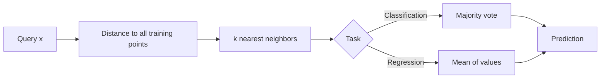

# K-Nearest Neighbors

## Beginner-Friendly Intuition

KNN does not train a model; it remembers the dataset. To predict a new example,
it finds the `k` training points closest to it and votes (for classification) or
averages (for regression). That is the entire algorithm. There is no fitting
phase, no parameters to learn, no loss to minimize. The training set is the
model.

This makes KNN beautifully simple and pedagogically useful, but it also makes
KNN expensive at inference, sensitive to feature scaling, and fragile in high
dimensions. KNN is the algorithm you reach for when you want a quick sanity
baseline, when the decision boundary is genuinely complex and local, or when you
need a similarity-based system that you can debug by inspection.

## Formal Explanation

Given a training set `{(x_i, y_i)}` and a query `x`, find the `k` indices `i`
minimizing a distance `d(x, x_i)`. Predict:

- **Classification:** majority class among the `k` neighbors (optionally
  weighted by `1 / d` so closer neighbors count more).
- **Regression:** mean of the `k` neighbor values (optionally weighted).

Hyperparameters:

- **`k`.** Small `k` (1, 3, 5) gives high variance and follows the data closely;
  large `k` smooths the boundary and approaches the global mean. Pick by
  cross-validation.
- **Distance metric.** Euclidean (L2) is the default. Manhattan (L1) is more
  robust to feature outliers. Cosine for high-dimensional embeddings. Hamming
  for binary features. Always match the metric to feature scale and meaning.
- **Weighting.** Uniform vs distance-weighted. Distance-weighted is usually a
  free win and reduces sensitivity to `k`.

Computational cost:

- **Training:** O(n) just to store the data.
- **Inference (brute force):** O(n d) per query. Prohibitive for large `n`.
- **Inference (indexed):** KD-tree (good for low `d`, breaks down above ~20
  dims), Ball-tree, or Approximate Nearest Neighbors (ANN) like HNSW or IVF-PQ
  for high `d`. ANN is what makes KNN viable at production scale.

## Why It Matters in Real Jobs

KNN is the conceptual core of every retrieval and recommendation system, just
applied to learned embeddings rather than raw features. "Nearest neighbor in
embedding space" is the dominant pattern in semantic search, image similarity,
duplicate detection, recommendation candidate generation, and one-shot
classification. The classical KNN classifier on raw features is rarely the final
model in tabular work, but the **algorithm** lives on as the backbone of
embedding-based systems.

A second production role is the safety baseline: when you deploy a complex
model, a KNN against a small, hand-curated reference set is a useful sanity
detector. If KNN says "this query looks nothing like anything we have seen,"
that is a signal to refuse to predict.

## How It Works Step by Step

1. **Standardize features.** Distance is meaningless if one feature has values
   in [0, 1000] and another in [0, 1]. Standardize numerics, encode
   categoricals carefully (one-hot, then weight).
2. **Pick a distance.** Euclidean for low-dimensional dense data, cosine for
   normalized embeddings, Hamming for binary, Manhattan when robust to outliers.
3. **Choose `k` by cross-validation.** Sweep `k ∈ {1, 3, 5, 10, 25, 50}` and
   report validation metric. Pick the smallest `k` that is within one standard
   error of the best.
4. **Decide weighting.** Distance-weighted neighbors are more robust to the
   choice of `k`.
5. **Index for production.** Brute-force KNN is fine up to about 100K rows. Use
   FAISS, ScaNN, or HNSW above that. Tune the recall-vs-latency knob to your
   SLO.
6. **Calibrate confidence.** A KNN classifier's vote share is not a calibrated
   probability. Apply Platt scaling on a held-out set if you need probabilities.
7. **Watch for drift.** Because KNN is the data, retraining is replacing the
   data. Refresh the reference set as the world changes.

## Real-World Example

A team builds a duplicate-product detector for a marketplace. They embed product
titles with a sentence-transformer (384 dims, unit-norm). For each new listing,
they query the index for the top-5 cosine neighbors. If any neighbor exceeds
similarity 0.92, the listing is flagged as a likely duplicate and routed to
review. Brute force on 10M items would take 1.3 seconds per query; HNSW with
`M = 32, efSearch = 64` brings query latency to 4 ms with 0.97 recall@5. After
six months, the team notices new product categories drift in similarity space;
they add a periodic re-embed job and a calibration check that compares neighbor
similarity distributions month over month.

## Common Mistakes

- Forgetting to standardize numerics; the largest-scale feature dominates the
  distance.
- Using Euclidean distance on raw text, one-hot, or sparse data; switch to
  cosine or Jaccard.
- Picking `k = 1` and assuming low training error means low test error; KNN with
  `k = 1` always has zero training error and high variance.
- Brute-forcing nearest neighbors at 10M+ rows when an ANN index would cut
  latency by 1000x.
- Confusing distance with similarity. Some libraries return one and some the
  other; check signs.
- Treating a KNN vote as a probability without calibration.
- Using KNN at very high dimensionality (> a few hundred) on raw features
  without dimensionality reduction. The curse of dimensionality flattens
  distances.

## Interview Angle

**Question:** Why does KNN performance degrade in high dimensions?

**Strong answer:** Two reasons, often called the curse of dimensionality. First,
volume grows exponentially with dimension, so any fixed amount of training data
becomes increasingly sparse. To maintain a constant data density, you would need
exponentially more data. Second, distances concentrate: the ratio of the nearest
to the farthest neighbor's distance approaches 1 as dimension grows, making the
"nearest neighbor" notion meaningless. Numerically, in 1000-dim Gaussian data,
typical pairwise cosine is ~0.025, so almost everything is roughly equally far.
Solutions: dimensionality reduction (PCA, autoencoder), learn a metric (metric
learning, deep embeddings), or use a model that is not distance-based.

**Weak answer:** Saying "more dimensions are slower" without addressing density
or distance concentration.

**Follow-up questions:**

- How would you choose `k`?
- When does cosine beat Euclidean and vice versa?
- What is the difference between exact and approximate nearest neighbors?
- How would you handle a query that has no close neighbors?

## Mini Exercise

Take a 2D synthetic dataset with two interleaved half-moons. Fit KNN with
`k ∈ {1, 5, 25}`. Plot the decision boundary for each. Explain in one sentence
how `k` controls the bias-variance tradeoff.

## Diagram

---
## Navigation

[⬅ Previous](02-logistic-regression.md) | [🏠 Home](../README.md) | [➡ Next](04-naive-bayes.md)
