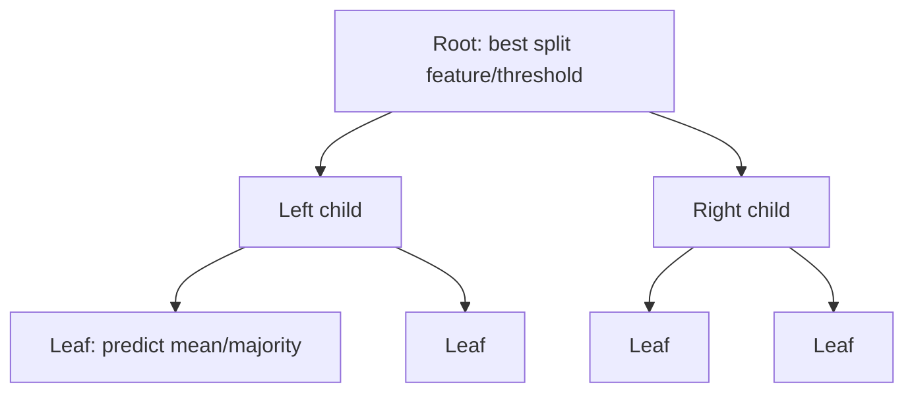

# Decision Trees

## Beginner-Friendly Intuition

A decision tree is a flowchart that asks one yes/no question at a time. "Is age
> 30? If yes, is income > 50K? If yes, predict high spend." Each internal node
is a feature test, each leaf is a prediction. The tree learns which questions to
ask, in what order, by greedily choosing splits that make the children as pure
as possible.

The reason trees matter is intuition: a tree mirrors how a human reasons through
a decision. They handle non-linearity automatically, deal with mixed feature
types, do not need scaling, and are explainable by walking the path from root to
leaf. They are also dramatically unstable and almost always lose to ensembles
(random forests, gradient boosting), which is why a single tree is rarely the
final model and almost always the conceptual building block of a better one.

## Formal Explanation

A decision tree partitions the feature space into axis-aligned regions and
predicts a constant per region. For classification it predicts the majority
class in the region; for regression it predicts the mean.

Training is greedy and recursive:

1. At a node, search all features and all possible split thresholds.
2. Pick the (feature, threshold) that maximizes the **impurity decrease**.
3. Split the data into two children and recurse.
4. Stop when a stopping criterion is met (max depth, min samples per leaf,
   no impurity decrease).

Common impurity measures:

- **Gini impurity** for classification: `Σ p_c (1 - p_c) = 1 - Σ p_c²`. Cheap to
  compute. Default in CART and sklearn.
- **Entropy** for classification: `-Σ p_c log p_c`. Slightly more aggressive at
  small-class splits; costs a `log`.
- **Variance reduction** for regression: pick the split that minimizes the sum
  of squared errors in the children.

The split criterion is **information gain** for entropy, **Gini gain** for Gini,
or absolute MSE reduction for regression.

Tree complexity is controlled by:

- `max_depth` (most important).
- `min_samples_split` and `min_samples_leaf` (prevent splits on tiny groups).
- `max_features` (number of features to consider per split).
- **Cost-complexity pruning (alpha):** post-fit, prune subtrees whose impurity
  reduction is below `α`. Used by CART and sklearn's
  `cost_complexity_pruning_path`.

Computational cost: O(n d log n) for fitting (each split sorts each feature).
Inference is O(depth), typically fast.

## Why It Matters in Real Jobs

A single decision tree is rarely the production model, but trees are everywhere
because every gradient-boosted and random-forest model is built from them. When
do you ship a single tree? Three cases. First, when the regulator requires a
fully transparent decision rule that a non-engineer can read. Second, as a
diagnostic surrogate for a complex model: a small tree fit to the predictions of
a deep model often reveals which features actually matter. Third, in low-latency
edge environments where an ensemble does not fit.

For any moderately complex tabular problem, the answer is "use a gradient
boosted tree, not a single tree." But to debug, tune, or explain that ensemble,
you have to understand the building block.

## How It Works Step by Step

1. **Encode categoricals.** Sklearn's tree implementations require numeric
   features; one-hot encode or use a library that handles categoricals natively
   (LightGBM, CatBoost). Trees do not care about scale.
2. **Set a depth budget.** Start with `max_depth = 3` to 6 for interpretability,
   `max_depth = None` (unlimited) only when you plan to prune later.
3. **Fit.** sklearn `DecisionTreeClassifier` or `DecisionTreeRegressor`.
4. **Cross-validate the depth.** Sweep depth and pick the value that maximizes
   validation metric.
5. **Inspect the tree.** Print or plot it. If a feature you trust dominates, the
   tree is reasonable. If a noisy feature dominates the root split, investigate
   leakage.
6. **Prune.** Use cost-complexity pruning if you need a smaller tree. Sklearn
   supports `ccp_alpha`.
7. **If accuracy is not enough, switch to a random forest or gradient boosted
   trees.** The single tree is the floor, not the goal.

## Why a Single Tree Underperforms

Decision trees are **high-variance**: small changes in the training data can
produce a very different tree. The first split is chosen greedily, so a slight
shift in the data picks a different feature and the rest of the tree
restructures. That instability shows up as poor generalization.

Two ways to fix it. **Bagging** (random forests): train many trees on
bootstrapped samples and average. **Boosting** (GBM, XGBoost): train trees
sequentially, each fitting the previous ensemble's errors. Both ensembles give
up the per-tree explainability for substantial accuracy gains.

A single tree also struggles with smooth functions. Predicting a linear target
with a tree produces a step function; you need many leaves to approximate the
line. Linear regression handles that natively. Trees are best when the
relationship is genuinely interaction-heavy and non-linear.

## Real-World Example

A loan approval team needs a transparent baseline before launching their first
GBM. They fit a depth-4 decision tree on 20K applications with 12 features.
Validation AUC is 0.74; their GBM later reaches 0.83. They keep the tree as
the explanation artifact: the regulator can read "if income > 60K and
credit_score > 700 and debt_to_income < 0.4, approve." When a customer is
declined, they can show which leaf they fell into and which feature pushed them
there. The tree does not approve loans in production; the GBM does. But every
dispute, audit, and fairness check uses the tree.

## Common Mistakes

- Letting the tree grow to full depth without regularization or pruning;
  training error goes to zero, validation error goes up.
- Reading per-feature importances from a single tree and trusting them; they
  are noisy. Use permutation importance or SHAP on an ensemble instead.
- Comparing trees across runs with different random seeds and concluding the
  feature ordering is meaningful.
- Using trees for problems with smooth linear structure (e.g., physics-based
  regression). Linear models do better with fewer parameters.
- Treating a tree's leaf-mean prediction as a probability without
  smoothing. Small leaves give 0 or 1 predictions that are useless for
  thresholding.
- Encoding ordinal categoricals as one-hot when the order matters; trees can
  exploit ordering with integer encoding.
- Forgetting that trees handle missing values poorly by default in sklearn;
  LightGBM and XGBoost handle them natively.

## Interview Angle

**Question:** Why does a single decision tree usually generalize worse than a
random forest of trees, and what specifically does the forest fix?

**Strong answer:** A single decision tree is high variance. The greedy
split-selection means the first split dominates the structure of everything
below it, and small data perturbations change the first split. Two trees
trained on slightly different bootstrap samples can look entirely different.
A random forest fixes this with two pieces. Bagging: train each tree on a
bootstrap sample, so each tree sees a different slice of the data. Random
feature subsampling at each split: force the trees to use different features at
the top, which decorrelates them. Averaging decorrelated high-variance learners
reduces variance by a factor of `1 / m` for `m` trees if the trees were fully
independent; the actual reduction is smaller because trees share data, but it is
still substantial. The bias is roughly unchanged. So the forest gets the
flexibility of deep trees without the variance penalty.

**Weak answer:** "More trees is better" without explaining decorrelation or
variance reduction.

**Follow-up questions:**

- What is the difference between Gini and entropy as split criteria?
- How does cost-complexity pruning work?
- When would you choose a tree over a linear model?
- How do you handle missing values in a decision tree?

## Mini Exercise

Take any tabular dataset. Fit a decision tree with `max_depth ∈ {2, 4, 8, None}`.
Plot training and validation accuracy vs depth. Identify the depth where the gap
opens.

## Diagram

---
## Navigation

[⬅ Previous](04-naive-bayes.md) | [🏠 Home](../README.md) | [➡ Next](06-random-forests.md)
