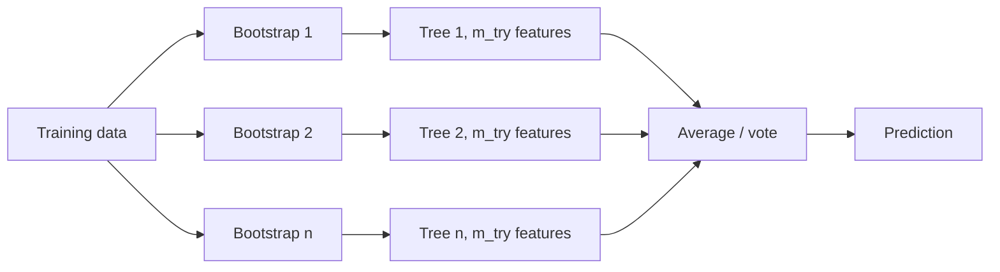

# Random Forests

## Beginner-Friendly Intuition

A random forest is what you get when you train hundreds of decision trees on
slightly different slices of the data and average their predictions. Each
individual tree is mediocre and unstable. The average is robust, accurate, and
hard to overfit. The trick is making the trees disagree with each other in
useful ways, then letting the disagreement cancel out.

The reason forests are still in production a decade after they peaked: they are
nearly turnkey. Sensible defaults work on most tabular data, no scaling is
needed, missing values are tolerated, and the failure modes are easy to read
from out-of-bag error. They lose to gradient boosted trees on accuracy by a
small but consistent margin, and to neural networks on unstructured data by a
huge one. But for a five-minute baseline on a tabular problem, a random forest
is hard to beat.

## Formal Explanation

A random forest is a **bagged ensemble of decision trees** with two sources of
randomness:

- **Bootstrap aggregating (bagging).** Each tree sees a bootstrap sample of the
  training set: draw `n` rows with replacement from the original `n`-row data.
  About 63 percent of unique rows appear in any given bootstrap; the rest are
  out-of-bag (OOB) for that tree.
- **Random feature subsampling.** At each split, only `m_try < d` randomly
  chosen features are considered. Default: `sqrt(d)` for classification, `d/3`
  for regression.

Predictions:

- **Classification:** majority vote across trees, or average of per-tree
  probability estimates.
- **Regression:** average across trees.

Why two sources of randomness? Bagging alone reduces variance, but bagged trees
are highly correlated because each tree picks the same dominant feature near
the root. Random feature subsampling forces trees to use different features at
the top, decorrelating them. The variance of the average of `B` correlated
predictors with pairwise correlation `ρ` and individual variance `σ²` is

```
ρ σ² + (1 - ρ) σ² / B
```

So variance does not go to zero as `B` grows; it floors at `ρ σ²`. Lowering `ρ`
through feature randomness lowers the floor.

**Out-of-bag (OOB) error** is a free validation estimate: for each row, predict
using only the trees that did not see it during training. This works as a
substitute for cross-validation and avoids the cost of refitting.

Hyperparameters that matter, in order:

1. `n_estimators`: more trees rarely hurt, just slow inference. 100 to 500 is
   typical.
2. `max_features` (m_try): controls decorrelation. Default is usually fine.
3. `max_depth`, `min_samples_leaf`: tree complexity per learner. Defaults grow
   trees fully; that is the right choice for a forest because the ensemble
   regularizes.
4. `class_weight` for imbalance.

## Why It Matters in Real Jobs

Three production roles. First, the no-nonsense baseline: random forest with
defaults takes 30 seconds to fit on a 100K-row dataset and gives a reasonable
score that anchors all later experiments. Second, feature importance scaffolding
for a more careful analysis: while RF impurity-based importance is biased
toward high-cardinality features, permutation importance from a fitted RF is
very useful for narrowing the feature set. Third, the safe production choice
when team capacity is limited: forests are robust to scaling errors, missing
values, weird categorical encodings, and small label noise in ways that
gradient boosters often are not.

When does it lose? Two situations. On large structured datasets where you can
afford to tune, gradient boosting (XGBoost / LightGBM) typically lifts AUC by 1
to 3 points. On image, audio, text, or any genuinely unstructured input, deep
learning dominates by a much larger margin.

## How It Works Step by Step

1. **Encode categoricals.** Sklearn's RandomForest needs numeric inputs;
   one-hot or use a library with native categorical support.
2. **Set `n_estimators` to 200 or 500.** More than that rarely helps.
3. **Leave trees deep.** Forests regularize through averaging; per-tree pruning
   is rarely needed. Use `min_samples_leaf = 1` to 5.
4. **Fit.** sklearn `RandomForestClassifier` / `RandomForestRegressor`.
5. **Read OOB error.** Set `oob_score = True`. The OOB estimate is your free
   validation number.
6. **Inspect feature importance carefully.** Prefer permutation importance from
   `sklearn.inspection.permutation_importance` over the built-in impurity
   importance, which is biased toward high-cardinality features.
7. **Calibrate if needed.** RF probabilities are usually decent but not perfect;
   isotonic regression on a held-out set tightens them.

## Real-World Example

A team predicting customer churn fits a random forest with 300 trees and
defaults. OOB AUC is 0.81 in 45 seconds. The same team's gradient boosted
model takes 4 hours to tune and lands at 0.84. The decision: ship the random
forest as v1 (because the team has to launch in two weeks), and roll the GBM
into v2 once the data pipeline is stable. Six months later the GBM ships, and
the random forest stays as the canary: if the GBM service goes down, the RF
serves traffic with 3 percent worse AUC but no other behavior change.
Permutation importance from the RF identified two leaky features that had also
contaminated the GBM; without the RF as a debugging tool the leakage might have
shipped.

## Common Mistakes

- Using `max_features = d` (no feature subsampling); the trees become correlated
  and the ensemble degenerates toward a single deep tree.
- Setting `min_samples_leaf` very large for "regularization"; trees lose their
  ability to capture interactions.
- Reading the built-in feature importance and acting on it. Impurity-based
  importance is biased toward high-cardinality numeric features. Use
  permutation importance.
- Treating RF probabilities as perfectly calibrated.
- Tuning `n_estimators` aggressively. Past about 200 trees, gains are marginal
  and inference cost grows linearly.
- Forgetting that RF predictions are bounded by the training target range
  (regression). They cannot extrapolate beyond it; if your test target is
  outside the training range, RF is the wrong model.
- Splitting time-series data randomly when fitting an RF; use time-aware splits.

## Interview Angle

**Question:** Why does random feature subsampling matter on top of bootstrap
aggregating?

**Strong answer:** Bagging alone reduces variance only to the extent that the
bagged predictors are uncorrelated. Bagged decision trees on the same data
share most of their structure: they all pick the same dominant feature for the
root split because all the data is similar. Pairwise correlation `ρ` between
trees stays high. The variance of an average of `B` correlated predictors is
`ρ σ² + (1 - ρ) σ² / B`, which floors at `ρ σ²` no matter how large `B` gets.
Random feature subsampling at each split forces trees to consider different
features near the top, decorrelating them, which lowers `ρ` and lets the average
keep shrinking variance. That is why a random forest with `max_features < d`
beats a bag of full-feature trees with the same number of estimators.

**Weak answer:** "It adds randomness" without explaining variance reduction or
correlation between predictors.

**Follow-up questions:**

- What is OOB error and when is it as good as cross-validation?
- Why does random forest tend to lose to gradient boosting on tuned tabular
  problems?
- What happens to the bias-variance trade-off as you add more trees?
- When would you NOT use a random forest?

## Mini Exercise

Fit a random forest with `n_estimators ∈ {10, 100, 500}` and
`max_features ∈ {sqrt(d), d}`. Compare OOB error in a 2x3 table. Note where
adding trees stops helping and where dropping `max_features` helps.

## Diagram



---
## Navigation

[⬅ Previous](05-decision-trees.md) | [🏠 Home](../README.md) | [➡ Next](07-gradient-boosting.md)
