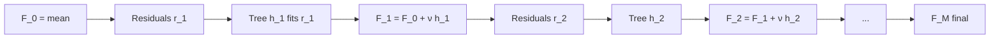

# Gradient Boosting

## Beginner-Friendly Intuition

Gradient boosting builds a model one piece at a time, where each new piece tries
to fix what the previous pieces got wrong. Imagine you start with a constant
prediction (the mean of `y`). Compute the residuals (errors). Fit a small tree
to the residuals. Add that tree's predictions, scaled by a small learning rate,
to the running prediction. Recompute residuals. Fit another tree. Repeat for
hundreds or thousands of rounds.

The "gradient" in the name is the generalization: instead of literal residuals,
each round fits the **negative gradient of the loss** with respect to the
current prediction. For squared error, the negative gradient is exactly the
residual. For log-loss, it is the difference between the label and the
predicted probability. The framework works for any differentiable loss.

This is why gradient boosting dominates structured data competitions: it is
flexible (any loss), accurate (deeper than any single tree), regularizable
(through depth, learning rate, and shrinkage), and robust (no scaling needed).

## Formal Explanation

Given training data and a differentiable loss `L(y, F(x))`, gradient boosting
builds an additive model `F_M(x) = Σ_{m=1}^M ν · h_m(x)` where each `h_m` is a
weak learner (typically a small tree) and `ν` is the learning rate.

Algorithm:

```
F_0(x) = argmin_c Σ_i L(y_i, c)              # initial constant prediction
for m = 1 to M:
    r_im = - ∂L / ∂F(x_i) | F = F_{m-1}      # negative gradient (pseudo-residual)
    fit h_m to {(x_i, r_im)}                  # weak learner regresses on residuals
    F_m(x) = F_{m-1}(x) + ν · h_m(x)         # update
return F_M
```

For squared error, `r_im = y_i - F_{m-1}(x_i)`, the literal residual. For
log-loss with sigmoid, `r_im = y_i - σ(F_{m-1}(x_i))`. Each round corrects the
model's current error pattern.

Hyperparameters that matter, in order:

1. **Learning rate `ν`** (often called `eta` or `learning_rate`). Smaller is
   better for accuracy but needs more trees. Typical range 0.01 to 0.1.
2. **Number of trees `M`** (`n_estimators`). Use early stopping on a validation
   set rather than picking by hand.
3. **Tree depth.** Boosters use **shallow** trees, typically `max_depth = 3` to
   8. Deep trees overfit quickly when boosted.
4. **Subsampling.** `subsample = 0.5` to 0.8 (stochastic gradient boosting)
   reduces variance.
5. **Regularization.** L2 on leaf values, min child weight, gamma (minimum
   split gain) -- vary by library.

The product `ν · M` controls capacity. A common default: `ν = 0.05`, `M = 1000`,
early-stop after no validation improvement for 50 rounds.

**Loss choices in practice:**

- **Regression:** squared error, absolute error (more robust), Huber, quantile
  (for prediction intervals), Tweedie (for zero-inflated nonneg data),
  Poisson (for counts).
- **Binary classification:** log-loss (logistic), exponential (AdaBoost-style).
- **Multiclass:** softmax cross-entropy.
- **Ranking:** pairwise rank loss (LambdaRank), ListMLE.

## Why It Matters in Real Jobs

Gradient boosting is the **default winning model on tabular data**. Pick any
Kaggle tabular competition since 2014; the leaderboard is dominated by XGBoost,
LightGBM, or CatBoost. In production, GBMs run pricing, credit scoring, ad
ranking, fraud, churn, and demand forecasting at most major companies. Three
reasons. First, accuracy: typically 1 to 5 points better than random forest on
tuned tabular problems. Second, flexibility: any loss, including ranking and
quantile losses that no other classical model gives you. Third, scaling:
LightGBM trains 100M-row datasets in minutes on a single CPU node.

The cost is sensitivity: a GBM with badly chosen learning rate and depth can
overfit silently. A random forest is harder to break.

## How It Works Step by Step

1. **Pick a library.** XGBoost, LightGBM, or CatBoost. They are all variants of
   the same gradient boosting idea (covered in the next file in detail).
2. **Choose the loss.** Squared error for regression with no outliers, absolute
   error if outliers matter, log-loss for binary classification, quantile loss
   for prediction intervals.
3. **Set a low learning rate.** `eta = 0.05` is a good default. Smaller helps
   accuracy and needs more trees.
4. **Use early stopping.** Hold out 10 to 20 percent of training as a validation
   set, set `early_stopping_rounds = 50`. Library will stop when validation loss
   stops improving.
5. **Tune tree depth.** Sweep `max_depth ∈ {3, 4, 6, 8}`. Lower is more
   regularization. Five-fold CV picks one.
6. **Add row and column subsampling.** `subsample = 0.8`,
   `colsample_bytree = 0.8` reduces variance.
7. **Calibrate.** GBM probabilities are usually well-calibrated when trained
   with log-loss, but check with a reliability diagram. Apply isotonic
   regression on a held-out set if needed.
8. **Inspect feature importances and SHAP values.** GBM importances are noisy;
   SHAP values are the gold standard for tabular interpretability.

## Real-World Example

A retail team forecasts daily demand per SKU per store. They compare three
models: linear regression with engineered lag features (RMSE 14.2), random
forest (RMSE 11.6), and a gradient boosted regressor with quantile loss at
`τ = 0.5` (RMSE 10.4) plus prediction intervals at `τ = 0.1` and `τ = 0.9` for
inventory bounds. The GBM ships. They use `eta = 0.03`, `max_depth = 6`,
`subsample = 0.7`, `colsample_bytree = 0.7`, `n_estimators = 5000` with early
stopping at round 50; in practice it stops around round 1800. Training on 60M
SKU-store-day rows takes 25 minutes on a single 96-core machine with LightGBM.

## Common Mistakes

- Setting `learning_rate = 1.0` and using few trees. The classic AdaBoost-style
  defaults overfit. Use `eta = 0.05` and many trees.
- Not using early stopping. Without it, you either overfit or stop too early.
- Picking deep trees. Boosters use shallow trees (`max_depth = 3` to 8). Deep
  trees overfit each round and the boost cannot recover.
- Treating boosting as bagging; it is fundamentally sequential, not parallel,
  in its model logic. Each tree depends on the previous ensemble.
- Forgetting that GBMs cannot extrapolate. Like RF, predictions are bounded by
  training target range.
- Tuning hyperparameters one at a time greedily. Use grid or random search over
  `(eta, max_depth, subsample)` jointly.
- Comparing AUC of GBM with default `eta = 0.3` to logistic regression and
  concluding GBM is barely better. The default `eta` is wrong; try `0.05`.

## Interview Angle

**Question:** Why does gradient boosting use shallow trees while random forest
grows them deep?

**Strong answer:** They reduce variance through different mechanisms. Random
forest reduces variance by **averaging high-variance learners**; deep trees are
fine because the ensemble averages over their noise. The trees act as
independent predictors of the same quantity. Gradient boosting reduces error by
**sequentially correcting the previous ensemble**. Each tree's job is to fit a
small residual signal, not the whole target. A deep tree is too aggressive: it
fits the residual exactly, including the noise, and the next round must undo
that overfitting. A shallow tree captures only the strongest pattern in the
residual and lets later trees handle the rest. So boosting fits many small
trees, each correcting a tiny piece, while bagging fits fewer big trees, each
voting on the whole answer. The math: in boosting, increasing depth raises the
per-tree variance and breaks the additive structure; in bagging, increasing
depth raises capacity per learner but the average still shrinks variance.

**Weak answer:** "Boosting needs less complex trees" without explaining the
sequential vs parallel dynamic.

**Follow-up questions:**

- What is the role of the learning rate?
- Why does early stopping help?
- How does gradient boosting differ from AdaBoost?
- What loss would you use for a quantile regression task?

## Mini Exercise

Fit a gradient boosted classifier on any binary dataset with
`learning_rate ∈ {0.3, 0.1, 0.05, 0.01}` and 1000 trees with early stopping.
Plot validation log-loss vs round for each LR. Note how a smaller LR converges
slower but to a lower validation loss.

## Diagram



---
## Navigation

[⬅ Previous](06-random-forests.md) | [🏠 Home](../README.md) | [➡ Next](08-xgboost-lightgbm-catboost.md)
