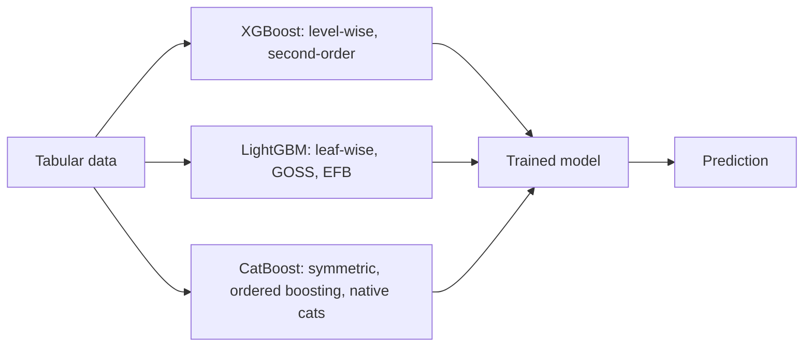

# XGBoost, LightGBM, and CatBoost

## Beginner-Friendly Intuition

XGBoost, LightGBM, and CatBoost are all engineering refinements of gradient
boosting. They share the same core idea (sequentially fit trees to gradients of
a loss) but differ in how they handle large data, categorical features, missing
values, and where they grow trees first. In 2026, one of these three is almost
certainly the right choice for any tabular-data problem above a few thousand
rows.

The intuition for choosing between them: XGBoost is the careful, well-tuned
default; LightGBM is the speed champion at large scale; CatBoost is the easy
button when you have many high-cardinality categorical features. All three give
similar accuracy with proper tuning. The differences matter most for training
speed, ergonomics, and edge cases.

## Formal Explanation

All three implement the gradient boosting framework from
[07-gradient-boosting.md](07-gradient-boosting.md), with key engineering
differences:

### XGBoost (2014, T. Chen)

- **Histogram-based splits.** Bin continuous features into a small number of
  bins (256 by default). Splits search over bins, not raw values.
- **Level-wise tree growth.** Grow the tree breadth-first by depth.
- **Second-order optimization.** Uses both first and second derivatives of the
  loss for split scoring (Newton-Raphson style). The objective is

  ```
  Obj = Σ_i [ g_i f(x_i) + 0.5 h_i f(x_i)² ] + γ T + 0.5 λ Σ w_j²
  ```

  where `g_i, h_i` are the per-row first and second derivatives, `T` is leaf
  count, `λ` is L2 on leaf weights, `γ` is the minimum split gain.
- **Sparse-aware.** Handles missing values by learning, per split, a default
  direction (left or right) for missing rows.
- **GPU support** since 2017.

### LightGBM (2017, Microsoft)

- **Histogram-based splits**, like XGBoost.
- **Leaf-wise (best-first) tree growth.** At each step, split the leaf with the
  highest gain, regardless of depth. Faster convergence per round but can
  overfit if not depth-limited.
- **Gradient-based One-Side Sampling (GOSS).** Keeps all rows with large
  gradients (the hard cases) and randomly samples the rest. Approximates the
  full-data gain at lower cost.
- **Exclusive Feature Bundling (EFB).** Bundles mutually-exclusive sparse
  features (one-hot rows that never co-occur) into single histograms. Cuts
  effective feature count on sparse data.
- **Native categorical support.** Specify `categorical_feature` and LightGBM
  finds optimal partitions of category values without one-hot encoding.

### CatBoost (2017, Yandex)

- **Symmetric (oblivious) trees.** All splits at the same depth use the same
  feature/threshold. The tree becomes a decision table; inference is very fast.
- **Ordered boosting.** Avoids the target leakage that traditional GBM has when
  using target-encoded features by computing each row's residual using only
  rows seen earlier in a permutation. Reduces overfitting on small data.
- **Native categorical handling** via target encoding with the leakage fix.
- Often the best out-of-the-box accuracy with minimal tuning, especially on
  small to medium data with many categoricals.

### When to pick which

- **XGBoost** when you want the most-stable, most-documented default. Best
  GPU support and the longest production track record.
- **LightGBM** when training speed matters: 10M+ rows, many features, frequent
  retraining. Be careful with leaf-wise growth on small data; cap `max_depth`
  or `num_leaves`.
- **CatBoost** when you have many high-cardinality categoricals (user IDs,
  product IDs, ZIP codes) and want minimal preprocessing. Slower training but
  often higher accuracy with default settings.

## Why It Matters in Real Jobs

These three libraries collectively run a large fraction of production ML
prediction systems on tabular data. Knowing the differences saves real engineer
time. A common mistake is to default to XGBoost because it is famous, then
spend three weeks one-hot encoding 200K-cardinality user IDs by hand, when
CatBoost would have handled them in 30 seconds. Another is to use LightGBM at
default settings on 5K rows of data and have leaf-wise growth overfit;
LightGBM's defaults assume larger data than that.

A senior engineer's instinct: pick the library that matches your data shape,
tune three hyperparameters seriously (`learning_rate`, depth, regularization),
and stop. Marginal accuracy gains from chasing the last 0.5 AUC point are
almost never worth the extra complexity.

## How It Works Step by Step

1. **Pick a library by data shape.** Above rule of thumb. When in doubt,
   XGBoost.
2. **Set up the basics.** Numeric features as-is. Categoricals: one-hot for
   XGBoost, native for LightGBM and CatBoost.
3. **Configure early stopping.** All three support it. Hold out 10 to 20
   percent of training as validation; set `early_stopping_rounds = 50`.
4. **Tune three hyperparameters.** `learning_rate ∈ {0.01, 0.05, 0.1}`,
   `max_depth ∈ {3, 6, 8}` (or `num_leaves ∈ {15, 31, 63}` for LightGBM),
   `min_child_weight` or library equivalent. Random search of 30 to 60
   configurations is plenty.
5. **Inspect feature importance.** Built-in importance is noisy; prefer SHAP
   values for serious analysis. All three libraries integrate with the `shap`
   library.
6. **Calibrate.** GBMs trained with log-loss are usually well-calibrated, but
   check with a reliability diagram. Apply isotonic regression on a held-out
   fold if needed.
7. **Productionize.** All three export models as text or binary; XGBoost has the
   most language bindings. Inference is fast: thousands to millions of
   predictions per second per core.

## Real-World Example

A team predicts ad click-through-rate. They have 80M rows, 200 features
including 50 categoricals with cardinalities from 100 to 10M. They benchmark.
XGBoost with one-hot encoding: 14 hours training, AUC 0.762. LightGBM with
native categorical support: 35 minutes training, AUC 0.764. CatBoost with
default settings: 2.5 hours training, AUC 0.767. They ship CatBoost. Six months
later, with 800M rows, the same comparison flips: LightGBM trains in 6 hours,
CatBoost in 18, and the AUC gap closes. They migrate to LightGBM. The lesson is
that the "best" library depends on data scale and feature mix; treat it as a
choice that may change as the business grows.

## Common Mistakes

- Using LightGBM defaults on small data (under ~10K rows). Leaf-wise growth
  overfits. Cap `num_leaves` or use `max_depth`.
- One-hot encoding a 1M-cardinality user ID and feeding it to XGBoost. Use
  CatBoost or LightGBM native categorical support instead.
- Treating CatBoost's native categorical handling as a free win on every
  problem. On large datasets with mostly numeric features, XGBoost or LightGBM
  often train faster.
- Skipping early stopping; you either pay for too many trees or stop too soon.
- Trusting built-in feature importance. Use SHAP.
- Tuning 10 hyperparameters at once with no signal. Three matter most.
- Setting `learning_rate = 0.3` (the historical default) and getting unstable,
  overfitted models. Modern recipes use 0.01 to 0.1.
- Forgetting that all three are still gradient boosting; the same overfitting
  failure modes apply.

## Interview Angle

**Question:** What is the difference between level-wise (XGBoost) and leaf-wise
(LightGBM) tree growth?

**Strong answer:** Level-wise growth grows the tree breadth-first: at each
depth, split every leaf at that depth before moving on. The result is a
balanced tree of fixed depth. Leaf-wise (best-first) growth picks, at each
step, the single leaf in the entire tree with the highest split gain and splits
it, regardless of depth. The result is an unbalanced tree that converges to a
lower training loss in fewer total splits. Practical consequences. Leaf-wise
trains faster per round of equivalent accuracy, especially on large data.
Leaf-wise overfits more aggressively because it can grow much deeper along
specific branches; LightGBM controls this with `num_leaves` (the dominant
hyperparameter, replacing `max_depth`) and `min_data_in_leaf`. On small data
(under 10K rows), leaf-wise without strict caps will memorize. Level-wise's
balanced structure is more robust to small data but slower at scale.

**Weak answer:** "LightGBM is faster" without explaining why or naming the
caveat.

**Follow-up questions:**

- How does histogram-based split finding speed up training?
- How does CatBoost's ordered boosting prevent target leakage?
- What is GOSS in LightGBM?
- When would you use XGBoost over the other two?

## Mini Exercise

Take the same tabular dataset and train all three libraries with default
settings and a fixed `learning_rate = 0.05`. Compare training time and
validation AUC. Tune each on three hyperparameters. Compare again. Note which
gains the most from tuning.

## Diagram



---
## Navigation

[⬅ Previous](07-gradient-boosting.md) | [🏠 Home](../README.md) | [➡ Next](09-support-vector-machines.md)
