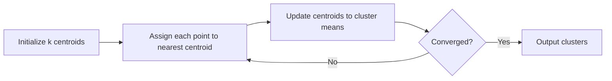

# K-Means Clustering

## Beginner-Friendly Intuition

K-means takes a number `k`, picks `k` initial centers, and then alternates two
steps: assign every point to its nearest center, then move every center to the
mean of its assigned points. Repeat until nothing moves. The points that share
a center belong to the same cluster.

The intuition is gravitational. Each center pulls in the nearby points; once
points have been assigned, the center drifts to the new center of mass; that
shift pulls in slightly different points; eventually the system settles. The
result is `k` blobs whose total "spread" (sum of squared distances to their
centers) is locally minimized.

K-means is the canonical clustering algorithm. It is fast, simple, and easy to
explain. It also assumes spherical, equal-sized clusters, gets stuck in local
minima, and demands you choose `k` ahead of time. Knowing when those
assumptions break is the difference between using k-means well and producing
nonsense clusters.

## Formal Explanation

Given `n` points in `R^d` and a target number of clusters `k`, k-means seeks
centers `μ_1, ..., μ_k` and an assignment `c: {1...n} -> {1...k}` minimizing

```
J = Σ_i ||x_i - μ_{c(i)}||²
```

Lloyd's algorithm:

1. Initialize centers (random or k-means++).
2. **Assignment step.** `c(i) = argmin_j ||x_i - μ_j||²`. O(nkd).
3. **Update step.** `μ_j = mean of points assigned to cluster j`.
4. Repeat 2-3 until assignments stop changing or a max iteration cap is hit.

Each iteration decreases `J`; convergence is guaranteed but only to a local
minimum.

**k-means++** initialization (Arthur and Vassilvitskii, 2007): pick the first
center at random; pick each subsequent center with probability proportional to
the squared distance to the nearest already-chosen center. This gives an
`O(log k)` factor approximation guarantee in expectation and dramatically
reduces the chance of bad local minima. It is the default in sklearn.

**Choosing `k`:**

- **Elbow method.** Plot `J` vs `k`. Pick the `k` where the curve bends. Often
  ambiguous on real data.
- **Silhouette score.** For each point, `(b - a) / max(a, b)` where `a` is the
  mean distance to its own cluster and `b` is the minimum mean distance to any
  other cluster. Average over all points. Higher is better; pick the `k` that
  maximizes the average silhouette.
- **Gap statistic.** Compare `J` to what you would get on uniformly random
  data; pick the smallest `k` where the gap exceeds a threshold.
- **Domain knowledge.** Often the most reliable: "we have three customer
  tiers" or "we run experiments at four geographies."

**Mini-batch k-means** uses small random batches to update centers, scaling to
millions of rows at the cost of slightly worse minima. Useful for large data.

**Complexity:** standard k-means is `O(I n k d)` where `I` is the iteration
count (typically 10 to 100). It is fast.

## Why It Matters in Real Jobs

K-means lives in three production roles. First, **customer segmentation** for
analytics dashboards: cluster users by behavior signals to produce
human-readable cohorts. Second, **vector quantization** in retrieval: cluster
embeddings into `k` centers, then index by which centroid each vector is
closest to (the inverted file index in FAISS). Third, **feature engineering**:
the cluster ID is a useful new feature, and the distance to each centroid can
be added to a downstream model.

It loses when clusters are non-convex, of unequal size, or of very different
density. For non-convex shapes use DBSCAN or HDBSCAN. For unequal sizes use
Gaussian mixture models. For categorical or mixed data use k-prototypes or
k-modes. For very high dimensions, reduce dimensionality first (PCA, UMAP) or
use spectral clustering.

## How It Works Step by Step

1. **Standardize features.** K-means uses Euclidean distance; one big-scale
   feature dominates everything else.
2. **Pick `k`.** Use silhouette or domain knowledge. Run multiple values
   anyway.
3. **Use k-means++ initialization.** Default in sklearn. Cheap and worth it.
4. **Run multiple restarts.** sklearn's `n_init` defaults to 10. Each restart
   picks a different initialization; the algorithm keeps the lowest-`J`
   solution.
5. **Cap iterations.** `max_iter = 300` is the sklearn default. K-means usually
   converges in 10 to 30 iterations.
6. **Inspect cluster sizes.** Wildly imbalanced clusters (one cluster with 95
   percent of the data) usually mean `k` is too high or the data has no
   natural cluster structure.
7. **Validate the clusters mean something.** Silhouette score above 0.5 is
   strong; below 0.25 is weak. Compute per-cluster summaries (mean of each
   feature) and check they tell a coherent story to a domain expert.

## When K-Means Fails (and What to Use Instead)

- **Non-convex clusters** (concentric rings, spirals): k-means partitions by
  Voronoi cells, which are convex. Use DBSCAN, spectral clustering, or feature
  engineering.
- **Clusters of very different sizes:** the larger cluster's centroid drifts to
  steal points from the smaller cluster. Use Gaussian mixture models with
  full covariance, or HDBSCAN.
- **Categorical data:** Euclidean distance is undefined. Use k-modes or
  k-prototypes.
- **Outliers:** k-means is sensitive to extremes. Use k-medoids (PAM) or
  pre-process to remove outliers.
- **Unknown `k`:** if you cannot pick `k`, k-means is the wrong tool. Use
  HDBSCAN.

## Real-World Example

A subscription product wants to identify usage cohorts among 2M users. Features
are 14 standardized behavioral signals over the last 30 days. The team runs
k-means for `k ∈ {3, ..., 10}`. Silhouette peaks at `k = 5` with score 0.41.
They inspect each cluster's mean profile: power users (12 percent), engaged
casuals (28 percent), feature-narrow users (33 percent), one-feature users (19
percent), near-dormant (8 percent). The marketing team builds five separate
campaigns. Six months later, mini-batch k-means refits weekly on the latest
30-day windows; cluster IDs become a feature in the churn model and lift AUC
by 0.02 over the baseline without cluster IDs.

## Common Mistakes

- Skipping standardization; the feature with the largest scale dominates.
- Picking `k` once and trusting it forever. The natural number of clusters
  drifts with data.
- Random initialization without `n_init > 1`. Bad seeds produce visibly bad
  clusters.
- Reading the cluster IDs as ordinal. The IDs are arbitrary labels, not ranks.
- Using k-means on data with non-convex cluster structure. Plot first.
- Treating one-cluster outcomes (one cluster with most points) as a
  meaningful segmentation.
- Comparing inertia (`J`) across different `k` values and concluding the lower
  one is better. `J` always decreases with `k`; that is why the elbow exists.
- Running k-means on raw text TF-IDF without dimensionality reduction; high
  dimensionality plus equal Euclidean distance produces meaningless centroids.

## Interview Angle

**Question:** Describe Lloyd's algorithm and explain why it converges but only
to a local minimum.

**Strong answer:** Lloyd's algorithm alternates two steps: assign each point to
its nearest centroid, then update each centroid to the mean of its assigned
points. Both steps strictly decrease the total within-cluster sum of squares
`J`. The assignment step minimizes `J` over assignments holding centroids
fixed; the update step minimizes `J` over centroids holding assignments fixed.
So `J` is monotone decreasing. Since it is bounded below by zero and there are
finitely many possible assignments (k^n), the algorithm must terminate. But the
optimization is non-convex: different initializations lead to different
critical points, all of them local minima of `J`. K-means++ initialization
gives a probabilistic guarantee that the chosen starting centroids are
far apart, which empirically reduces the gap between local and global minima.
Running multiple random restarts (`n_init`) further reduces the chance of a bad
local minimum.

**Weak answer:** "It converges because the loss decreases" without addressing
local vs global or why initialization matters.

**Follow-up questions:**

- What is k-means++ and why does it help?
- How would you choose `k`?
- When does k-means fail?
- What is the time complexity of k-means?

## Mini Exercise

Generate three synthetic 2D datasets: three Gaussian blobs, two concentric
rings, and three Gaussians of unequal variance. Run k-means with `k = 3` on
each. Plot the resulting clusters. Note the failure modes.

## Diagram



---
## Navigation

[⬅ Previous](09-support-vector-machines.md) | [🏠 Home](../README.md) | [➡ Next](11-hierarchical-clustering.md)
