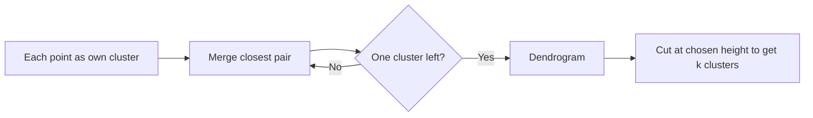

# Hierarchical Clustering

## Beginner-Friendly Intuition

Hierarchical clustering produces a tree of nested clusters, not a flat
partition. At the bottom of the tree, every point is its own cluster. At the
top, all points are one cluster. In between you can cut the tree at any height
to get a clustering of any granularity you want, all from a single fit. The
output is a **dendrogram**: a tree-shaped picture where the height of a join
shows how dissimilar two merged clusters were.

The intuition is genealogical. Imagine each point is a person. Family
relationships are agglomerated upward: siblings join first, then cousins, then
extended families, then communities. The dendrogram shows the whole family
tree at once.

Hierarchical clustering is what you reach for when the question is "what is
the structure of similarity in this data?" rather than "give me exactly `k`
clusters." It is also slow at scale and demands judgment to read; production
workflows usually move to k-means or HDBSCAN once the structure is understood.

## Formal Explanation

Two flavors:

- **Agglomerative (bottom-up).** Start with every point as its own cluster.
  Repeatedly merge the closest pair of clusters until one cluster remains. This
  is the dominant flavor.
- **Divisive (top-down).** Start with everything in one cluster. Repeatedly
  split the most heterogeneous cluster. Rarely used because deciding how to
  split is harder.

The cost of agglomerative is `O(n² log n)` with efficient priority queues, or
`O(n³)` naively. Memory is `O(n²)` for the distance matrix. So 50K rows is
roughly the practical ceiling.

**Distance between points.** Euclidean is the default for continuous data,
cosine for embeddings, Manhattan for L1-robust use, Hamming for binary, custom
for domain-specific cases. Choose this first; it determines what "close" means.

**Linkage criteria** (how the distance between clusters is defined):

- **Single linkage:** distance between the two closest points in the two
  clusters. Produces long chain-like clusters; suffers from "chaining" where
  unrelated clusters get merged through a thin bridge of points.
- **Complete linkage:** distance between the two farthest points. Produces
  compact, ball-shaped clusters. Sensitive to outliers (one far point dominates
  the cluster's diameter).
- **Average linkage (UPGMA):** average of all pairwise distances between the
  two clusters. A reasonable compromise.
- **Ward linkage.** Merges the two clusters that produce the smallest increase
  in total within-cluster variance. Equivalent to a hierarchical version of
  k-means, requires Euclidean distance, and tends to produce balanced clusters.
  The most common default.

The linkage choice changes results substantially. Single linkage on data with a
weak between-cluster bridge can produce one giant blob and many singletons;
Ward on the same data produces clean groups.

**Reading a dendrogram.** The y-axis is the dissimilarity at which two
clusters were merged. Long vertical lines (high merges) indicate that the
clusters being merged were quite different; short lines indicate similar
clusters. To get `k` clusters, draw a horizontal line at a height that
intersects exactly `k` vertical lines. The choice of cut height is yours; the
dendrogram visualizes the data, it does not pick `k` for you.

## Why It Matters in Real Jobs

Three production roles. First, **exploratory data analysis on small
datasets**: if you have 1K to 10K points and want to understand how they
group, hierarchical clustering with Ward linkage and a dendrogram is hard to
beat. Second, **taxonomy building**: organizing products into a category
hierarchy, organizing topics in a corpus, organizing genes by expression
pattern. The natural hierarchy maps to the data hierarchy. Third, **biology
and bioinformatics**, where the algorithm has been a default since the 1960s
because of its alignment with phylogenetic thinking.

It loses for production at scale (above 50K rows) and for cases where you need
a single fixed `k` with no review. K-means and HDBSCAN are the production
follow-ups once exploration is done.

## How It Works Step by Step

1. **Pick a distance metric.** Euclidean for standardized continuous,
   cosine for normalized embeddings, custom for domain-specific.
2. **Pick a linkage.** Ward by default (Euclidean only). Average if you cannot
   use Ward. Avoid single linkage unless you specifically want chaining.
3. **Compute the distance matrix.** scipy `pdist` and `linkage`.
4. **Plot the dendrogram.** scipy `dendrogram`. Inspect the natural cut
   heights; long vertical gaps suggest stable cluster counts.
5. **Cut at a chosen height (or `k`).** scipy `fcluster`.
6. **Validate the clusters.** Compute silhouette score on the cut. Inspect
   per-cluster summaries with a domain expert.
7. **Move to a scalable algorithm if you outgrow the size limit.** K-means
   with `k` chosen from the dendrogram, or HDBSCAN.

## Real-World Example

A bioinformatics team has 800 samples profiled across 18,000 genes. They want
to discover how samples relate. They standardize the gene expression matrix,
compute pairwise correlation distances (`1 - Pearson r`), and run agglomerative
clustering with average linkage. The dendrogram shows three deep groups
splitting at very different heights, plus a few outlier branches. Cutting at
the obvious height gives `k = 3`. They share the dendrogram itself with the
biology team, who immediately recognize the three groups as the known disease
subtypes plus a small fourth group that turns out to be a previously
unrecognized phenotype. K-means with `k = 3` on the same data gives the same
core groupings but no visualization, and would have missed the small group.
For this problem, the dendrogram was the deliverable.

## Common Mistakes

- Using single linkage on noisy data; chaining produces meaningless clusters.
- Standardizing for Ward linkage but forgetting that Ward requires Euclidean
  distance.
- Running on 100K+ rows and waiting hours; pre-cluster with k-means first or
  switch to HDBSCAN.
- Cutting the dendrogram at a height that produces 50 clusters when the data
  has only three natural groups; trust the long vertical gaps.
- Treating cluster IDs from hierarchical clustering as ordered. The IDs are
  arbitrary; the tree structure is the meaningful output.
- Comparing single-linkage and Ward results without acknowledging they
  represent different cluster shapes. They will disagree on data with chains.
- Forgetting that hierarchical clustering does not have an "assign new point"
  step. To assign a new point, you have to refit or use a separate model.

## Interview Angle

**Question:** What is the difference between single, complete, average, and
Ward linkage, and when would you pick each?

**Strong answer:** All four merge the closest pair of clusters at each step;
they differ in what "closest" means.

- **Single linkage** uses the minimum distance between any two points across
  the two clusters. It produces long, chain-like clusters and suffers from
  chaining: a single point bridging two otherwise distant clusters causes them
  to merge prematurely. Useful for elongated structure (e.g., trajectories) and
  rarely otherwise.
- **Complete linkage** uses the maximum distance. It produces compact,
  spherical clusters but is sensitive to outliers, since one far point inflates
  the cluster's diameter.
- **Average linkage** uses the mean of all pairwise distances. A compromise:
  less chain-prone than single, less outlier-sensitive than complete. Good
  default when Ward is not available.
- **Ward linkage** merges the two clusters that minimize the increase in total
  within-cluster variance. It produces balanced, roughly equal-sized,
  spherical clusters. Requires Euclidean distance. The most common default
  for continuous data because it tends to match how humans see "clusters."

Pick by the cluster shape you expect: Ward for compact balanced groups,
single for chains, complete for compact but with outlier care, average for a
neutral choice.

**Weak answer:** Listing definitions without explaining when each fits.

**Follow-up questions:**

- How do you read a dendrogram?
- Why is hierarchical clustering slow on large data?
- How would you assign a new point to a hierarchical clustering after fitting?
- When would you use hierarchical clustering instead of k-means?

## Mini Exercise

Take a 2D dataset of 200 points with three visible clusters. Run hierarchical
clustering with single, complete, and Ward linkage. Plot all three
dendrograms and color-code the points by cluster ID at the natural cut. Note
how the linkage changes the result.

## Diagram

---
## Navigation

[⬅ Previous](10-k-means-clustering.md) | [🏠 Home](../README.md) | [➡ Next](12-dbscan.md)
