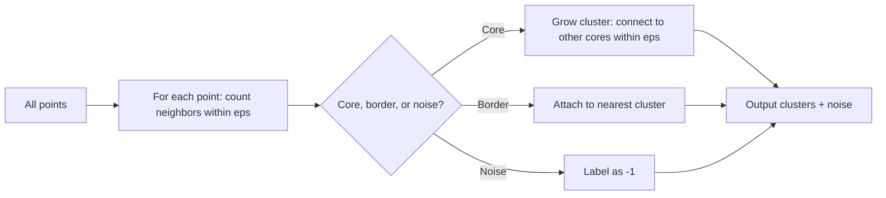

# DBSCAN

## Beginner-Friendly Intuition

DBSCAN clusters points by **density**, not by distance to a centroid. A cluster
is a region of the feature space where points are dense; the gaps between
clusters are sparse. Points that do not fall in any dense region are labeled
**noise** and excluded from every cluster. This is the single biggest reason
DBSCAN exists: unlike k-means, it does not force every point into a cluster,
and it does not care about cluster shape.

The intuition is geographic. Imagine looking at a city map at night. Clusters
are the bright neighborhoods (lots of streetlights close together). Noise is
the highway between cities (sparse lights along a thin line). You can pick out
neighborhoods without caring about how round they are or how big.

DBSCAN works beautifully on non-convex shapes (rings, spirals, blobs of
different sizes), discovers `k` automatically, and tolerates outliers. It
demands two hyperparameters that interact, and its performance degrades on
high-dimensional data and on clusters with very different densities. HDBSCAN
fixes the latter and is the modern follow-up.

## Formal Explanation

DBSCAN (Density-Based Spatial Clustering of Applications with Noise; Ester et
al., 1996) works with two parameters:

- **`eps`** (`ε`): the radius of the neighborhood around a point.
- **`min_samples`** (`MinPts`): the minimum number of points required for a
  region to be considered dense.

For each point `p`, count how many other points are within distance `eps`
(its `eps`-neighborhood). Then:

- **Core point.** A point `p` is a core point if its `eps`-neighborhood
  contains at least `min_samples` points (including `p` itself).
- **Border point.** A point that is within `eps` of a core point but is not
  itself a core point.
- **Noise point.** A point that is neither core nor border.

A cluster is the connected component of core points (any two core points within
`eps` of each other are in the same cluster), plus all border points within
`eps` of any core point in that cluster. Noise points are not in any cluster
and get a label of `-1`.

The algorithm:

```
mark all points as unvisited
for each unvisited point p:
    mark p as visited
    if p is a core point:
        start a new cluster, add p
        expand cluster by recursively adding all density-reachable points
    else:
        mark p as noise (may be reclaimed later as a border point)
```

**Complexity:** with a spatial index (KD-tree, Ball-tree, or R-tree), DBSCAN
runs in `O(n log n)`. Without an index, it is `O(n²)`.

**Choosing `eps`:** the standard heuristic is the **k-distance plot**. For
`k = min_samples`, compute each point's distance to its `k`-th nearest
neighbor, sort all such distances, and plot. The "elbow" of this curve
suggests a good `eps`.

**Choosing `min_samples`:** rule of thumb is `min_samples >= d + 1` where `d`
is dimensionality, with `min_samples = 4` to `10` typical. Higher
`min_samples` produces fewer, larger clusters and labels more points as noise.

## Why It Matters in Real Jobs

Three production roles. First, **anomaly and outlier detection**: DBSCAN's
noise-labeling is a free anomaly detector. Run DBSCAN on user behavior
features; the noise points are candidates for fraud or unusual activity.
Second, **spatial clustering**: GPS traces, ride-hailing pickup hotspots,
satellite imagery patterns. DBSCAN handles arbitrary cluster shapes and
ignores empty space. Third, **non-convex cluster discovery in any domain**
where k-means produces clearly wrong groups (concentric circles, S-shapes,
density variations).

DBSCAN loses on data with **clusters of different densities**: a tight cluster
and a loose cluster need different `eps`, but DBSCAN uses one value globally.
HDBSCAN solves this by varying `eps` per cluster, and is usually the better
modern choice.

## How It Works Step by Step

1. **Standardize features.** DBSCAN uses Euclidean distance by default; one
   large-scale feature dominates `eps`.
2. **Pick `min_samples`.** Default 5; use `2 * d` as a rough heuristic for
   higher dimensions.
3. **Pick `eps` from the k-distance plot.** Compute each point's distance to
   its `min_samples`-th nearest neighbor, sort, and plot. The elbow is your
   `eps`.
4. **Run DBSCAN.** sklearn `DBSCAN`. Use `algorithm = 'ball_tree'` or `kd_tree`
   for low to moderate dimensions; `brute` becomes necessary in very high
   dimensions but is slow.
5. **Inspect cluster sizes and the noise fraction.** A noise fraction of 5 to
   20 percent is normal; 50 percent often means `eps` is too small.
6. **Iterate on `eps`.** If a single cluster is gigantic, decrease `eps`. If
   too many small clusters, increase `eps`.
7. **Switch to HDBSCAN if densities vary.** HDBSCAN auto-selects `eps` per
   cluster and is generally superior on real-world data.

## Real-World Example

A ride-hailing platform wants to identify pickup hotspots in a city. They have
2.5M GPS points (lat, lon) over a month. K-means with `k = 50` produces blobby
circular regions that ignore street layout and merge unrelated zones. DBSCAN
with `eps = 30 meters`, `min_samples = 50` (chosen from the k-distance plot)
produces 312 clusters of varying shapes, plus 18 percent noise (the highways
and rural areas with sparse pickups). The clusters align with venues:
shopping centers, transit stations, entertainment districts. The noise label
is itself useful: it identifies one-off rides not part of a recurring hotspot,
which the team uses to refine driver positioning suggestions. They later
migrate to HDBSCAN because daytime versus nighttime hotspots have very
different densities, which a single `eps` cannot capture.

## Common Mistakes

- Skipping standardization. With one feature in [0, 1] and another in [0, 1000],
  `eps` cannot be set sensibly.
- Picking `eps` arbitrarily without the k-distance plot.
- Using DBSCAN on data with very different cluster densities and being
  surprised when small dense clusters get merged into large loose ones. Use
  HDBSCAN.
- Using DBSCAN at high dimensions (above ~20) without dimensionality reduction.
  Distance concentration makes `eps` selection impossible.
- Treating noise as automatically meaningful. Noise can be true outliers, but
  it can also be points that fall just outside a slightly-too-small `eps`.
- Comparing DBSCAN's number of clusters to k-means's. They are answering
  different questions; DBSCAN's `k` is data-determined.
- Adding new points incrementally and assuming the clusters stay stable.
  DBSCAN does not have a clean online update; HDBSCAN's prediction routines
  approximate this.

## Interview Angle

**Question:** Why does DBSCAN handle non-convex clusters that k-means cannot?

**Strong answer:** K-means partitions the feature space into Voronoi cells
around `k` centroids. Voronoi cells are by definition convex polytopes, so
k-means clusters are always convex. DBSCAN does not use centroids at all. It
defines a cluster as a maximal connected component of density-reachable points,
where two core points are connected if one is within `eps` of the other. This
connectivity-based definition lets a cluster wind through space in any shape:
a ring, a spiral, an S-curve. As long as you can walk from one end of the
shape to the other in `eps`-sized hops through dense regions, the points are
in the same cluster. The cost is two hyperparameters (`eps`, `min_samples`)
and sensitivity to varying density across clusters, which HDBSCAN was
designed to address.

**Weak answer:** "It uses density" without explaining the connectivity
definition or why convexity follows from the centroid model.

**Follow-up questions:**

- How do you choose `eps`?
- What is HDBSCAN and why is it usually better?
- What does DBSCAN do with a single isolated point?
- Why does DBSCAN struggle in high dimensions?

## Mini Exercise

Generate a 2D dataset of two interleaved half-moons plus 30 random noise
points. Run DBSCAN with `eps = 0.2, min_samples = 5`. Run k-means with
`k = 2`. Plot both. Describe in two sentences why the results differ.

## Diagram



---
## Navigation

[⬅ Previous](11-hierarchical-clustering.md) | [🏠 Home](../README.md) | [➡ Next](13-pca.md)
