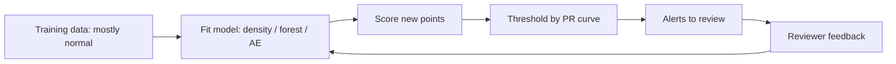

# Anomaly Detection

## Beginner-Friendly Intuition

Anomaly detection asks "is this point unusual?" instead of "what class is this
point?". The difference matters because anomalies, by definition, are rare and
heterogeneous. You almost never have enough labeled examples of every kind of
anomaly to train a regular classifier. Instead, you model what **normal** looks
like and flag points that do not fit.

The intuition is the bouncer at a club. The bouncer does not need to know
every kind of fake ID; they know what a real ID looks like, and anything that
looks off gets a closer look. Anomaly detection algorithms learn the same
"looks off" intuition statistically.

The challenge is two-sided. First, "normal" is rarely a single tight blob; it
is a complicated, multi-modal distribution. Second, evaluation is hard:
labeled anomalies are scarce, and the things you most want to catch are by
definition things you have not seen.

## Formal Explanation

Anomaly detection methods fall into four families.

### 1. Statistical (parametric)

Fit a probability density `p(x)` to the data. Score each point by `-log p(x)`
(higher score = more anomalous). Threshold by quantile or by domain rule.

- **Univariate Gaussian.** Per-feature z-score; flag `|z| > 3`.
- **Multivariate Gaussian.** Mahalanobis distance from the data mean.
- **Mixture models.** Fit a Gaussian mixture; score by likelihood under the
  mixture.

Strengths: principled probability, fast. Weaknesses: assumes a parametric
form; fails on multimodal or non-Gaussian data.

### 2. Distance and density-based

- **Local Outlier Factor (LOF).** Compares each point's local density (mean
  distance to its `k` nearest neighbors) to the densities of those neighbors.
  Anomalies have lower local density than their neighbors do. Handles varying
  density across the dataset.
- **DBSCAN noise points.** Anything DBSCAN labels as `-1`.
- **k-NN distance.** Distance to the `k`-th nearest neighbor; large means
  isolated.

Strengths: non-parametric, handles non-convex shapes. Weaknesses: scales
poorly (`O(n²)` without an index), suffers in high dimensions.

### 3. Tree-based

- **Isolation Forest.** Builds many random trees that recursively partition
  the data on random features and random thresholds. Anomalies tend to get
  isolated (assigned to a leaf alone) at shallower depths than normal points,
  because they are easier to separate. The anomaly score is `2^{-h(x) /
  c(n)}`, where `h(x)` is the average path length over trees and `c(n)`
  normalizes for tree size.

Strengths: scales linearly, no distance computations, works in moderate
dimensions, no scaling needed. The default for tabular anomaly detection.

### 4. Reconstruction-based (model-based)

- **Autoencoders.** Train a neural network to reconstruct the input. Anomalies
  reconstruct poorly; the reconstruction error is the anomaly score.
- **PCA reconstruction.** Project to top-`k` components and reconstruct.
  Reconstruction error is the score.
- **One-class SVM.** Fit a tight boundary (in some kernel space) around the
  normal data. Points outside are anomalies.

Strengths: model-based, can use deep architectures for image/text. Weaknesses:
overfits to training data; an autoencoder trained on enough variety
reconstructs anomalies too well.

### Evaluation

Labeled anomalies are scarce, so:

- **PR-AUC** is the standard metric, since AUC-ROC is misleading at extreme
  imbalance.
- **Recall at fixed precision** ("catch the top 100 alerts; how many were
  real?") matches operational reality.
- **Synthetic injection.** Inject known anomalies (perturbed normal points,
  flipped labels) to estimate detection rate.
- **Backtesting.** Apply the model to historical data and compare flags to
  later-confirmed incidents.

Threshold selection is part of the model. Pick the threshold from the
precision-recall curve based on the cost ratio of false positives (analyst
time) to false negatives (missed anomaly).

## Why It Matters in Real Jobs

Anomaly detection runs fraud detection, intrusion detection, IT monitoring,
manufacturing quality control, financial market surveillance, and healthcare
abnormality screening. The constraint that anomalies are rare and labels are
scarce is universal across these domains. A team that knows how to choose
between Isolation Forest, LOF, and an autoencoder, set thresholds correctly,
and validate without ground truth has a genuine production skill.

## How It Works Step by Step

1. **Define the anomaly.** Point anomaly (a single odd record), contextual
   anomaly (odd given the context), or collective anomaly (a group is odd
   together). The choice changes the algorithm.
2. **Profile the data.** Are features Gaussian? Multimodal? Sparse? Heavy
   tailed? Plot first.
3. **Pick a default by data type.** Tabular numeric: Isolation Forest. Tabular
   with varying density: LOF. Time series: ARIMA residual or
   reconstruction-based deep model. Images: autoencoder. Sequences: LSTM
   reconstruction.
4. **Standardize if the algorithm needs it.** LOF and autoencoders yes;
   Isolation Forest no.
5. **Train on (mostly) normal data.** Some methods (one-class SVM, Isolation
   Forest) tolerate small contamination; others (autoencoders) prefer clean
   training.
6. **Score and threshold.** Compute scores on a held-out set. Pick the
   threshold from the precision-recall curve at your operating point.
7. **Validate.** Inject synthetic anomalies. Backtest on historical incidents.
   Have a domain expert review the top-k alerts.
8. **Monitor in production.** Anomaly distributions shift; retrain and refit
   thresholds on a regular schedule.

## Real-World Example

A payments team builds a fraud anomaly detector. Their labeled fraud rate is
0.3 percent over the last quarter. They train an Isolation Forest on the last
six months of transactions (200 features, 60M rows). They threshold at the
top 1 percent of scores, flagging 600,000 transactions per quarter for
review. PR-AUC on held-out labeled fraud is 0.42. Recall at the threshold is
0.71; precision is 0.21 (one in five flagged transactions is real fraud,
which the review team can sustain). Six months later, fraud patterns shift;
they add a streaming autoencoder per-merchant that flags reconstruction
errors above the merchant's local 99.5th percentile. The combined system
catches a class of synthetic-account fraud that the Isolation Forest missed.

## Common Mistakes

- Using accuracy as the metric. With 0.1 percent anomalies, "predict normal
  always" achieves 99.9 percent accuracy and zero recall.
- Training on contaminated data without realizing it; the anomalies become
  part of the "normal" model.
- Setting the threshold without considering the cost ratio. The cheapest
  threshold to compute (top 1 percent) is rarely the right operating point.
- Treating the anomaly score as a probability without calibration.
- Using a deep autoencoder when the data is small and features are tabular;
  Isolation Forest does as well or better with much less complexity.
- Forgetting that anomalies drift over time. A model trained six months ago
  is detecting six-month-old anomalies, not today's.
- Not having human review in the loop. Almost every real anomaly system
  routes flags to a reviewer; the model is a triage tool, not a final
  decision.
- Ignoring concept drift; the threshold must move as the score distribution
  shifts.

## Interview Angle

**Question:** Walk through how Isolation Forest detects anomalies, and explain
why it works without distance computations.

**Strong answer:** Isolation Forest builds a forest of random trees. Each
tree is constructed by repeatedly choosing a random feature, choosing a
random split threshold within that feature's range, and partitioning the
data. The recursion continues until every point sits in its own leaf or a
maximum depth is reached. The path length from the root to a point's leaf is
its **isolation depth**. Normal points sit in dense regions of the data, so
many random splits are needed to isolate them; their average path length is
long. Anomalies sit in sparse regions; one or two random splits are often
enough to cut them off; their average path length is short. The anomaly
score is `2^{-E[h(x)] / c(n)}`, where `E[h(x)]` is the average path length
across the forest and `c(n)` is the expected path length for a random binary
search tree of size `n`. Score near 1 means anomaly, near 0.5 means normal.
Crucially, no distance is ever computed; only random splits and path lengths.
That makes Isolation Forest work in moderate-to-high dimensions where
distance-based methods break, scale linearly with `n`, and require no feature
scaling.

**Weak answer:** "It uses random trees" without explaining isolation depth or
why distance-free matters.

**Follow-up questions:**

- How does LOF differ from Isolation Forest in what it detects?
- How would you set the threshold for an anomaly score?
- What is the difference between point and contextual anomalies?
- How do you evaluate an anomaly detector without labels?

## Mini Exercise

Generate a 2D dataset of 1,000 points from a Gaussian, plus 20 random outliers
in the corners. Run Isolation Forest, LOF, and a univariate Gaussian z-score
detector. Compute precision and recall on the known outliers at the same
threshold rank. Compare.

## Diagram

---
## Navigation

[⬅ Previous](13-pca.md) | [🏠 Home](../README.md) | [➡ Next](15-time-series-basics.md)
