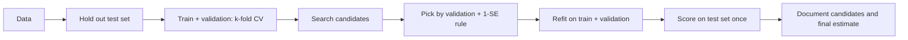

# Model Selection

## Beginner-Friendly Intuition

Model selection is the discipline of choosing one model out of many candidates,
defensibly. The candidates can differ in family (linear vs tree vs neural),
in hyperparameters within a family (learning rate, depth, regularization), or
in feature subsets. The trap is that the candidate that scores best on your
validation data is not necessarily the candidate with the best generalization;
optimizing the validation score across many candidates contaminates it. Model
selection is the set of practices that prevents that contamination and gives
you a defensible best-model claim.

The intuition is statistical. Every candidate evaluation is noisy. If you try
1,000 candidates and pick the best, you have likely picked the candidate that
got the luckiest noise, not the one with the best true performance. Cross-
validation, nested CV, regularization of the search space, and a held-out
final test set are the standard tools that bound that noise.

## Formal Explanation

The selection problem in one line: pick the candidate that minimizes
**generalization error**, estimated honestly. Sources of bias and variance:

- **Bias-variance trade-off.** Underfit candidates have high bias and low
  variance; overfit candidates have low bias and high variance. The validation
  metric weights both. The model with the lowest validation error sits near
  the bias-variance trade-off optimum, but the curve is noisy.
- **Selection bias.** Picking the lowest-error candidate from many trials
  introduces optimistic bias proportional to `sqrt(2 log K / n)` for `K`
  candidates and `n` test points. With many candidates and small validation
  sets, the gap between validation and true error grows.
- **Hyperparameter overfitting.** If you tune thousands of hyperparameters,
  the validation set is implicitly part of the training process. The held-out
  test set must be untouched until the final candidate is chosen.

### Search strategies

- **Grid search.** Sweep all combinations of a small parameter grid.
  Exhaustive but quickly impractical: 5 hyperparameters with 5 values each is
  3,125 fits.
- **Random search.** Sample hyperparameter combinations from a distribution.
  Bergstra and Bengio (2012) showed random search outperforms grid search at
  the same compute budget on most realistic surfaces, because grid search
  wastes axes that do not matter.
- **Bayesian optimization.** Build a surrogate model (typically a Gaussian
  process or a tree-based regressor) of the objective surface and pick the
  next candidate by an acquisition function (expected improvement, UCB).
  Efficient for expensive evaluations (e.g., training large models).
  Libraries: scikit-optimize, Optuna, Hyperopt.
- **Hyperband / BOHB.** Successive halving: start many candidates with small
  budgets, kill the worst, give more compute to the survivors. Good for
  iterative training (neural networks).
- **Population-based training (PBT).** Multiple workers train in parallel;
  periodically the worst worker copies the best worker's hyperparameters with
  a perturbation. Used in DeepMind's RL training.

### Information criteria (no held-out set)

For probabilistic models with explicit likelihood:

- **AIC** = `2 k - 2 log L`. Penalizes the log-likelihood by parameter count.
- **BIC** = `k log n - 2 log L`. Penalizes more strongly with `n`.

Lower is better. AIC tries to minimize predictive error; BIC tries to find the
true model. They give different rankings; pick by what you care about.

### Nested cross-validation

When you tune hyperparameters AND want an unbiased generalization estimate,
nest two loops:

- **Outer loop:** k-fold split. For each outer fold:
- **Inner loop:** k-fold CV on the outer training fold to pick
  hyperparameters.
- Train with those hyperparameters on the outer training fold; evaluate on
  the outer test fold.
- Average outer test scores.

The outer loop's score is an honest estimate of generalization. The cost is
`k_inner * k_outer` model fits.

### Train / validation / test discipline

Without nested CV, the standard split is:

- **Train.** Fit model parameters.
- **Validation.** Tune hyperparameters and select among candidates.
- **Test.** A held-out set used **once**, after the final model is chosen,
  to report the production estimate.

Touching the test set during selection invalidates the production estimate.

## Why It Matters in Real Jobs

Three production reasons. First, defensibility: you have to be able to
answer "why this model?" with more than "it had the best validation score."
A senior engineer's selection process names the candidates considered, the
search strategy, the validation protocol, and the final test estimate, with
intervals. Second, deployment risk: the validation score and the production
score should agree within reasonable bounds. If they do not, the selection
process leaked something. Third, retraining: the chosen hyperparameters are
artifacts of the data slice you trained on. Periodic retraining must redo
selection, not just refit.

## How It Works Step by Step

1. **Hold out the test set first.** A 10 to 20 percent slice, time-ordered for
   time series, group-aware for grouped data. Lock it away.
2. **Split the rest into train and validation, or use k-fold CV.** 5-fold or
   10-fold CV for moderate data; a single held-out validation for very large
   data.
3. **Define the candidate space.** Model families and hyperparameter ranges.
   Use log scales for learning rates and regularization strengths.
4. **Choose a search strategy.** Random search is the default. Bayesian for
   expensive evaluations. Hyperband for iterative training.
5. **Run the search.** Track every candidate's validation score and timing.
6. **Pick the best by validation score, or by a one-standard-error rule** (the
   simplest model whose score is within one standard error of the best). The
   1-SE rule fights overfitting to validation noise.
7. **Refit the chosen candidate on train + validation combined.** More data,
   same hyperparameters.
8. **Evaluate on the held-out test set once.** Report the score with a CI.
   Do not iterate after this step.
9. **Document.** Candidate space, search strategy, scores per candidate, final
   test score with interval. Future you will thank present you.

## Real-World Example

A team chooses between logistic regression, random forest, gradient boosted
trees, and a small MLP for a binary classification task. They hold out 15
percent as the test set. On the remaining 85 percent, they run 5-fold CV.
Logistic regression: 0.78 AUC. Random forest with random search over 50
configs: 0.81. LightGBM with random search over 100 configs: 0.84. MLP with
random search over 60 configs: 0.83. They pick LightGBM. They refit LightGBM
on the full 85 percent. Test AUC is 0.84 with a bootstrap 95 percent CI of
[0.83, 0.85]. They report all four candidates' validation scores in the
project doc. Six months later when retraining on fresh data, they redo the
random search; the new optimal hyperparameters differ slightly, which is
expected.

## Common Mistakes

- Tuning on the test set; the test estimate becomes meaningless.
- Reporting the best validation score from many trials as the production
  estimate; selection bias inflates it.
- Using grid search when random search would be faster; especially with more
  than four hyperparameters.
- Picking the model with the highest validation AUC by 0.001 over a much
  simpler model; the 1-SE rule and qualitative judgment matter.
- Forgetting to refit on train + validation after selection.
- Comparing models with different validation splits and pretending the scores
  are comparable.
- Skipping nested CV when you have small data and many hyperparameters; the
  selection bias is significant.
- Picking by accuracy on imbalanced data, by AUC on a problem where threshold
  matters, or by RMSE when the business cares about percentage error. Match
  the metric to the deployment cost.

## Interview Angle

**Question:** Why might a model that performs best on the validation set
generalize worse than a model that scores slightly lower?

**Strong answer:** Validation scores are noisy estimates of generalization
error. Picking the highest-scoring candidate from many trials introduces
selection bias proportional to roughly `sqrt(2 log K / n)` for `K` candidates
and `n` validation points. The "winner" is partly winning real performance
and partly winning the lucky-noise lottery. The slightly-lower candidate
might have lower true generalization error but unluckier validation noise on
this particular split. Two practical fixes. First, the **one-standard-error
rule**: pick the simplest model whose validation score is within one
standard error of the best. Second, **nested cross-validation**: the outer
loop estimates generalization without contamination from selection. Both
trade some best-case validation score for a lower variance and lower bias
estimate of true performance, which is what you actually want when you ship.

**Weak answer:** "Lucky split" without quantifying or naming the fixes.

**Follow-up questions:**

- When would you use nested CV?
- What is the one-standard-error rule?
- How do you decide between random search and Bayesian optimization?
- What is AIC and when is it useful?

## Mini Exercise

Pick any tabular dataset. Define a candidate space of three model families
with three hyperparameters each. Run random search with 30 trials per family.
Apply the one-standard-error rule. Compare the chosen candidate to the
"best validation" candidate on a held-out test set.

## Diagram

---
## Navigation

[⬅ Previous](15-time-series-basics.md) | [🏠 Home](../README.md) | [➡ Next](17-cross-validation.md)
