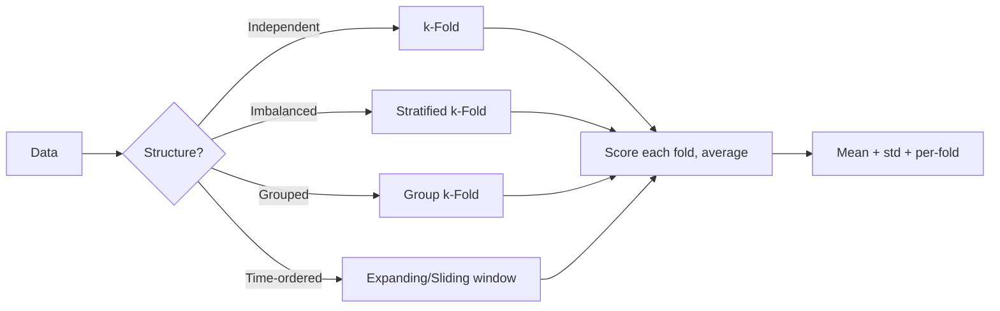

# Cross-Validation

## Beginner-Friendly Intuition

Cross-validation (CV) is the discipline of using your data to estimate how a
model will perform on data it has not yet seen. The idea is simple: rather
than trusting a single train/test split (which might get lucky or unlucky),
split the data multiple ways, fit on each training portion, score on each
held-out portion, and average. The average and its spread are a more honest
estimate of generalization than any single split.

The intuition is statistical. Each fold's score is a noisy estimate of true
performance. Averaging many noisy estimates reduces variance roughly as
`1 / sqrt(k)` for `k` folds. The standard deviation across folds tells you how
much your validation metric depends on which split you chose, which is
information you cannot extract from a single split.

The catch is that CV only works correctly when the splits respect the data's
structure. Random k-fold on time series is a leakage bug. Random k-fold on
grouped data (multiple rows per user) overestimates generalization to new
users. The right CV strategy is the one that mimics the deployment
distribution.

## Formal Explanation

### k-Fold CV

Divide the data into `k` equal-sized folds. For each fold `i`:

1. Train on the union of all folds except `i`.
2. Score on fold `i`.
3. Record the score.

Average the `k` scores; report the mean and standard deviation. Common
choices: `k = 5` or `k = 10`. Larger `k` gives a lower-bias estimate but
higher variance and higher cost.

### Leave-One-Out CV (LOO)

`k = n`. Each fold contains one row. Nearly unbiased estimate but extremely
high variance and `n` model fits.

### Stratified k-Fold

For classification, ensure each fold has roughly the same class balance as
the full dataset. Critical for imbalanced data: a random fold of an 8 percent
positive class might land at 0 percent positives in a 100-row fold, which
breaks any class-aware metric. sklearn's `StratifiedKFold` is the default
for classification.

### Group k-Fold

When data has groups (multiple rows per user, multiple measurements per
patient, multiple sensors per device), random splitting puts the same group
in both train and test. The model learns user-specific shortcuts that do not
generalize. Group k-fold ensures every group is in exactly one fold.
sklearn's `GroupKFold`.

### Time-Series CV

Time-ordered splitting. Two common patterns:

- **Expanding window.** Train on [1..T], test on [T+1..T+h]; train on
  [1..T+h], test on [T+h+1..T+2h]; and so on. Mimics retraining as data
  arrives.
- **Sliding window.** Train on [t..t+W], test on [t+W+1..t+W+h], shift the
  window. Useful when the relationship changes over time and old data is not
  representative.

`sklearn.model_selection.TimeSeriesSplit` implements expanding window.

### Repeated k-Fold

Run k-fold multiple times with different random seeds. Reduces variance from
the random fold assignment. Useful when CV variance is high.

### Nested CV

Two CV loops: the outer loop estimates generalization, the inner loop tunes
hyperparameters. Crucial when you want both a model AND an honest
generalization estimate. See
[16-model-selection.md](16-model-selection.md) for details.

### Bootstrap

Sample `n` rows with replacement, train on the sample, score on the rows
not in the sample (the out-of-bag set, about 36.8 percent of unique rows).
Repeat `B` times. Lower variance than k-fold for small data; built into
random forests as OOB error.

## Why It Matters in Real Jobs

CV is the line between an honest model and a fragile one. Three production
reasons. First, **calibrated uncertainty**: a single validation score gives
you a number; CV gives you a distribution, and the spread tells you how much
to trust the number. A team that ships "AUC 0.84" without an interval is
lying by omission. Second, **leakage detection**: when CV scores swing
wildly across folds, something is leaking through the split. The
investigation usually finds a feature computed from data that includes the
test rows. Third, **fair model comparison**: comparing two models on the
same CV folds removes the luck of any particular split, letting small
differences become meaningful.

## How It Works Step by Step

1. **Identify the data structure.** Independent rows, classes, groups, time
   ordering, mixed.
2. **Pick the matching CV strategy.**
   - Independent rows, balanced classes: k-fold.
   - Independent rows, imbalanced classes: stratified k-fold.
   - Grouped data: group k-fold.
   - Time series: time-series split, never random.
   - Hyperparameter tuning + generalization: nested CV.
3. **Pick `k`.** 5 or 10 for most tabular data; higher for very small data.
4. **Use the same splits for all candidates.** Reproducibility and fair
   comparison.
5. **Average and report.** Mean, standard deviation, and the score per fold.
   A spike in one fold is a clue worth investigating.
6. **Watch for the test set.** CV uses train + validation; the held-out test
   set is separate and untouched until final evaluation.
7. **Refit on the full training data.** After CV chooses hyperparameters,
   refit the final model on all data except the held-out test set, so the
   shipped model sees more data than any single fold's training portion.

## Real-World Example

A team predicts loan default. Data is grouped by applicant (each applicant
has multiple loan applications over time). Their first attempt: 5-fold random
CV gives AUC 0.91 with std 0.005. They ship; production AUC is 0.74. The
investigation: random splits put the same applicant's loans in both train
and test, and several features (e.g., "applicant's average late payments")
were computed across all of the applicant's loans, leaking the future. They
switch to GroupKFold with applicant as the group. CV AUC drops to 0.78,
matching production within noise. They refit features to be strictly
"applicant's history before this loan's date" and CV AUC rises to 0.81.
That number is the honest estimate. The lesson: the right split protects
you from yourself.

## Common Mistakes

- Random k-fold on time series. Leakage is silent and the model collapses
  in production.
- Random k-fold on grouped data. The model learns to recognize the user/
  patient/device, not the underlying signal.
- Computing scaling, imputation, or feature encodings on the full dataset
  before splitting. The transformation has seen the test rows. Pipelines
  fix this; do not skip them.
- Reporting only the mean CV score, not the spread. A high-mean
  high-variance result might be worse than a slightly-lower-mean
  low-variance result.
- Using LOO when k-fold would do. LOO is high-variance and expensive;
  rarely the right call.
- Tuning on the average CV score across many candidates without a held-out
  test set; selection bias inflates the reported number.
- Picking different folds for different candidates and then comparing.
  Always use the same folds.
- Not stratifying on imbalanced data; some folds end up with zero
  positives.

## Interview Angle

**Question:** When is k-fold CV the wrong choice, and what do you use
instead?

**Strong answer:** Three common cases.

First, **time-series data**. Random k-fold puts future rows in the training
set and past rows in the test set, which is the opposite of the deployment
task. The autocorrelation in time series makes future-from-past
interpolation easy, so CV scores look great and production fails. Use
expanding-window or sliding-window CV that respects time order.

Second, **grouped data** (multiple rows per user, patient, device, store).
Random k-fold splits a group across folds, so the model can memorize
group-specific shortcuts and "generalize" by recognizing the group, not
the underlying signal. CV scores overstate generalization to new groups.
Use GroupKFold or LeaveOneGroupOut.

Third, **highly imbalanced classification**. Random k-fold on 1 percent
positives might produce a fold with zero positives, making the metric
undefined. Use StratifiedKFold to preserve class balance per fold.

In all three, the principle is the same: the CV split must mimic the
deployment task. Whatever the production model will be asked to do (predict
the future, predict for a new user, predict on the same imbalance) must be
what each fold's evaluation simulates.

**Weak answer:** "Use a different split sometimes" without naming the cases.

**Follow-up questions:**

- What is stratified k-fold and when is it required?
- How does nested CV differ from regular k-fold?
- When would you use bootstrap instead of k-fold?
- How do you do CV with severe imbalance and grouped data at the same time?

## Mini Exercise

Take a dataset with a known group structure (e.g., MNIST with the digit as
the group, or a tabular dataset with a user ID). Run k-fold CV ignoring the
groups, then GroupKFold. Compare the mean and spread of validation scores.
Note the difference.

## Diagram

---
## Navigation

[⬅ Previous](16-model-selection.md) | [🏠 Home](../README.md) | [➡ Next](18-evaluation-metrics.md)
