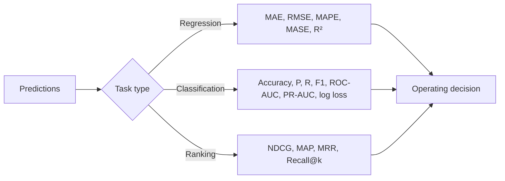

# Evaluation Metrics

## Beginner-Friendly Intuition

A metric translates model behavior into a single number that decides whether
the model is good enough to ship. Pick the wrong metric and you optimize the
wrong thing. The hardest part of evaluation is not computing metrics; it is
choosing the metric that matches the cost of mistakes in your specific
problem. Accuracy on a 99 percent negative class is meaningless. RMSE when
the business cares about percentages is misleading. AUC on a problem where
the threshold is what matters is a distraction.

The intuition: every metric is a bet on what counts. RMSE bets that large
errors hurt more than small ones. MAE bets they hurt the same per unit.
Precision bets false positives are costly. Recall bets false negatives are.
Match the metric to the business cost and the rest of evaluation becomes
straightforward.

## Formal Explanation

### Regression metrics

- **MAE (Mean Absolute Error).** `(1/n) Σ |y_i - ŷ_i|`. In original units.
  Robust to outliers. Use when each unit of error costs the same.
- **RMSE (Root Mean Squared Error).** `sqrt((1/n) Σ (y_i - ŷ_i)²)`. In
  original units. Penalizes large errors quadratically. Use when occasional
  big misses are very expensive.
- **MSE.** RMSE squared. Same shape, less interpretable in original units.
- **MAPE (Mean Absolute Percentage Error).** `(100/n) Σ |y_i - ŷ_i| / |y_i|`.
  Scale-free but blows up near zero, asymmetric (under-forecasts and
  over-forecasts cost differently).
- **sMAPE (Symmetric MAPE).** Mitigates one of MAPE's asymmetries; still
  unstable near zero.
- **MASE (Mean Absolute Scaled Error).** Error relative to a naive baseline.
  Robust, scale-free, recommended for time-series benchmarks.
- **R² (Coefficient of determination).** `1 - SSres / SStot`. Fraction of
  variance explained. Easy to game with overfitting; report on a held-out set.
- **Adjusted R².** Penalizes parameter count. Use when comparing models with
  different feature counts.
- **Quantile loss (pinball loss).** For predicting a quantile `τ`. Use when
  the deliverable is a prediction interval.
- **Huber loss.** Quadratic for small errors, linear for large ones. Robust
  to outliers while keeping smooth gradients.

### Binary classification metrics

For threshold-based classification, define from the confusion matrix:

| | Predicted + | Predicted − |
| --- | --- | --- |
| Actual + | TP | FN |
| Actual − | FP | TN |

- **Accuracy.** `(TP + TN) / (TP + TN + FP + FN)`. Useless on imbalanced
  data.
- **Precision.** `TP / (TP + FP)`. Of the positive predictions, what fraction
  is correct? Use when false positives are costly.
- **Recall (Sensitivity, TPR).** `TP / (TP + FN)`. Of the actual positives,
  what fraction did we catch? Use when false negatives are costly.
- **F1.** Harmonic mean of precision and recall. `2 P R / (P + R)`. A
  balanced compromise; use when both matter.
- **F-beta.** `(1 + β²) P R / (β² P + R)`. `β > 1` weights recall, `β < 1`
  weights precision.
- **Specificity (TNR).** `TN / (TN + FP)`. Recall on the negative class.

For probability or score outputs:

- **ROC-AUC.** Area under the receiver operating characteristic curve (TPR vs
  FPR across thresholds). Threshold-independent, scale-invariant.
  Misleading on heavily imbalanced data because FPR is tiny when negatives
  are abundant.
- **PR-AUC.** Area under the precision-recall curve. The right
  threshold-independent metric for imbalanced data.
- **Log loss (cross-entropy).** `-(1/n) Σ [y log p + (1-y) log(1-p)]`.
  Penalizes confident wrong predictions heavily. Optimized directly by
  logistic regression and most calibrated classifiers.
- **Brier score.** Mean squared error of predicted probabilities. Lower is
  better.
- **Calibration error.** ECE (expected calibration error): bin predictions
  by probability, compare bin mean prediction to bin actual rate, average
  weighted by bin size.

### Multiclass metrics

- **Macro F1.** Unweighted mean of per-class F1. Treats every class equally.
- **Weighted F1.** Mean weighted by support. Tracks majority class.
- **Micro F1.** Computed from total TP, FP, FN across classes. Equals
  accuracy in single-label problems.
- **Top-k accuracy.** True class is in the top-k predicted classes.

### Ranking metrics

- **NDCG@k (Normalized Discounted Cumulative Gain).** Position-discounted
  relevance, normalized by the ideal ranking. Standard for graded relevance.
- **MAP (Mean Average Precision).** Mean over queries of average precision.
  Standard for binary relevance.
- **MRR (Mean Reciprocal Rank).** `1/rank` of the first relevant item,
  averaged over queries.
- **Recall@k, Precision@k, Hit Rate.** Simple top-k metrics for retrieval
  and recommendation.

## Why It Matters in Real Jobs

The metric you ship on is the metric that drives every future decision.
Three production reasons. First, **business alignment**: pricing teams care
about percentage error, fraud teams care about recall at fixed precision,
ranking teams care about NDCG. Reporting RMSE to a fraud team is a
miscommunication. Second, **threshold setting**: precision-recall trade-offs
must be explicit. The default 0.5 threshold is rarely optimal. Third,
**fairness and uncertainty**: a single aggregate metric hides per-segment
performance. Per-cohort metrics surface bias.

## How It Works Step by Step

1. **Identify the cost structure.** What does a false positive cost? A
   false negative? A 10 percent error vs a 100 percent error?
2. **Pick a primary metric matched to the cost.** This is the number that
   decides launch.
3. **Pick guardrail metrics.** Latency, fairness slices, calibration.
4. **Pick at most one threshold-independent and one threshold-dependent
   metric.** ROC-AUC plus precision at fixed recall, for example.
5. **Compute on a held-out set with bootstrap CIs.** Single numbers without
   intervals are a lie of omission.
6. **Slice by segment.** Country, device, plan, time window. The aggregate
   often hides where the model is broken.
7. **Compare to baselines.** Naive, last-value, simple rule. If your model
   does not beat these, the model is not the answer.
8. **Lock the metric before iterating.** Selecting the metric after seeing
   results is a form of p-hacking.

## Real-World Example

A team predicts repair part failure 30 days ahead. The cost of a missed
failure is high (downtime); the cost of a false alarm is moderate (a
technician visit). They evaluate four candidate metrics. Accuracy: useless
because 99.5 percent of parts do not fail. ROC-AUC: 0.88, looks good but
hides the operating point. PR-AUC: 0.34, more honest about the imbalance.
Recall at precision 0.7: 0.41. They pick "recall at precision 0.7" as the
primary metric, because the technician dispatch system can sustain at most
30 percent false alarms. The chosen threshold is the one on the
precision-recall curve where precision = 0.7. They also report PR-AUC for
threshold-independent comparison and per-region recall for fairness. Six
months later, the technician system can sustain higher false-alarm rates
after process improvements; they revisit the threshold and lift recall to
0.55 at precision 0.55.

## Common Mistakes

- Reporting accuracy on imbalanced data and concluding the model is
  excellent.
- Using ROC-AUC as the headline on a heavily imbalanced problem; PR-AUC is
  more honest.
- Comparing AUC across datasets with different positive rates and
  concluding one model is "better"; it depends on the rate.
- Using MAPE on series that include zeros.
- Picking the threshold on the test set.
- Tuning threshold and reporting performance at that threshold without
  saying you tuned.
- Reporting one number with no interval.
- Aggregating across segments and missing per-segment failures (a 0.85
  global AUC can mean 0.95 in one country and 0.55 in another).
- Optimizing log-loss but reporting AUC; the relationship is approximate
  and depends on calibration.
- Using F1 by default without thinking about whether precision or recall
  matters more.

## Interview Angle

**Question:** Why is ROC-AUC misleading on imbalanced data, and what should
you use instead?

**Strong answer:** ROC-AUC is the area under the curve of TPR vs FPR.
FPR is `FP / (FP + TN)`. When negatives vastly outnumber positives, even a
large absolute number of false positives makes a tiny dent in FPR, because
TN is so large. So a model can move from "useless" to "decent" while the
ROC curve barely changes, and a model can have high ROC-AUC while
operating in a region where precision is terrible. Concretely, with 1
percent positive rate and 1,000 false positives out of 99,000 negatives,
FPR is 0.01, which on a ROC plot is invisible; but those 1,000 false
positives might overwhelm the maybe 50 true positives, making precision
0.05. The PR curve plots precision vs recall directly. Both are computed
in terms of TP, FP, FN; TN never enters. So the curve is sensitive exactly
where ROC-AUC is not. PR-AUC is the right threshold-independent metric for
heavily imbalanced classification. Combine with recall at fixed precision
(or vice versa) to nail down the operating point.

**Weak answer:** "Use PR-AUC for imbalance" without explaining why ROC-AUC
hides the problem.

**Follow-up questions:**

- When would you optimize log-loss over accuracy?
- What is calibration and why does it matter?
- How do you choose between MAE and RMSE?
- What is NDCG and when do you use it?

## Mini Exercise

Take any binary dataset. Train one model. Compute accuracy, ROC-AUC,
PR-AUC, F1 at threshold 0.5, and recall at precision 0.7. Report all five
with bootstrap 95 percent CIs. Note which metrics agree and which diverge,
and explain why.

## Diagram

---
## Navigation

[⬅ Previous](17-cross-validation.md) | [🏠 Home](../README.md) | [➡ Next](19-interpretability-shap-lime.md)
