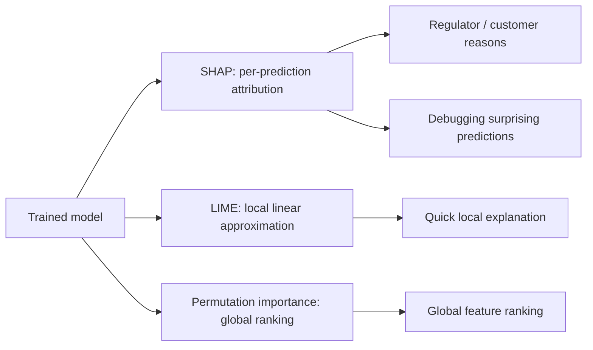

# Interpretability: SHAP and LIME

## Beginner-Friendly Intuition

Interpretability is the answer to "why did the model say that?" When the model
is a linear regression, the answer is the coefficient. When it is a deep
gradient-boosted ensemble, "the answer" requires more work. SHAP and LIME are
the two dominant methods that explain a single prediction by attributing the
output to each input feature.

The intuition: imagine the model output as a collaboration of features.
Without features, the model would predict the dataset mean. With each feature
turned on (set to its actual value), the prediction shifts. The shift
attributable to each feature is its contribution to that prediction. SHAP
formalizes this with cooperative game theory; LIME approximates it with a
local linear model.

Why these and not raw feature importances? Built-in tree feature importances
(Gini gain, permutation importance) tell you about the model globally, not
about a single prediction. Stakeholders, regulators, and debugging sessions
ask about specific predictions. Per-prediction explanations are what SHAP and
LIME provide.

## Formal Explanation

### SHAP (SHapley Additive exPlanations)

SHAP values come from cooperative game theory (Shapley, 1953). Treat each
feature as a player in a coalition; the model output is the payout. The
Shapley value `φ_i` for feature `i` is its average marginal contribution to
the prediction across all possible orderings of features:

```
φ_i = Σ_{S ⊆ N \ {i}} [|S|! (|N| - |S| - 1)! / |N|!] · [f(S ∪ {i}) - f(S)]
```

where `f(S)` is the model's expected output given only the features in `S`.
Computing this exactly is exponential in the feature count; practical
algorithms approximate it.

**Properties** (which uniquely characterize Shapley values):

- **Local accuracy.** The sum of SHAP values plus the base value equals the
  model's output: `f(x) = φ_0 + Σ φ_i`.
- **Missingness.** Features with no value get zero contribution.
- **Consistency.** If a model changes so that a feature contributes more in
  every coalition, its SHAP value cannot decrease.

**Practical algorithms:**

- **TreeSHAP.** Exact, polynomial-time SHAP values for tree ensembles
  (XGBoost, LightGBM, CatBoost, sklearn trees). The default for tabular
  models. Fast and exact.
- **KernelSHAP.** Model-agnostic, approximates Shapley values by sampling
  feature coalitions and fitting a weighted linear model. Slow.
- **DeepSHAP.** For neural networks, leverages backpropagation.
- **GradientSHAP, IntegratedGradients.** Path-integral methods for deep
  networks, related to SHAP under specific assumptions.

**Visualizations:**

- **Force plot.** Shows how each feature pushes the prediction up or down
  from the base value, for a single example.
- **Summary plot.** Per-feature SHAP value distribution across the dataset;
  reveals global importance and effect direction.
- **Dependence plot.** SHAP value vs feature value, colored by an
  interacting feature; reveals non-linear effects.

### LIME (Local Interpretable Model-agnostic Explanations)

LIME explains a single prediction by fitting a simple, interpretable model
(usually linear or sparse linear) on perturbed samples around the input.

Algorithm:

1. Pick the example `x` to explain.
2. Generate `n` perturbed samples around `x` (sample features from the
   training distribution, mask features with mean values, sample word
   subsets for text).
3. Get the black-box model's predictions on the perturbed samples.
4. Weight each perturbed sample by its similarity to `x` (typically
   exponential decay in distance).
5. Fit a sparse linear model on the weighted perturbed samples, predicting
   the black-box output.
6. Return the linear model's coefficients as the explanation.

LIME is **local**: the linear approximation is only good near `x`. The
coefficients are not the global feature importances; they are the local
linear slopes.

### SHAP vs LIME

- **Theoretical foundation.** SHAP has a unique solution under three
  axioms; LIME does not. SHAP values are invariant to feature ordering;
  LIME results can vary with random sampling.
- **Speed on tree models.** TreeSHAP is exact and fast; KernelSHAP and
  LIME are slow.
- **Explanation type.** Both produce per-feature attributions; SHAP is
  additive (sums to the prediction), LIME is approximate.
- **Stability.** SHAP is more stable across runs; LIME's perturbation
  sampling produces noisier results.
- **Practical default.** TreeSHAP for tabular tree models, DeepSHAP for
  neural nets, LIME for quick model-agnostic baselines or text.

### Other Interpretability Tools

- **Permutation importance.** Shuffle a feature's values, measure the metric
  drop. Global importance, not per-prediction.
- **Partial dependence plot (PDP).** Average model output as one feature
  varies, marginalizing the others. Global, smooth, hides interactions.
- **Individual Conditional Expectation (ICE).** Like PDP but per-instance,
  reveals interaction-induced heterogeneity.
- **Counterfactual explanations.** "What is the smallest change to features
  that flips the prediction?" Useful for actionable explanations ("increase
  income by $5K to be approved").
- **Feature ablation.** Re-evaluate the model with feature `j` zeroed out.
  Easy but does not handle correlated features cleanly.

## Why It Matters in Real Jobs

Three production roles. First, **regulatory compliance**: in finance,
healthcare, and increasingly hiring, you must be able to tell a customer or
a regulator why a specific decision was made. SHAP per-prediction
attribution is the standard answer. Second, **debugging**: SHAP summary plots
catch leaky features ("this feature has a huge importance and you did not
expect it to matter"), data bugs, and surprising interactions. Third, **trust
and adoption**: stakeholders who understand a model adopt it. The team that
ships SHAP plots alongside the predictions gets buy-in faster than the team
that does not.

The cost is real: TreeSHAP is fast for trees but KernelSHAP is slow for
arbitrary models, and explanations themselves can be misinterpreted. A SHAP
value is not a causal effect; it is the contribution of a feature **to this
specific model's output**, which depends on what the model learned (which
might be wrong).

## How It Works Step by Step

1. **Pick the right SHAP variant.** TreeSHAP for trees, DeepSHAP for nets,
   KernelSHAP for everything else.
2. **Compute SHAP values on a representative sample.** Often 1,000 to
   10,000 examples is enough; full datasets are unnecessary.
3. **Inspect the summary plot first.** Global feature importance plus
   direction of effect.
4. **Use dependence plots for non-linear features.** Reveals if the model
   is doing something weird (saturation, sign flip, leaked threshold).
5. **For specific predictions, use force plots or waterfall plots.** Show
   the user the top features pushing the prediction up or down.
6. **Audit unexpected importances.** A feature that should be a noise
   feature but has high SHAP value is a leakage candidate.
7. **Document the interpretation pipeline.** Future you and the team need
   to know how the explanations were generated.

## Real-World Example

A bank deploys a credit scoring model. The model is XGBoost with 80
features. Compliance requires a per-decline reason. They compute TreeSHAP
values per decision. For each declined application, the top three SHAP
contributions become the reason codes shown to the customer ("credit
utilization above 80 percent contributed to the decision"). The risk team
inspects the global summary plot weekly and catches a feature whose
importance jumped suddenly: an upstream pipeline started reporting nulls
as -1 instead of NaN, and the model learned to use -1 as a strong signal.
SHAP caught it in 30 seconds; without SHAP it would have shown up only as
a slow drift in approval rates.

## Common Mistakes

- Treating SHAP values as causal. SHAP attributes the **model's**
  prediction to features given **what the model learned**. If the model
  learned a spurious correlation, SHAP will faithfully attribute the
  prediction to that spurious feature.
- Comparing SHAP values across models or datasets without scaling. They
  are in the units of the model output.
- Using KernelSHAP on a large dataset and waiting hours; switch to
  TreeSHAP if you have a tree model.
- Showing the customer per-feature contributions without aggregating
  one-hot dummies; the customer sees "city_NYC contributed -0.05" rather
  than "city contributed -0.05."
- Reading LIME explanations as global; they are valid only near the
  explained point.
- Trusting LIME on a single run. The perturbation sampling is noisy; run
  multiple times and average.
- Applying SHAP to a deeply correlated feature set without
  interventional/SHAP-tree-path-dependent methods; correlated features
  share credit and the attribution can be ambiguous.
- Confusing SHAP with permutation importance. They answer different
  questions (per-prediction attribution vs global drop in metric).

## Interview Angle

**Question:** What is a SHAP value, what makes it different from
permutation feature importance, and when would you use each?

**Strong answer:** A SHAP value `φ_i` is the contribution of feature `i`
to a single prediction, computed as the average marginal contribution
across all orderings of features in a cooperative game where the payout
is the model output. SHAP values are signed (positive or negative,
indicating direction), additive (sum to the prediction minus the base
value), and exist per-prediction. They are local in the sense that each
prediction has its own attribution.

Permutation feature importance is global. It measures how much a model's
metric drops when you randomly shuffle a feature's values. It tells you
how much the model relies on that feature on average across the dataset,
but not how it relies on it for any specific prediction.

Use SHAP when you need per-prediction explanations: regulator-facing
reason codes, customer-facing decision explanations, or debugging a
specific surprising prediction. Use permutation importance when you need
to rank features by global importance, especially if you suspect spurious
high-cardinality features (the built-in Gini importance is biased toward
them; permutation is not). Both can be wrong if features are correlated;
SHAP attributes credit by averaging across orderings, which spreads
correlated-feature credit but can still be misleading. Permutation
importance double-counts correlated features.

**Weak answer:** "SHAP is more accurate" without explaining the
per-prediction vs global distinction.

**Follow-up questions:**

- What is the difference between TreeSHAP and KernelSHAP?
- Why is SHAP not a measure of causality?
- How would you handle correlated features in a SHAP analysis?
- When would you use a partial dependence plot instead of SHAP?

## Mini Exercise

Train a LightGBM model on any tabular dataset. Compute TreeSHAP values for
a sample of 100 predictions. Plot the summary plot and a dependence plot
for the top feature. Pick one specific prediction and explain its top
three contributing features in plain English.

## Diagram



---
## Navigation

[⬅ Previous](18-evaluation-metrics.md) | [🏠 Home](../README.md) | [➡ Next](20-classical-ml-interview-patterns.md)
