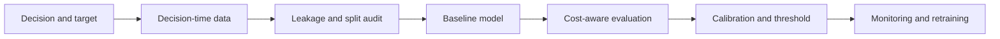

# Classical ML Interview Patterns

## Beginner-Friendly Intuition

Classical ML interviews are usually not tests of how many algorithms you can name. They test whether
you can turn messy tabular data into a measurable decision, build a baseline, prevent leakage,
evaluate honestly, and explain why a model is trustworthy enough to use.

The pattern is simple: define the prediction target, inspect the data available at decision time,
choose the simplest baseline, measure errors by slice, then justify any added complexity. If you
cannot explain why logistic regression, a decision tree, or a gradient-boosted model is appropriate,
the interviewer will not trust a more complex answer.

## Formal Explanation

Classical ML interview answers should connect four layers:

- **Problem framing:** user, decision, target variable, prediction horizon, and cost of mistakes.
- **Data design:** features available before the decision, label source, missingness, leakage risk,
  and train-validation-test split strategy.
- **Modeling path:** baseline, feature transformations, candidate model families, calibration,
  interpretability, and thresholding.
- **Evaluation and operations:** primary metric, guardrails, segment analysis, drift monitoring,
  retraining trigger, rollback, and human review.

A strong answer is not "use XGBoost." A strong answer explains why a regularized linear model might
be the first baseline, why tree ensembles may improve nonlinear interactions, how class imbalance
changes metrics, and how confidence or thresholds connect to product actions.

## Why It Matters in Real Jobs

Classical ML still powers credit risk, fraud detection, churn prediction, pricing, ranking features,
operations forecasting, and many internal decision systems. These systems often fail because of
data leakage, unstable labels, poor calibration, hidden segment errors, or weak monitoring rather
than because the model family was not fashionable.

Interviewers want evidence that you can ship a useful model without making the system fragile. They
look for baseline discipline, data skepticism, and clear tradeoffs between accuracy,
interpretability, latency, maintainability, and business cost.

## How It Works Step by Step

1. **Clarify the decision.** State who consumes the prediction and what action changes.
2. **Define the target.** Specify label timing, positive class, prediction horizon, and delayed
   outcomes.
3. **Audit the data.** Check missingness, duplicated users, future information, leakage, outliers,
   imbalance, and train-serving skew.
4. **Build baselines.** Try rules, majority class, logistic regression, decision tree, and simple
   ranking heuristics before complex ensembles.
5. **Evaluate by cost.** Choose metrics such as AUC, PR-AUC, log loss, calibration error, recall at
   fixed precision, false decline rate, or business cost.
6. **Inspect slices.** Compare errors by geography, device, cohort, product, time, and protected or
   sensitive groups where appropriate.
7. **Productionize carefully.** Version data, features, model, threshold, and monitoring dashboards.

## Real-World Example

For fraud detection, start by clarifying whether the model blocks payments, challenges users, or
routes transactions to review. The baseline could combine velocity rules, merchant risk lists, and a
logistic regression over amount, device age, account tenure, and recent transaction counts.

A gradient-boosted tree may improve recall on nonlinear interactions, but it also needs calibration,
latency checks, explanation support for reviewers, and monitoring for new fraud patterns. The
dangerous failure is not only missed fraud. False declines can damage trust and revenue, so the
evaluation must include fraud loss, false decline rate, review precision, and latency.

## Common Mistakes

- Starting with a model family before defining the decision and label.
- Randomly splitting time-dependent or user-dependent data and creating leakage.
- Optimizing accuracy on an imbalanced problem.
- Ignoring calibration when thresholds drive real actions.
- Treating feature importance as causal explanation.
- Reporting one aggregate metric without slice analysis.
- Forgetting train-serving skew, drift, rollback, and reviewer workflow.

## Interview Angle

Interviewers often ask classical ML questions to test disciplined judgment. They expect you to move
from baseline to complexity only when the evidence supports it.

**Question:** Design a churn prediction model for a subscription product.

**Strong answer:** Clarify the intervention, prediction horizon, definition of churn, and contact
cost. Build a baseline with recency, frequency, tenure, support tickets, and plan changes. Use a
time-based split, evaluate lift or recall at a fixed contact budget, inspect segments, calibrate
scores, and monitor drift after launch.

**Weak answer:** Train a random forest on all historical user data, report accuracy, and send offers
to everyone above a score without checking leakage or intervention cost.

**Follow-up questions:**

- How would you handle delayed or censored labels?
- Which feature is most likely to leak future information?
- What metric would you use if only ten percent of users can be contacted?
- How would you explain the model to a customer success team?

## Mini Exercise

Choose one tabular problem from `case-studies/`: fraud, churn, credit risk, or ad CTR. Write a
six-line answer: target, data available at decision time, baseline, metric, leakage risk, and
production monitor. Then add one sentence explaining why a more complex model is or is not justified.

## Diagram

---
## Navigation

[⬅ Previous](19-interpretability-shap-lime.md) | [🏠 Home](../README.md) | [➡ Next](../deep-learning/01-what-is-a-neural-network.md)
