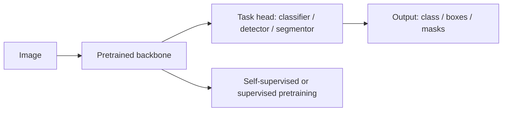

# Computer Vision Overview

## Beginner-Friendly Intuition

Computer vision is the field that teaches computers to extract meaning
from images and video. The set of tasks is wide: classify a photo,
detect every car in a frame, segment a tumor in a CT scan, recognize a
face, generate an image from text. The unifying technical thread is
that pixels are not directly meaningful; you need to learn a
hierarchical representation that turns "an array of brightness values"
into "this is a stop sign at this location."

The intuition for the modern era of CV: hand-engineered features (SIFT,
HOG, Haar) ruled until 2012. Then AlexNet (Krizhevsky et al., 2012)
showed that a deep CNN trained on ImageNet beat all hand-engineered
methods by 10+ percentage points. The next decade was the steady
improvement of CNN-based methods (VGG, Inception, ResNet, EfficientNet)
and their extension to detection, segmentation, and beyond. In 2020, the
Vision Transformer (Dosovitskiy et al.) showed that transformers can
match or exceed CNNs given enough data. In 2026, modern systems
typically use either a CNN backbone (ResNet, ConvNeXt, EfficientNet) or
a vision transformer (ViT, Swin, DINOv2), often pretrained on
hundreds of millions of images.

## Formal Explanation

### The major tasks

- **Image classification.** One label per image. ImageNet (1000 classes),
  CIFAR, custom domain classifiers. The simplest task and the workhorse
  benchmark.
- **Object detection.** For each image, output a list of (class, box,
  confidence) tuples. COCO is the standard benchmark.
  See [05-object-detection.md](05-object-detection.md).
- **Image segmentation.** Per-pixel classification.
  See [06-image-segmentation.md](06-image-segmentation.md).
- **Pose estimation.** Keypoints on a person or animal.
- **Depth estimation.** Per-pixel distance to camera.
- **Optical flow.** Per-pixel motion vectors between consecutive
  frames.
- **Face recognition.** Identify or verify a person from an image.
- **Image generation.** Generate images from text, sketches, or noise
  (GANs, diffusion, autoregressive transformers).
- **Image-text retrieval.** Match images to captions and vice versa
  (CLIP).

### The eras

1. **Hand-engineered features (pre-2012).** SIFT, HOG, Haar cascades,
   bag-of-visual-words. Hand-tuned per domain; did not generalize.
2. **CNNs from scratch (2012-2017).** AlexNet, VGG, GoogLeNet, ResNet.
   ImageNet pretraining became the default starting point for any
   vision task.
3. **Architecture engineering (2014-2020).** Detection (R-CNN, YOLO,
   SSD, Faster R-CNN), segmentation (FCN, U-Net, Mask R-CNN), efficient
   inference (MobileNet, EfficientNet).
4. **Transformer era (2020+).** ViT, Swin, DETR, DINO, MAE. Transformers
   match or exceed CNNs at scale; CNNs remain strong at low data and
   on edge devices.
5. **Foundation models (2021+).** CLIP (image-text), SAM (segment
   anything), DINOv2 (self-supervised features), large multimodal LLMs
   (LLaVA, GPT-4V). Pretrained models that transfer broadly.

### Inductive biases

Different architectures encode different priors:

- **CNN.** Translation equivariance (a cat in the corner is the same
  cat as in the center) and locality (nearby pixels are related).
  Strong inductive bias; trains well on small data.
- **Transformer (ViT).** Permutation invariance over patches. Weak
  inductive bias; needs massive pretraining (300M+ images for the
  original ViT) to compete.
- **Hybrids (Swin, ConvNeXt).** Combine CNN locality with transformer
  flexibility. Often best of both worlds in 2026.

### Pretraining options in 2026

- **Supervised pretraining on ImageNet** (1.3M images, 1000 classes).
  The classical default.
- **Self-supervised pretraining.** DINO, MAE, SimCLR, BYOL. No labels
  needed. Often produces better-transferring features than supervised
  for downstream tasks with limited labels.
- **Vision-language pretraining.** CLIP-style contrastive training on
  image-caption pairs. Produces zero-shot classifiers and a flexible
  feature space.
- **Diffusion pretraining.** Stable Diffusion, DALL-E variants. Used for
  generation but the encoders also produce useful features.

### What changed for production

In 2026, the production checklist for a new vision project usually is:

1. Define the task (classification, detection, segmentation).
2. Find a pretrained backbone that matches scale (mobile,
   server, GPU edge).
3. Fine-tune on labeled data (often 1K-100K examples).
4. Quantize and optimize for inference.
5. Deploy with monitoring for distribution shift.

Training a backbone from scratch is rare. Pretraining is research; fine-
tuning is engineering.

## Why It Matters in Real Jobs

Vision is everywhere: phone cameras, autonomous driving, manufacturing
QA, medical imaging, security, content moderation, retail visual
search, augmented reality, video understanding. The technical depth
of a vision engineer in 2026 is less about training models from
scratch and more about choosing the right pretrained backbone, the
right fine-tuning recipe, the right deployment optimization, and the
right monitoring strategy.

## How It Works Step by Step

1. **Frame the task.** Classification, detection, segmentation,
   generation, or some combination.
2. **Audit the data.** Image counts, label counts per class, label
   noise, image quality, lighting variation, segment distribution.
3. **Pick a pretrained backbone.** ResNet-50 for a strong baseline.
   EfficientNet for FLOP-constrained settings. ConvNeXt or Swin for
   modern accuracy. ViT-B for transformer-based pipelines.
4. **Add the task-specific head.** Linear classifier for
   classification. Detection head (FPN + class + box) for detection.
   Decoder for segmentation.
5. **Fine-tune with augmentation.** RandomCrop, HorizontalFlip,
   ColorJitter. Mixup, CutMix, RandAugment for stronger results.
6. **Train with the right recipe.** SGD with momentum and cosine LR
   for classical CNNs; AdamW for ViTs and ConvNeXt.
7. **Evaluate per class and per segment.** Aggregate metrics hide
   per-class failures.
8. **Quantize and optimize.** Int8 quantization is standard. Compile
   with TensorRT, ONNX Runtime, or CoreML for the target hardware.
9. **Deploy with monitoring.** Track per-class accuracy and image
   distribution drift; retrain on a schedule.

## Real-World Example

A team builds a defect detector for printed circuit boards. They have
4,000 labeled images across 7 defect classes. They benchmark.

- ResNet-50 from scratch: validation F1 0.62 (severe overfitting on
  small data).
- ResNet-50 pretrained on ImageNet, fine-tuned: F1 0.84.
- ConvNeXt-tiny pretrained, fine-tuned: F1 0.89.
- DINOv2-base self-supervised features + linear classifier: F1 0.86,
  faster training (no full fine-tune needed).

They ship ConvNeXt-tiny. They quantize to int8 for the production
inference server; F1 drops to 0.88, latency from 65 ms to 22 ms per
image. Six months later, they add a fallback: when ConvNeXt-tiny's
top-1 confidence is below 0.5, route to a human reviewer plus a
GPT-4V multimodal model that explains what it sees. The hybrid
catches a class of novel defects that the trained model misses.

## Common Mistakes

- Training from scratch on small data; transfer learning wins.
- Using ImageNet preprocessing (mean and std) on grayscale or
  domain-shifted images without checking.
- Skipping augmentation; vision models overfit fast on small datasets.
- Ignoring per-class metrics; one class can drag down macro F1.
- Comparing CNN vs ViT on small data without acknowledging that ViT
  needs more data to compete.
- Skipping the pretrained baseline; you can spend weeks on architecture
  tuning when fine-tuning a frozen backbone would have shipped.
- Forgetting that label noise has a much larger effect than architecture
  choice on small data.
- Skipping calibration; production downstream systems often use
  confidence thresholds.
- Not testing under distribution shift (different cameras, lighting,
  product variants) before deployment.

## Interview Angle

**Question:** A team wants to build a vision model for a custom defect-
detection task with 5,000 labeled images. Walk through your approach.

**Strong answer:** With 5,000 labeled images, training from scratch is
out (the model would overfit massively). The right approach is transfer
learning from a strong pretrained backbone.

The pipeline.

1. **Audit the data first.** Class balance, label noise (have a small
   fraction of labels reviewed by a domain expert), image quality
   (lighting, focus, resolution distribution), and edge cases.
2. **Pick the pretrained backbone.** ResNet-50 for a fast baseline
   (CNNs work well on small data because of their inductive bias).
   ConvNeXt-tiny or Swin-tiny for modern accuracy at moderate cost.
   Avoid pure ViT for small data; the inductive bias is too weak
   without massive pretraining.
3. **Choose between linear probe and fine-tuning.** Linear probe
   (freeze backbone, train only the classification head) is faster,
   less prone to overfitting, and often within 1-3 points of full fine-
   tuning on small data. Fine-tuning the last few layers is a middle
   ground.
4. **Set up training.** AdamW for ConvNeXt/Swin (`lr = 1e-4`); SGD
   with momentum for ResNet (`lr = 1e-2` to `1e-3`). 30-100 epochs
   with cosine LR decay. Linear warmup over 500-1000 steps.
5. **Add augmentation.** RandomCrop, HorizontalFlip, ColorJitter as
   defaults. RandAugment, Mixup, CutMix for stronger results on small
   data.
6. **Use class-balanced sampling or class weights.** If classes are
   imbalanced, weighted sampling or weighted loss helps.
7. **Evaluate per class.** Macro F1 + confusion matrix. Per-class
   precision and recall. Inspect false positives and false negatives
   manually.
8. **Plan deployment.** Quantize to int8 for inference; profile
   latency on target hardware. Add confidence threshold for human
   review of low-confidence predictions.

What I would not do. Train from scratch (5K is too small). Use ViT
pretrained on small data (CNN inductive bias matters at this scale).
Skip data augmentation (vision overfits fast).

What I would also include in the deliverable. Per-class metrics with
confidence intervals. Fairness analysis if any segment matters
(different camera locations, product variants). A monitoring plan for
distribution shift in production.

**Weak answer:** "Train ResNet-50" without addressing pretraining, data
size, or class imbalance.

**Follow-up questions:**

- When would you choose a CNN over a ViT?
- What is the difference between linear probe and fine-tuning?
- How do you handle class imbalance in vision?
- How would you detect distribution shift after deployment?

## Mini Exercise

Pick any small image classification dataset (Flowers-102, CUB-200,
Food-101). Train a randomly-initialized ResNet-50 and a pretrained
ResNet-50 with the same recipe for 30 epochs. Compare validation
accuracy.

## Diagram

---
## Navigation

[⬅ Previous](../nlp/11-nlp-evaluation.md) | [🏠 Home](../README.md) | [➡ Next](02-images-as-tensors.md)
