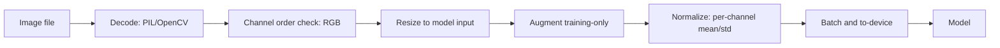

# Images as Tensors

## Beginner-Friendly Intuition

To a computer vision model, an image is not a picture; it is a
multidimensional array of numbers. A 224x224 RGB photo is a tensor of
shape `(3, 224, 224)`: three color channels, each a 224x224 grid of
pixel intensities. Once you accept this representation, every later
operation (convolution, pooling, attention) is just tensor arithmetic.

The intuition: pixels are not the same as features. A raw pixel value
of 127 in the center of an image carries almost no information by
itself. The information lives in the **patterns** across pixels: edges
between bright and dark regions, textures from repeated micro-patterns,
shapes from connected regions. Computer vision models learn to extract
these patterns layer by layer.

This file covers the practical details: how images are stored, the
shape conventions, normalization, augmentation, and the failure modes
that come from getting these wrong. Without these foundations, even the
best model architecture cannot work.

## Formal Explanation

### Tensor layouts

Two conventions for representing batches of color images:

- **CHW** (Channels, Height, Width): `(3, H, W)`. PyTorch default.
  Faster on most modern GPUs because adjacent values in memory belong
  to the same channel and are processed together.
- **HWC** (Height, Width, Channels): `(H, W, 3)`. NumPy and Pillow
  default; how PNG/JPEG decode by default.

Batched: `(B, C, H, W)` for PyTorch, `(B, H, W, C)` for TensorFlow
(historically). Always know which convention your library uses; mixing
them is a frequent bug.

### Pixel value ranges

Three common ranges:

- **`[0, 255]` uint8.** What PNG/JPEG decode to. Standard storage.
- **`[0, 1]` float32.** What models typically expect after dividing
  uint8 by 255.
- **Standardized (mean 0, std 1) per channel.** What pretrained models
  expect. ImageNet means and stds: `[0.485, 0.456, 0.406]` and
  `[0.229, 0.224, 0.225]`.

Forgetting to normalize before passing to a pretrained model produces
garbage outputs. Mixing normalization (e.g., dividing by 255 but
forgetting the mean/std subtraction) gives subtly wrong outputs that
look almost-right.

### Color channels

- **RGB** (Red, Green, Blue). Standard.
- **BGR.** OpenCV's default order. Mixing RGB-trained models with
  BGR inputs produces predictions that are technically wrong but often
  close enough that the bug hides for weeks.
- **Grayscale.** Single channel. Many medical and industrial datasets
  are grayscale; pretrained ImageNet models expect 3 channels, so you
  duplicate the grayscale channel three times or use a grayscale-
  pretrained model.

### Resolution

- **Original.** What the camera captured.
- **Resized.** What the model sees, typically 224x224 (ImageNet),
  448x448, or 384x384 for ViTs. Smaller images train faster but
  lose fine detail.
- **Crops.** Random for training augmentation, center for evaluation.

Resizing strategy matters. Bilinear interpolation is the default;
bicubic and Lanczos are slower but slightly higher quality. Avoid
nearest-neighbor for downstream learning (introduces aliasing).

### Data augmentation

Random transformations applied at training time. Defaults for image
classification:

- **RandomResizedCrop.** Sample a random crop with scale [0.08, 1.0]
  of the image area, aspect ratio in [3/4, 4/3], resize to model
  input size. Standard for ImageNet training.
- **HorizontalFlip.** With probability 0.5, mirror left-right. Almost
  always safe for natural images. Wrong for tasks where left-right
  matters (text, traffic signs depending on country).
- **ColorJitter.** Random brightness, contrast, saturation, hue
  adjustments. Brightness range [0.8, 1.2] and similar for the others
  is typical.
- **Normalize.** Subtract per-channel mean, divide by per-channel
  std. Always last before the model.

Stronger augmentation:

- **RandAugment** (Cubuk et al., 2020). Random combinations of
  augmentations from a fixed set with a magnitude parameter. Standard
  in modern recipes.
- **AutoAugment.** Learned augmentation policies. Slightly better than
  RandAugment; rarely worth the complexity.
- **Mixup.** Linearly combine two images and their labels:
  `x = λ x_1 + (1-λ) x_2`. Works surprisingly well; standard in modern
  CNN training.
- **CutMix.** Replace a rectangular patch of one image with a patch
  from another; mix labels by area. Often beats Mixup.
- **TrivialAugment.** A simpler RandAugment variant with similar
  performance.
- **CutOut.** Zero out a random rectangle. Cheap regularizer.

Augmentation must be **on training only**. Evaluating with augmentation
(test-time augmentation, TTA) is a separate technique that improves
predictions at inference cost.

### Aspect ratio handling

Real images have many aspect ratios. Three options:

- **Resize to square.** Distorts.
- **Resize then crop.** Loses information.
- **Resize then pad.** Adds black borders the model must learn to
  ignore.

Choice depends on the task and the dominant subject location.

### Common storage formats

- **JPEG.** Lossy compression. Standard for natural photos. Read with
  Pillow, OpenCV, or torchvision.
- **PNG.** Lossless compression. Standard for screenshots and graphics.
- **TIFF.** Uncompressed or lossless compression. Standard for medical
  imaging and scientific data.
- **DICOM.** Medical imaging container with metadata.
- **HDF5, Zarr.** Bulk scientific data, multidimensional.
- **FFCV, WebDataset, Petastorm.** High-throughput formats for ML
  training; read 10-100x faster than per-file decode.

For large training jobs, the data loader is often the bottleneck;
switching from per-file JPEG to FFCV or WebDataset can cut epoch time
in half.

## Why It Matters in Real Jobs

Three production reasons. First, **train-serving consistency**: the
preprocessing pipeline (resize, normalize, channel order, dtype) at
training must exactly match preprocessing at inference. A mismatch is
silent and accuracy-killing. Second, **data loader throughput**: a slow
loader leaves the GPU idle most of the time. Profiling and switching
formats can transform training cost. Third, **augmentation strategy**:
the difference between strong and weak augmentation can be 5-15
percentage points of validation accuracy on small datasets.

## How It Works Step by Step

1. **Decode the image.** PIL, OpenCV, or torchvision's
   `read_image`. Know the byte order (RGB or BGR) the library returns.
2. **Convert to tensor.** Move to `(C, H, W)` for PyTorch.
3. **Resize.** Match the model's expected input size.
4. **Augment (training only).** RandomResizedCrop, HorizontalFlip,
   ColorJitter; optionally RandAugment, Mixup, CutMix.
5. **Normalize.** Subtract per-channel mean, divide by per-channel
   std. Use the values the pretrained model was trained with.
6. **Batch.** Stack into `(B, C, H, W)`.
7. **Move to GPU.** `tensor.to(device)`.
8. **At inference, do steps 1-3, 5, 6, 7. Skip augmentation.** Use
   `model.eval()` to disable dropout and batchnorm in training mode.

## Real-World Example

A team trains a defect classifier. Validation accuracy is 91 percent in
the lab. Production accuracy is 84 percent. Investigation: the lab uses
PIL to load images (RGB), the production server uses OpenCV (BGR), and
nobody noticed. The model trained on RGB sees a "red is blue" version
in production. Adding a `.cvtColor(BGR2RGB)` line in the production
preprocessing fixes it. Validation and production accuracy now match
within 1 percent.

## Common Mistakes

- BGR vs RGB mismatch between training and inference; subtle accuracy
  drop.
- Forgetting normalization; pretrained models produce garbage on
  unnormalized inputs.
- Using `.float()` without dividing by 255; values are 100x larger
  than expected.
- Mixing CHW and HWC tensor layouts; model errors or silent wrong
  outputs.
- Loading images on CPU when GPU has spare cycles; throughput
  bottleneck. Use Pillow-SIMD, FFCV, or DALI to accelerate.
- Random horizontal flip on text or traffic signs.
- Identical preprocessing at train and eval, but with eval mode active
  during eval (forgetting `model.eval()`).
- Using one set of normalization statistics for all images when the
  domain has very different means (e.g., medical imaging).

## Interview Angle

**Question:** A pretrained model that worked great on ImageNet performs
poorly on a custom dataset. List the things you would check in
preprocessing before changing the model.

**Strong answer:** Many "the model is bad" diagnoses are actually
preprocessing bugs. The list, in order of likelihood.

1. **Channel order.** The model expects RGB; OpenCV gives BGR. A
   silent channel swap drops accuracy 5-15 percentage points without
   raising errors.
2. **Normalization values.** The model expects ImageNet means
   `[0.485, 0.456, 0.406]` and stds `[0.229, 0.224, 0.225]`. Custom
   datasets with very different brightness or color distributions need
   their own normalization, or at least the model's pretraining
   normalization applied consistently.
3. **Pixel range.** The model expects `[0, 1]` float (after
   normalization is applied to that). Forgetting to divide by 255
   produces values around 127 at training time, which the model has
   never seen.
4. **Resize method.** Bilinear is the standard. Nearest-neighbor
   produces aliasing. Resizing twice (once during preprocessing, once
   inside the model) wastes computation and degrades quality.
5. **Aspect ratio.** Did the training pipeline center-crop, pad, or
   stretch? Production must match.
6. **Train vs eval mode.** Forgot `model.eval()`? BatchNorm running
   statistics and dropout behave differently.
7. **Tensor layout.** PyTorch expects `(B, C, H, W)`; production
   pipelines sometimes assemble tensors as `(B, H, W, C)`.
8. **Mixed precision mismatch.** Training in BF16 and serving in FP32
   can produce subtle output differences if the model is not properly
   loaded.

The diagnostic procedure: print one production tensor's shape, dtype,
range, and mean per channel. Compare to a training-time tensor. The
differences are usually obvious.

What I would do before changing the model: run inference on a known
training-set image, in both training and production pipelines. The
model's output should be identical (or very close). If they differ,
the bug is in preprocessing.

**Weak answer:** "Try a different model" without checking
preprocessing first.

**Follow-up questions:**

- Why does ImageNet use those specific normalization values?
- What augmentation policy would you use for a small custom dataset?
- How would you handle non-square inputs?
- What is mixup and when does it help?

## Mini Exercise

Take any image. Load it with PIL (RGB) and with OpenCV (BGR). Pass
both through a pretrained ResNet-50 with standard ImageNet
normalization. Compare the top-5 predictions. Note the difference;
this is the silent bug you guard against.

## Diagram

---
## Navigation

[⬅ Previous](01-computer-vision-overview.md) | [🏠 Home](../README.md) | [➡ Next](03-convolution.md)
