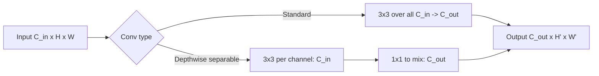

# Convolution

## Beginner-Friendly Intuition

A convolution is a small filter (a tiny weight matrix, typically 3x3
or 5x5) that slides across an image and produces a response wherever
the input matches the filter's pattern. One filter learns to detect
horizontal edges, another vertical edges, another the corner of an
eye, another a wheel of a car. A convolutional layer applies many
filters in parallel, producing a stack of "feature maps" that
represent what the layer found in the image.

The intuition for why this works: the filter is the same wherever it
slides. A horizontal-edge detector at the top-left of the image is
the same horizontal-edge detector at the bottom-right. This is
**weight sharing**, and it is what makes CNNs both parameter-efficient
and **translation equivariant**: shift the input by 5 pixels, and the
output shifts by 5 pixels, with the same features detected.

The deep-learning file
[../deep-learning/09-cnns.md](../deep-learning/09-cnns.md) covers CNN
architectures end-to-end. This file focuses on the convolution
operation itself: stride, padding, dilation, kernels, depthwise
separable convolutions, and the receptive field.

## Formal Explanation

### The 2D convolution operation

For input `x` of shape `(B, C_in, H, W)` and a learned filter `W` of
shape `(C_out, C_in, k, k)`:

```
y[b, c_out, i, j] = Σ_{c_in, di, dj} W[c_out, c_in, di, dj] · x[b, c_in, i+di, j+dj]
                  + bias[c_out]
```

with `di, dj` ranging over the kernel size `k`. Output shape is
`(B, C_out, H', W')`.

(Note: technically deep learning uses **cross-correlation**, not the
mathematical convolution which flips the kernel. The terminology is
sloppy but universal.)

### Hyperparameters

- **Kernel size `k`** (typical 3, sometimes 1, 5, 7, or larger for
  the first layer).
- **Stride `s`** (default 1; `s=2` halves spatial size).
- **Padding `p`** (zero-padding around the input; `same` padding keeps
  spatial size with stride 1).
- **Dilation `d`** (gaps in the kernel; `d=1` is normal,
  `d=2` skips every other position).

Output size:
`H' = floor((H + 2p - d(k-1) - 1) / s) + 1`.

### Parameter count and FLOPs

A conv layer with `C_in` input channels and `C_out` output channels
and `k x k` kernel has:

- **Parameters:** `C_in · C_out · k · k + C_out`.
- **FLOPs per output position:** `C_in · C_out · k · k`.
- **Total FLOPs:** `H' · W' · C_in · C_out · k · k`.

For a typical layer (input 64 channels, output 128 channels, 3x3
kernel, 56x56 spatial output): 73,856 parameters, 232M FLOPs.

### Pooling

Down-samples by a fixed rule, no learned parameters. Reduces spatial
size while keeping channel count.

- **Max pooling.** Take the max over a `k x k` window. The classical
  default. Picks the strongest activation.
- **Average pooling.** Take the mean. Smoother.
- **Global average pooling.** Reduce to a single value per channel.
  Used as a parameter-free replacement for the giant fully-connected
  layer at the end of older CNNs.
- **Strided convolution.** Replace pooling with a conv layer of stride
  2. Same downsampling effect, but learnable. Used in modern CNNs
  (ResNet, EfficientNet).

### Receptive field

Each pixel in a deep layer "sees" a region of the input image. The
receptive field grows with depth, kernel size, stride, and dilation.
Example: a stack of `n` 3x3 convolutions with stride 1 has receptive
field `2n + 1`. A stack of `n` 3x3 convs with stride 2 has receptive
field `2^n + 1` (roughly).

Why receptive field matters: the final layer's receptive field should
be at least the size of the structures you want to detect. If you
classify dogs (typically taking up most of an image), the receptive
field needs to span the image. If you detect small defects (10x10
pixels in a 1024x1024 image), a smaller receptive field per layer
plus a multi-scale architecture is more appropriate.

### 1x1 convolutions

A 1x1 conv looks weird but is critical. It does not see spatial
context (kernel is one pixel). What it does is mix channels: it
applies a learned linear transformation to the channel vector at
each spatial position.

Uses:

- **Bottleneck layers.** Reduce channels (e.g., 256 -> 64) before a
  3x3 conv, then expand back (64 -> 256). Saves compute.
- **Channel attention.** Squeeze-and-excitation blocks use 1x1 convs.
- **Pointwise convolution** in depthwise separable convolutions.

### Depthwise separable convolutions

Replace a standard `k x k` conv with two cheaper operations:

1. **Depthwise convolution.** A `k x k` filter per input channel,
   no mixing across channels. Output: `C_in` channels.
2. **Pointwise convolution.** A 1x1 conv that mixes channels.
   Output: `C_out` channels.

Total cost: `H' · W' · C_in · k · k + H' · W' · C_in · C_out`. For
`k=3`, `C_in = C_out = 256`, this is about 9x cheaper than a standard
3x3 conv. Used in MobileNet, EfficientNet, Xception.

### Dilated (atrous) convolutions

Insert gaps between kernel positions. A 3x3 conv with dilation 2
"sees" a 5x5 region but uses only 9 weights. Used in semantic
segmentation (DeepLab) to grow the receptive field without
downsampling.

### Transposed convolutions (deconvolution)

Used to upsample feature maps. Conceptually, swap input and output of
a normal convolution: each input pixel becomes a `k x k` patch in the
output, and overlapping patches sum. Useful for image generation,
segmentation decoders.

Beware: naive transposed convolutions produce **checkerboard
artifacts** because of overlapping kernel positions. Modern designs use
upsampling + standard conv (or PixelShuffle) to avoid this.

## Why It Matters in Real Jobs

Three production reasons. First, **CNNs are still everywhere**: every
mobile phone camera, autonomous-driving system, manufacturing QA
pipeline runs CNNs in the hot path. Understanding convolution is
non-negotiable for vision engineers. Second, **efficiency**: depthwise
separable convolutions, 1x1 bottlenecks, and structured sparsity make
the difference between a model that runs at 30 FPS on a phone and one
that does not. Third, **debugging**: receptive-field calculations and
shape arithmetic catch bugs before they become "the model does not
work" mysteries.

## How It Works Step by Step

1. **Pick the kernel size.** 3x3 for most layers; 1x1 for channel
   mixing; 7x7 only at the input layer (some architectures use it for
   initial downsampling).
2. **Pick the stride.** 1 for most layers; 2 for downsampling.
3. **Pick the padding.** "Same" padding keeps spatial size when
   stride=1; "valid" (no padding) shrinks. Standard architectures
   alternate.
4. **Choose the channel count.** Common pattern: start at 64,
   double when stride doubles. Final layer has a global avg pool +
   linear head with the right output dimension.
5. **Compute the receptive field.** Verify it matches the scale of
   structures you want to detect.
6. **Add normalization and activation.** Standard pattern:
   `Conv -> BN -> ReLU` or `Conv -> GELU -> LN` for ConvNeXt-style.
7. **Initialize weights.** He init for ReLU networks, Kaiming
   uniform for most variants.
8. **Profile.** FLOPs and parameter count tell you how much the layer
   costs.

## Real-World Example

A team builds a defect detector that must run at 30 FPS on a CPU.
Their first model is a standard ResNet-50; inference is 220 ms per
image, far over budget. They switch to MobileNetV3, which uses
depthwise separable convolutions throughout, plus squeeze-and-
excitation blocks. Inference drops to 35 ms; accuracy drops 1.8 F1
points. They add a knowledge-distillation step: train MobileNetV3 to
match the predictions of ResNet-50. Accuracy recovers within 0.6 F1.
They quantize to int8; inference drops to 18 ms. The lesson: the
choice between standard and depthwise separable convolutions is the
single biggest lever for inference cost in CNNs, often without much
accuracy loss.

## Common Mistakes

- Using kernel sizes 5x5 or 7x7 throughout when 3x3 stacks would do
  the same job with fewer parameters.
- Using stride > 1 with kernel size 3 without padding; output is much
  smaller than expected.
- Forgetting that "same" padding for kernel 3 stride 2 still down-
  samples; semantically "same" only when stride is 1.
- Adding too many layers without considering FLOPs growth.
- Using transposed convolutions and getting checkerboard artifacts.
- Using a 7x7 kernel at every layer because it "captures more
  context"; you can stack three 3x3 layers for the same receptive
  field with fewer parameters and more non-linearity.
- Forgetting that MobileNet-style depthwise separable convolutions
  trade ~5 percent accuracy for 5-10x speedup; verify the trade-off
  fits the application.
- Using `padding=0` accidentally and watching the spatial size
  shrink unexpectedly.

## Interview Angle

**Question:** Compare standard convolution and depthwise separable
convolution. What does each compute, and when do you choose which?

**Strong answer:** A standard 2D convolution applies a `k x k`
filter that simultaneously combines spatial neighbors and input
channels. For input shape `(C_in, H, W)` and output shape `(C_out, H,
W)` (with same padding), the operation is:

```
y[c_out, i, j] = Σ_{c_in, di, dj} W[c_out, c_in, di, dj] · x[c_in, i+di, j+dj]
```

Cost: `H · W · C_in · C_out · k · k` FLOPs.

Depthwise separable convolution factorizes this into two cheaper
operations:

1. **Depthwise convolution.** A `k x k` filter per input channel, no
   channel mixing. Each input channel produces one output channel.
2. **Pointwise convolution (1x1).** A 1x1 convolution that mixes
   channels but does not see spatial context.

Total cost: `H · W · C_in · k · k + H · W · C_in · C_out`. For typical
values (`k = 3`, `C_in = C_out = 256`), this is about 9x cheaper than
the standard convolution.

The key insight: depthwise separable convolutions decouple the spatial
and channel dimensions. Standard convolution learns joint spatial-
channel filters; depthwise separable learns spatial filters per
channel and then mixes channels. Empirically, this factorization
costs ~1-3 percent accuracy at well-tuned settings while saving 5-9x
in compute. The trade-off is overwhelmingly worth it on edge devices.

When to choose which:

- **Standard convolution.** Server-side inference where compute is
  cheap and accuracy matters. Architectures that don't have specific
  efficiency constraints (ResNet, ConvNeXt).
- **Depthwise separable convolution.** Mobile, embedded, or any
  inference-FLOP-constrained setting. MobileNet, EfficientNet, and
  most modern efficient architectures.
- **Mixed.** Some architectures (EfficientNet) use depthwise
  separable convolutions for the bulk of the network and standard
  convolutions for specific blocks.

A senior engineer's instinct: when latency or memory is the binding
constraint, depthwise separable is the first lever before changing
architecture or quantizing.

**Weak answer:** "Depthwise is faster" without explaining the
factorization or the accuracy trade-off.

**Follow-up questions:**

- What is the receptive field and how do you compute it?
- Why are 1x1 convolutions useful?
- What is dilated convolution?
- How does pooling differ from strided convolution?

## Mini Exercise

Compute the FLOPs and parameter count for: (a) a 3x3 conv with 256
input and 256 output channels at 56x56 spatial size, (b) a depthwise
separable equivalent. Compute the speedup factor. Verify the formula
above.

## Diagram



---
## Navigation

[⬅ Previous](02-images-as-tensors.md) | [🏠 Home](../README.md) | [➡ Next](04-cnns-for-classification.md)
