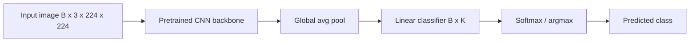

# CNNs for Classification

## Beginner-Friendly Intuition

Image classification is the task: input one image, output one label
out of K classes. ImageNet (1.3M images, 1000 classes) was the
benchmark that made deep learning famous in 2012; nearly every later
CV breakthrough started from improvements to ImageNet classification.
The standard recipe in 2026: take a CNN backbone pretrained on
ImageNet (or self-supervised on a larger corpus), replace the final
classification head for your K classes, fine-tune on your labeled
data.

The intuition for what works in classification: the model needs to
build up from low-level features (edges, textures) to mid-level
(parts, patterns) to high-level (objects). Pretrained CNNs already
have the low and mid layers ready; you mostly need to teach them
what your specific classes look like. With less than 100K labeled
images, fine-tuning a pretrained model beats training from scratch by
huge margins.

The deep-learning CNN file
[../deep-learning/09-cnns.md](../deep-learning/09-cnns.md) covers
architectures generically. This file focuses on the classification-
specific recipe: which backbones, training tricks, augmentation, and
how to handle the specific failure modes of fine-tuning for
classification.

## Formal Explanation

### Modern backbones

| Family | Year | Strengths | Best use |
| --- | --- | --- | --- |
| ResNet (18, 34, 50, 101, 152) | 2015 | Reliable, well-understood, broad ecosystem | Strong baseline, transfer learning |
| EfficientNet (B0-B7) | 2019 | Compound scaling, FLOP-efficient | FLOP-constrained inference |
| ConvNeXt (Tiny, Small, Base, Large) | 2022 | Modernized CNN with transformer tricks | High-accuracy CV |
| RegNet | 2020 | Designed by neural architecture search | Various scales |
| MobileNet (V2, V3, V4) | 2017+ | Mobile-optimized, depthwise separable | Edge inference |
| ConvNeXt V2 | 2023 | MAE-pretrained, sparse convolution | Modern strong baseline |

### Classification head

Takes the backbone's output (typically a feature map of shape
`(B, C, H', W')` where `C` is hundreds to thousands and `H', W'` are
small, e.g., `(B, 2048, 7, 7)` for ResNet-50 at 224x224 input):

1. **Global average pooling.** Average over `H', W'` to get
   `(B, C)`.
2. **Linear classifier.** `(B, C) -> (B, K)` for K classes.
3. **Softmax** during inference for probabilities; cross-entropy loss
   uses the logits directly.

Older CNNs (VGG) had multiple fully-connected layers at the end,
adding tens of millions of parameters. Modern CNNs use just a global
average pool plus one linear layer; far fewer parameters with no
accuracy loss.

### Loss

Standard:

```
L = - Σ_i log p_{y_i}    (cross-entropy on one-hot targets)
```

Implemented as `CrossEntropyLoss` in PyTorch (which expects logits and
applies softmax internally with numerical stability).

For class imbalance: class weights or focal loss.
For label noise: label smoothing
(`y_smooth = (1 - ε) y_one_hot + ε / K`).
For very large K: hierarchical softmax or sampled softmax (rarely
needed in vision; common in NLP).

### Training recipe (classical: SGD + cosine)

For ResNet, EfficientNet, and most CNNs trained from scratch on
ImageNet-scale data:

- Optimizer: SGD with momentum 0.9.
- Initial LR: 0.1 (linearly scale with batch size).
- LR schedule: cosine decay over 90-300 epochs.
- Weight decay: 1e-4.
- Batch size: 256-2048 (with linear LR scaling and warmup).
- Warmup: 5 epochs.
- Augmentation: RandomResizedCrop + HorizontalFlip + ColorJitter +
  RandAugment + MixUp + CutMix + Random Erasing.
- Label smoothing: 0.1.

This is the recipe behind the modern ImageNet baselines that beat the
original ResNet paper by 4-5 points without architecture changes.

### Training recipe (modern: AdamW + cosine)

For ViTs, ConvNeXt, and many transfer-learning settings:

- Optimizer: AdamW with `β_1 = 0.9, β_2 = 0.999`, weight_decay 0.05.
- Initial LR: 1e-3 to 4e-3.
- LR schedule: cosine decay with linear warmup (5-20 epochs).
- Batch size: 256-1024.
- Augmentation: RandomResizedCrop + HorizontalFlip + RandAugment +
  MixUp + CutMix + Random Erasing.
- Label smoothing: 0.1.
- Stochastic depth (DropPath): increasing rate 0.0 to 0.1 with depth.

### Transfer learning recipe

For fine-tuning a pretrained model on a custom dataset:

- Pretrained backbone, replace the final linear classifier with your
  own.
- Optimizer: AdamW or SGD with much lower LR (1e-4 to 1e-5 for
  full fine-tuning, 1e-3 for the new head only).
- Schedule: cosine decay over 30-100 epochs.
- Weight decay: 1e-4 to 1e-2.
- Augmentation: matched to data scale. Strong augmentation hurts on
  very small data (under 1K images per class); use mild augmentation
  there.
- Optionally: linear probe (freeze backbone) first, then unfreeze.

### Test-time augmentation

For higher accuracy at higher inference cost, predict on multiple
augmented versions of the test image (5-crop or 10-crop), average the
predictions. Adds 0.5-2 percentage points typically. Used at
inference if latency budget allows.

### Calibration

CNN logits are typically overconfident; predicted probabilities do
not match observed accuracies. Calibration techniques:

- **Temperature scaling.** Divide logits by a learned scalar `T`
  before softmax. Single parameter, fit on validation. Best
  cost-benefit ratio.
- **Vector or matrix scaling.** More parameters per class. Marginal
  gains over temperature scaling.

For classifiers used in downstream systems with thresholds,
calibration is necessary, not optional.

### Per-class metrics

Aggregate accuracy hides per-class failures. Always report:

- **Per-class accuracy / F1.** A model with 95 percent overall
  accuracy and 50 percent on the rarest class is a different model
  than one with 90 percent overall and 80 percent everywhere.
- **Confusion matrix.** Reveals which classes the model confuses
  with which.
- **Top-5 accuracy** for ImageNet-style with many similar classes.

## Why It Matters in Real Jobs

Image classification is the most-deployed CV task: phone gallery
auto-tagging, content moderation, retail visual search, medical
abnormality screening, manufacturing defect detection. Three
production reasons. First, **transfer learning is the default**, and
the recipe (which backbone, how much data to fine-tune, what
augmentation, what LR schedule) decides whether your project ships
in two weeks or two months. Second, **deployment trade-offs**: int8
quantization, distillation, pruning are real levers that change
inference cost. Third, **calibration**: many classifiers feed
downstream rules engines that consume probabilities; uncalibrated
classifiers silently break those systems.

## How It Works Step by Step

1. **Define classes precisely.** Mutually exclusive labels with
   examples and counter-examples. Inter-annotator agreement.
2. **Audit the data.** Class balance, label noise, image quality
   distribution.
3. **Pick a pretrained backbone.** ResNet-50 for a fast strong
   baseline. ConvNeXt-tiny for modern accuracy. EfficientNet-B0 or
   MobileNetV3 for FLOP-constrained.
4. **Fine-tune.** Replace the classification head, train with the
   transfer-learning recipe. AdamW, lr=1e-4, 30-100 epochs, cosine
   decay, augmentation matched to data scale.
5. **Tune the threshold or top-k.** For binary, tune the decision
   threshold. For top-1 vs top-5 metrics, decide which matters.
6. **Calibrate.** Temperature scaling on validation.
7. **Evaluate per class.** Confusion matrix, per-class precision and
   recall.
8. **Quantize and deploy.** Int8 typically loses under 1 point of
   accuracy. Use TensorRT, ONNX Runtime, or CoreML for the target
   hardware.
9. **Monitor in production.** Per-class accuracy, image distribution
   drift, low-confidence rate. Retrain on a schedule.

## Real-World Example

A team builds a plant-disease classifier (12 classes, 8K labeled
images). They benchmark several recipes.

- ResNet-50 from scratch: validation accuracy 0.61, train accuracy
  0.99 (severe overfitting).
- ResNet-50 pretrained, full fine-tune: 0.86.
- ResNet-50 pretrained, linear probe (frozen backbone): 0.84.
- ConvNeXt-tiny pretrained, full fine-tune: 0.91.
- ConvNeXt-tiny + RandAugment + MixUp: 0.93.
- Same + 5-crop test-time augmentation: 0.94 (at 5x inference cost).

They ship ConvNeXt-tiny with RandAugment (no TTA, latency budget).
Quantization to int8 drops accuracy to 0.92. Per-class analysis
shows the rarest disease class (8 percent of training data) has F1
0.78; they oversample it in retraining and recover to 0.85 on that
class.

## Common Mistakes

- Training from scratch on small data; pretraining beats it
  dramatically.
- Forgetting to replace the final layer; the model still has 1000
  ImageNet classes.
- Using ImageNet normalization on a domain that has very different
  statistics (e.g., medical grayscale).
- Skipping augmentation; the model overfits in a few epochs.
- Using too-strong augmentation on very small data; the
  augmentations dominate the signal.
- Reporting only top-1 accuracy when the application uses top-5.
- Skipping per-class metrics; the worst class is often the one the
  user complains about.
- Skipping calibration; downstream systems treat logits as
  probabilities and break.
- Forgetting `model.eval()` at inference; BatchNorm and dropout misbehave.

## Interview Angle

**Question:** You have 5,000 labeled images across 10 classes. Walk
through your training recipe.

**Strong answer:** With 5,000 images (500 per class), training from
scratch is out. The right approach is transfer learning from a
pretrained backbone.

The recipe.

1. **Pick the backbone.** ResNet-50 for a fast baseline. ConvNeXt-tiny
   for modern accuracy at moderate cost. EfficientNet-B0 if FLOPs are
   constrained. Avoid ViT at this data scale; the inductive bias is
   too weak.

2. **Decide between linear probe and full fine-tune.** Linear probe
   (freeze backbone, train only the classifier) is a strong baseline
   that's hard to overfit. Full fine-tune typically beats it by 1-3
   points but needs more care. With 5K images, full fine-tune at a
   low LR (1e-4 to 1e-5) is the right starting point.

3. **Augmentation matched to data scale.** RandomResizedCrop +
   HorizontalFlip + ColorJitter as the baseline. RandAugment and
   MixUp help on top. Avoid extremely strong augmentation that
   degrades the signal at this data scale.

4. **Optimizer and schedule.** AdamW for ConvNeXt or EfficientNet
   (lr=1e-4, weight decay 0.05). SGD with momentum for ResNet
   (lr=1e-3 with linear warmup, cosine decay). 50-100 epochs with
   cosine LR decay. Linear warmup over 500-1000 steps.

5. **Class imbalance.** If classes are uneven, use weighted random
   sampling or class weights in cross-entropy. Don't oversample
   without augmentation; you'll memorize the minority class.

6. **Label smoothing.** ε=0.1. Small accuracy gain plus better
   calibration.

7. **Validation discipline.** Hold out 15-20 percent. Monitor
   validation accuracy per class. Pick the best checkpoint by macro
   F1 if classes are imbalanced; otherwise by accuracy.

8. **Calibration.** Temperature scaling on validation if downstream
   uses probabilities.

9. **Per-class evaluation.** Aggregate metrics hide per-class failures.
   Confusion matrix on the validation set; investigate the worst-
   performing class.

What I would not do. Train from scratch. Use ViT. Skip augmentation.
Use full fine-tune with a high LR (will destroy the pretrained
features). Tune hyperparameters on the test set.

What I would also do for the deliverable. Train two backbones (e.g.,
ResNet-50 and ConvNeXt-tiny) and pick the better one on validation.
Run a learning-rate sweep before committing. Inspect 50 wrong
predictions manually; many failures are mislabeled training data
that, once fixed, lift accuracy by a few percentage points.

**Weak answer:** "Fine-tune ResNet" without addressing data scale,
augmentation, or evaluation.

**Follow-up questions:**

- When would you use ViT instead of a CNN?
- What is mixup and why does it help?
- How would you handle severe class imbalance?
- How do you decide between linear probe and full fine-tune?

## Mini Exercise

Take a small image classification dataset (CIFAR-10, Flowers-102,
Food-101). Train ResNet-18 from scratch and ResNet-50 pretrained,
fine-tuned. Compare validation accuracy after the same number of
epochs. Note the gap.

## Diagram



---
## Navigation

[⬅ Previous](03-convolution.md) | [🏠 Home](../README.md) | [➡ Next](05-object-detection.md)
