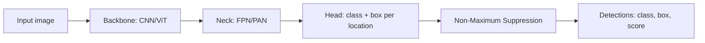

# Object Detection

## Beginner-Friendly Intuition

Object detection is "find every object of interest in this image and
draw a box around it, labeled by class." Unlike classification (one
image, one label), detection produces a variable number of outputs per
image: zero objects in some images, dozens in others. This shape
makes detection harder than classification: the model must
simultaneously decide where things are and what they are.

The intuition for the modern era of detection: the model produces
many candidate boxes (by default thousands across the image), scores
each candidate for "objectness" and class probability, and prunes
overlapping candidates with non-maximum suppression. The architecture
choices (one-stage vs two-stage, anchor-based vs anchor-free, set-
based with DETR) trade off speed against accuracy. In 2026, modern
production detectors are mostly one-stage (YOLO family, RT-DETR) or
DETR-like, with two-stage (Faster R-CNN, Mask R-CNN) reserved for
research and high-accuracy use cases.

## Formal Explanation

### The output

A detector outputs a list of detections per image:

```
detections = [(class_id, score, box) for each detection]
box = (x1, y1, x2, y2) or (cx, cy, w, h)
```

Different formats matter at the API boundary; libraries are
inconsistent.

### IoU (Intersection over Union)

The standard metric for matching predicted boxes to ground-truth
boxes:

```
IoU(A, B) = area(A ∩ B) / area(A ∪ B)
```

IoU = 1 means perfect overlap; IoU = 0 means no overlap. A predicted
box matches a ground-truth box if their IoU exceeds a threshold
(typically 0.5; COCO uses 0.5 to 0.95 in 0.05 increments).

### NMS (Non-Maximum Suppression)

Detectors produce many overlapping boxes for each object. NMS
removes redundant boxes:

1. Sort detections by score, descending.
2. Keep the highest-scoring detection.
3. Remove all other detections with IoU > threshold (typically 0.5)
   with the kept detection.
4. Repeat with the next highest-scoring remaining detection.

Variants: Soft-NMS (decay scores instead of removing), DIoU-NMS
(better for crowded scenes), Weighted Box Fusion (combine boxes
instead of choosing one).

### mAP (Mean Average Precision)

The standard detection metric:

1. For each class, compute the average precision (AP) across IoU
   thresholds: at each threshold, compute precision-recall, then
   average precision.
2. Average across classes -> mAP.

COCO mAP averages over IoU thresholds 0.5 to 0.95 in 0.05 steps,
penalizing localization error. PASCAL VOC mAP uses only IoU=0.5.
COCO is the standard benchmark.

### Architectures

#### Two-stage detectors

- **R-CNN (2014).** Generate region proposals via selective search;
  classify each.
- **Fast R-CNN (2015).** Share CNN features across proposals.
- **Faster R-CNN (2015).** Replace selective search with a Region
  Proposal Network (RPN). The classical two-stage detector.
- **Mask R-CNN (2017).** Faster R-CNN + mask head for instance
  segmentation.

Two-stage: high accuracy, lower throughput.

#### One-stage detectors

- **YOLO (You Only Look Once, 2015+).** Directly predict class and
  box per grid cell. Many versions (YOLOv1 to YOLOv11+); the YOLO
  family is the dominant production choice for real-time detection
  in 2026.
- **SSD (Single Shot Detector, 2015).** Predict at multiple scales.
  Older; outperformed by modern YOLO.
- **RetinaNet (2017).** One-stage with focal loss to handle class
  imbalance between foreground and background.
- **CenterNet, FCOS (2019).** Anchor-free; predict object center and
  size directly. Simpler than anchor-based.

One-stage: lower accuracy than two-stage historically, but modern
variants (YOLOv8, YOLOv11) match or exceed two-stage on COCO at
much higher throughput.

#### DETR family

- **DETR (Detection Transformer, 2020).** Treats detection as set
  prediction. Encoder-decoder transformer; learned object queries;
  Hungarian matching loss. End-to-end, no NMS.
- **Deformable DETR.** Sparse attention for faster training.
- **DINO, RT-DETR.** Modern variants with strong accuracy and real-
  time speed.

DETR-style models are increasingly the default for new research; YOLO
remains the default for fast deployment.

### Anchors vs anchor-free

- **Anchor-based.** Predefined boxes (anchors) at each spatial
  position; the model predicts offsets and class probabilities. Used
  by Faster R-CNN, RetinaNet, classical YOLO. Tuning anchor scales
  is its own headache.
- **Anchor-free.** Predict object center and size directly.
  CenterNet, FCOS, modern YOLO variants. Simpler, fewer
  hyperparameters, often equally accurate.

### Loss

Multi-task: classification loss (cross-entropy or focal) plus
localization loss (L1, smooth L1, IoU loss, GIoU/DIoU/CIoU).
Foreground-background class imbalance is severe (most anchors are
background); focal loss or hard negative mining handles it.

### Common training tricks

- **Mosaic augmentation.** Combine 4 images into one. YOLO standard.
- **Anchor-free or learned anchor-free.** Simpler.
- **EMA model weights.** Track an exponential moving average of
  model weights; evaluate against EMA. Often boosts mAP by 1+ point.
- **Multi-scale training.** Randomly resize inputs during training.
- **Strong augmentation.** Mosaic, Mixup, CutMix.
- **Label smoothing.** Helps calibration.

### Production concerns

- **Latency.** YOLOv8-n: 1-3 ms per image on a modern GPU at 640x640.
  Faster R-CNN: 50-100 ms.
- **Quantization.** Int8 standard; usually < 1 mAP loss.
- **TensorRT or ONNX Runtime** for deployment.
- **Streaming.** Detect per frame; track across frames if temporal
  consistency matters.

## Why It Matters in Real Jobs

Object detection runs autonomous driving, retail visual search,
manufacturing QA, video analytics, drone vision, and many more. Three
production reasons. First, **accuracy-latency trade-off** is real: a
large two-stage detector vs a small YOLO is a meaningful product
choice. Second, **NMS and confidence thresholds** are tunable;
different applications need different operating points. Third,
**post-processing** matters: tracking, smoothing, business rule
overrides on top of raw detections turn a pile of boxes into a useful
product.

## How It Works Step by Step

1. **Frame the task.** Number of classes, expected object counts per
   image, latency budget, accuracy requirements.
2. **Pick an architecture.** YOLOv8 or YOLOv11 for fast deployment.
   RT-DETR for transformer-based real-time. Mask R-CNN if you also
   need instance masks.
3. **Choose data.** Labeled bounding boxes per image. Tools: CVAT,
   Roboflow, custom annotation pipelines.
4. **Pick a backbone size.** YOLOv8-n for fastest, YOLOv8-x for
   highest accuracy. Match to compute budget.
5. **Train with augmentation.** Mosaic, HorizontalFlip, ColorJitter,
   Mixup. Long schedules (300-500 epochs typical for YOLO).
6. **Tune NMS and confidence threshold.** Different operating points
   for different applications.
7. **Evaluate with mAP per class.** Slice by object size (small /
   medium / large), since small objects are usually hardest.
8. **Quantize and deploy.** TensorRT for NVIDIA, CoreML for Apple,
   ONNX Runtime everywhere.
9. **Add tracking** if temporal consistency matters (ByteTrack,
   StrongSORT). Per-frame detection plus track-level smoothing
   reduces flicker.

## Real-World Example

A team builds a real-time pedestrian detector for a delivery robot.
Latency budget: 30 FPS on a Jetson AGX (about 33 ms per frame).
They benchmark.

- Faster R-CNN ResNet-50: 60 ms per image, mAP@0.5 0.81.
- YOLOv8-s: 12 ms, mAP@0.5 0.78.
- YOLOv8-m: 22 ms, mAP@0.5 0.81.
- YOLOv8-l: 35 ms, mAP@0.5 0.83.

YOLOv8-m is the sweet spot. They quantize to int8 and add TensorRT;
latency drops to 10 ms, mAP@0.5 holds at 0.80. They tune the
confidence threshold for high recall (low miss rate is more important
than precision; the robot can safely treat false positives as "wait
and look"). They add ByteTrack to maintain consistent IDs across
frames; per-track smoothing reduces detection flicker by 70 percent.

## Common Mistakes

- Using two-stage detectors for real-time deployment without checking
  latency.
- Setting NMS threshold and confidence threshold once and never
  revisiting; they are application-specific operating points.
- Reporting mAP@0.5 only when the application needs precise localization
  (use mAP@0.5:0.95).
- Forgetting that small objects are much harder than large ones; report
  per-size metrics.
- Skipping augmentation; detection benefits massively from mosaic and
  mixup.
- Treating detection as classification + localization independently;
  modern detectors jointly optimize both.
- Not handling crowded scenes; standard NMS removes correct
  detections in dense crowds. Use Soft-NMS or DIoU-NMS.
- Forgetting class imbalance; focal loss or hard negative mining is
  often necessary.
- Skipping tracking when you need temporal consistency; per-frame
  detection alone produces flickery outputs.

## Interview Angle

**Question:** Walk through the architecture of a one-stage detector
like YOLO and contrast with a two-stage detector like Faster R-CNN.

**Strong answer:** Both detectors share a common pattern: a
convolutional backbone produces a feature map, and a head consumes
that feature map to produce detections. They differ in how the head
works.

**Faster R-CNN (two-stage).**

1. **Backbone.** ResNet-50 or similar; produces a feature map.
2. **Region Proposal Network (RPN).** Slides a small network over the
   feature map; for each spatial position, predicts objectness scores
   and box offsets at multiple anchor scales. Outputs roughly 1000-
   2000 region proposals per image.
3. **RoI pooling / RoI align.** For each proposal, extract a fixed-
   size feature vector by cropping and resampling the backbone
   feature map.
4. **Classification + regression head.** Two fully-connected layers
   produce per-proposal class probabilities and refined box offsets.
5. **NMS.** Remove overlapping detections.

The two stages are: (1) propose regions, (2) classify and refine
them. Cost: about 50-100 ms per image at 600x600 input.

**YOLO (one-stage).**

1. **Backbone.** CSPDarknet, EfficientNet, or similar.
2. **Neck.** Feature pyramid (FPN, PAN) that combines multi-scale
   features.
3. **Head.** For each spatial position at each scale, directly
   predict class probabilities, objectness score, and box parameters.
   No region proposals; one forward pass produces all detections.
4. **NMS.** Remove overlapping detections.

The one stage is: predict everything end-to-end. Cost: 1-30 ms per
image depending on size.

The trade-off historically. Two-stage detectors had higher accuracy
because the second stage could refine each proposal carefully. One-
stage detectors were faster but less accurate. Modern YOLO variants
(v8, v11) closed the accuracy gap with techniques like:

- **Stronger backbones.**
- **Mosaic and CutMix augmentation.**
- **Anchor-free heads.**
- **Decoupled classification and regression heads.**
- **Distribution focal loss for box regression.**

In 2026, YOLOv11 matches or exceeds Faster R-CNN on COCO at 5-10x
the throughput. For real-time deployment, one-stage is the default.

DETR-style models are a third paradigm: treat detection as set
prediction with transformer encoder-decoder, no anchors, no NMS.
Modern variants (RT-DETR, DINO) compete with YOLO on speed and
accuracy.

**Weak answer:** "Two-stage is more accurate, one-stage is faster"
without explaining the architectural differences.

**Follow-up questions:**

- What is non-maximum suppression and what are its failure modes?
- How does mAP differ between PASCAL VOC and COCO?
- What is anchor-free detection and how does it work?
- How does DETR avoid NMS?

## Mini Exercise

Take a small detection dataset (e.g., a subset of COCO or a custom
dataset of 200 images). Train YOLOv8-s with default augmentations
for 50 epochs. Inspect failure cases: which objects are missed?
Which produce wrong classes? Which have wrong boxes?

## Diagram



---
## Navigation

[⬅ Previous](04-cnns-for-classification.md) | [🏠 Home](../README.md) | [➡ Next](06-image-segmentation.md)
