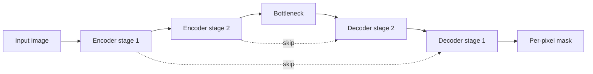

# Image Segmentation

## Beginner-Friendly Intuition

Segmentation is per-pixel classification. Instead of "this image
contains a cat" or "the cat is at this box", segmentation says "these
exact pixels are cat, those exact pixels are background." The output
is a mask the same size as the input image, where each pixel has a
class label.

The intuition: segmentation needs spatial precision that classification
and detection do not. The model must produce a high-resolution
output, which means it cannot just downsample to a tiny feature map
and call it done. Segmentation architectures use **encoder-decoder**
designs: the encoder downsamples (like a classification CNN) to
extract semantic content, the decoder upsamples back to image
resolution to produce per-pixel predictions, often with **skip
connections** that bring spatial detail from early encoder layers.

Three flavors of segmentation matter, and they answer different
questions: semantic segmentation says "what class is this pixel?",
instance segmentation says "what class is this pixel and which
specific object instance?", and panoptic segmentation answers both
at once.

## Formal Explanation

### Semantic vs instance vs panoptic

- **Semantic segmentation.** Per-pixel class label. Two cats next to
  each other are both "cat" pixels; the segmentation does not
  distinguish them.
- **Instance segmentation.** Per-pixel class plus a unique instance
  ID. The two cats get separate masks. Backgrounds (sky, road) are
  usually treated as "stuff" without instances.
- **Panoptic segmentation.** Combines both. Things (cats, cars) get
  instance IDs; stuff (sky, road) gets only a class label. One
  unified output.

The distinction matters: medical imaging usually wants semantic
segmentation (tumor pixels, regardless of count). Autonomous driving
wants instance segmentation (each pedestrian as a separate entity).
Photo editing wants panoptic.

### Architectures

#### FCN (Fully Convolutional Networks, 2015)

Replace the final fully-connected layers of a classification CNN
with convolutions, then upsample the output to image resolution.
Simple, set the template.

#### U-Net (2015)

Symmetric encoder-decoder with skip connections at every level. The
encoder downsamples; the decoder upsamples; skip connections
concatenate matching-resolution encoder features into the decoder.
The classical default for medical imaging and any task where high-
resolution detail matters.

#### DeepLab (v1-v3+)

Dilated convolutions in the encoder to maintain spatial resolution
while growing the receptive field. **Atrous Spatial Pyramid Pooling
(ASPP)** captures multi-scale context. Strong for street-scene
segmentation.

#### Mask R-CNN (2017)

Extends Faster R-CNN with a per-RoI mask head. The standard for
instance segmentation. Two-stage; high accuracy, moderate speed.

#### Panoptic FPN, Mask2Former

Unified architectures for panoptic segmentation. Mask2Former (2022)
uses transformer decoder over learned queries; same model handles
semantic, instance, and panoptic segmentation by changing the loss.

#### SAM (Segment Anything, 2023)

Foundation model for segmentation. Prompt with a point, box, or
text; the model produces a mask. Trained on 1B+ masks. Useful for
interactive segmentation and as a labeling tool.

### Loss functions

- **Cross-entropy.** Per-pixel cross-entropy. Standard for semantic
  segmentation. Suffers under class imbalance (large background, tiny
  foreground).
- **Dice loss.** `1 - 2 |A ∩ B| / (|A| + |B|)`. Directly optimizes
  the Dice coefficient (overlap with ground truth). Robust to class
  imbalance. Common in medical imaging.
- **Focal loss.** Down-weights easy pixels. Helps with imbalance.
- **Combined.** Many recipes use cross-entropy + Dice or focal +
  Dice.
- **Boundary loss.** Penalize errors near object boundaries. Improves
  edge quality.

### Metrics

- **IoU (Jaccard index) per class.** `|A ∩ B| / |A ∪ B|` between
  predicted mask and ground truth.
- **Mean IoU (mIoU).** Average IoU across classes. The standard
  semantic segmentation metric.
- **Dice coefficient.** `2 |A ∩ B| / (|A| + |B|)`. Equivalent to F1
  for binary masks. Common in medical imaging.
- **Pixel accuracy.** Misleading under class imbalance.
- **Boundary F1.** Measures edge accuracy specifically.
- **Panoptic Quality (PQ).** For panoptic segmentation: combination
  of segmentation quality (IoU) and recognition quality (precision
  and recall on instance match).
- **AP per IoU threshold** for instance segmentation, like detection
  but with mask IoU.

### Common training tricks

- **Heavy augmentation.** RandomCrop, HorizontalFlip, RandomScale,
  ColorJitter. Critical for small datasets.
- **Multi-scale training.** Train on multiple input resolutions.
- **Class balancing.** Weighted cross-entropy or oversampling for
  rare classes.
- **Test-time augmentation.** Multi-scale + flip; average masks.
- **Ensemble.** Multiple models; average predictions. Used in many
  Kaggle wins.

### Encoder backbones

Same as classification: ResNet, EfficientNet, ConvNeXt, ViT, Swin.
Pretrained ImageNet weights are the standard starting point.

### Resolution and memory

Segmentation is memory-hungry: the decoder produces high-resolution
output, which uses lots of GPU memory. Common workarounds:

- **Train at smaller crops** (e.g., 512x512 random crops from a
  1024x1024 image).
- **Mixed precision** (BF16 / FP16).
- **Gradient checkpointing** to save memory at compute cost.
- **Inference at full resolution** with overlapping tiles, then merge.

## Why It Matters in Real Jobs

Segmentation runs medical imaging (tumor segmentation, organ
segmentation), autonomous driving (drivable surface, lane
detection), photo editing (background removal), satellite imagery
(land use, deforestation), and manufacturing (defect mapping). Three
production reasons. First, **accuracy on rare classes** matters more
than aggregate IoU; per-class metrics drive most product decisions.
Second, **edge quality** matters: a mask with the right area but
fuzzy edges is unusable for many products. Third, **memory**: the
budget for high-resolution segmentation is the binding constraint
for many systems.

## How It Works Step by Step

1. **Frame the task.** Semantic, instance, or panoptic? Per-class
   importance? Required spatial precision?
2. **Pick an architecture.** U-Net for medical or small datasets.
   DeepLabv3+ for street scenes. Mask R-CNN for instance. Mask2Former
   or SAM for foundation-model-based.
3. **Pick a backbone.** ResNet-50 for a fast baseline; ConvNeXt or
   Swin for modern accuracy.
4. **Design the loss.** Cross-entropy for balanced. Cross-entropy +
   Dice for imbalanced. Add boundary loss if edges matter.
5. **Train with augmentation.** RandomCrop is the most important;
   match crop size to inference size or larger.
6. **Evaluate per class.** mIoU plus per-class IoU. Inspect masks
   visually; aggregate metrics hide systematic errors.
7. **Test-time augmentation if accuracy matters.** Multi-scale + flip
   averaging. Adds latency.
8. **Deploy.** Tile-based inference for large images. Quantization
   for memory savings.
9. **Monitor for distribution shift.** Per-class IoU on production
   data; retrain when it drifts.

## Real-World Example

A team builds a tumor segmentation model for medical imaging. Single-
class binary segmentation: tumor vs background. Tumors are about 0.5
percent of pixels.

- Cross-entropy alone: pixel accuracy 99.5 percent (model predicts
  background for everything), tumor IoU 0.02. Useless.
- Cross-entropy + class weights (1, 200): tumor IoU 0.68.
- Combined loss (cross-entropy + Dice): tumor IoU 0.74.
- Same plus boundary loss: tumor IoU 0.74 (no IoU change), but mask
  quality at edges measurably improved per radiologist review.
- Ensemble of 3 models with different seeds + TTA: tumor IoU 0.78.

They ship the ensemble for offline analysis (latency not critical).
For real-time triage, they use a single model without TTA at lower
accuracy. The lesson: under severe class imbalance, the loss
function matters more than the architecture.

## Common Mistakes

- Reporting pixel accuracy on imbalanced segmentation; "predict
  everything as background" can score 99 percent.
- Cross-entropy alone for highly imbalanced cases; the model
  predicts background everywhere.
- Forgetting test-time augmentation when accuracy matters; multi-
  scale + flip averaging adds 1-3 mIoU points.
- Resizing high-resolution masks naively; nearest-neighbor or
  bilinear changes class boundaries.
- Forgetting to handle the "ignore" class in many datasets; some
  pixels are unlabeled and should not contribute to loss.
- Using detection metrics for segmentation tasks; mAP is for boxes,
  mIoU for masks.
- Skipping skip connections in encoder-decoder architectures; output
  loses fine spatial detail.
- Using the same model for instance and panoptic without checking;
  panoptic needs additional supervision.
- Treating SAM zero-shot output as ground truth; it produces good
  masks but with wrong class labels.

## Interview Angle

**Question:** Walk through how U-Net works, what makes its skip
connections important, and when you would prefer it over DeepLabv3+
or Mask R-CNN.

**Strong answer:** U-Net (Ronneberger et al., 2015) is a fully
convolutional encoder-decoder architecture for semantic segmentation.

**Architecture.**

1. **Encoder (contracting path).** Standard convolution + pooling
   stages, like a classification CNN. Each stage halves the spatial
   resolution and doubles the channel count. Captures semantic
   content but loses spatial detail.
2. **Decoder (expanding path).** Symmetric to the encoder. Each stage
   doubles the spatial resolution (via transposed convolution or
   upsampling + convolution) and halves the channel count. Produces
   per-pixel output at the input resolution.
3. **Skip connections.** At each level, concatenate the encoder's
   feature map at that resolution with the decoder's feature map at
   the same resolution. The decoder thus has access to both deep
   semantic features (from below) and shallow spatial features (from
   the skip connection).

**Why skip connections are critical.** Without them, the decoder
must reconstruct spatial detail from a heavily-downsampled feature
map. The encoder discarded spatial precision when it pooled; the
decoder cannot recover that information from the bottleneck alone.
Skip connections bypass the bottleneck for spatial information,
giving the decoder direct access to high-resolution features. The
final output preserves edge accuracy and small structures.

**When to prefer U-Net.**

- **Medical imaging.** U-Net was designed for it. Strong on small
  datasets (tens to hundreds of images), where its inductive bias
  (multi-scale features, skip connections) matches the typical
  problem.
- **Tasks where edge accuracy matters.** Defect segmentation in
  manufacturing, organ boundaries in CT scans, anything where the
  exact mask boundary is part of the deliverable.
- **Smaller datasets.** U-Net trains cleanly with 100-1000 images
  thanks to its strong inductive bias.

**When to prefer DeepLabv3+.**

- **Street scenes and natural images.** Trained at scale on Cityscapes
  and similar. The dilated convolutions and ASPP capture multi-scale
  context better than U-Net at high resolution.
- **Heavily-textured natural scenes.**

**When to prefer Mask R-CNN.**

- **Instance segmentation.** When you need to distinguish individual
  objects of the same class.

**When to prefer Mask2Former or SAM.**

- **Multiple segmentation tasks.** Mask2Former handles semantic,
  instance, and panoptic with a single architecture.
- **Interactive labeling.** SAM with prompts is the modern annotation
  tool.

The general rule: U-Net is a workhorse for medical-style problems;
DeepLab for street-scene-style; Mask R-CNN for instances; Mask2Former
or SAM for foundation-model-driven workflows.

**Weak answer:** "U-Net has skip connections" without explaining what
they accomplish or when to use it.

**Follow-up questions:**

- What is Dice loss and when does it beat cross-entropy?
- What is the difference between semantic, instance, and panoptic
  segmentation?
- How does SAM's promptable segmentation work?
- What is mIoU and why is it the standard semantic segmentation
  metric?

## Mini Exercise

Take a small segmentation dataset (Pascal VOC subset, Cityscapes
subset, or a public medical dataset). Train U-Net with cross-entropy
only and with cross-entropy + Dice. Compare per-class IoU. Note the
difference for rare classes.

## Diagram

---
## Navigation

[⬅ Previous](05-object-detection.md) | [🏠 Home](../README.md) | [➡ Next](07-vision-transformers.md)
