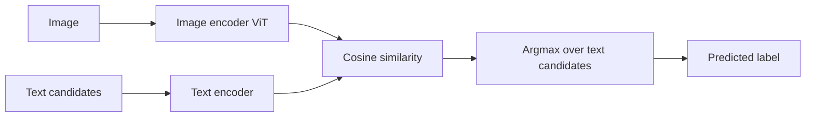

# Multimodal Models

## Beginner-Friendly Intuition

A multimodal model handles more than one input type at once: image
plus text, audio plus text, video plus audio plus text. The major
breakthrough came from CLIP (Radford et al., 2021), which learned to
embed images and text into the same vector space by training on 400M
image-text pairs from the internet. Two encoders, one contrastive
loss, one shared embedding space. The result was zero-shot image
classification (give the model any class name as text, it can
classify images into that class without training), the foundation of
text-to-image generation, and the embedding model behind countless
visual search systems.

The intuition: aligning two modalities into a shared space is the
big idea. Once images and text live in the same vector space, you
can search for images by text, classify images by text labels, and
condition image generation on text. The shared space is the
interface; everything else is engineering on top of it.

In 2026, multimodal models extend this further: large multimodal
language models (LLaVA, GPT-4V, Gemini, Claude with vision) take an
image as input and answer arbitrary questions about it. The
interface is conversational; the underlying machinery is ViT
encoders feeding into LLMs.

## Formal Explanation

### CLIP (Contrastive Language-Image Pretraining)

Two encoders trained jointly:

- **Image encoder.** ViT-Base/16 or ResNet-50.
- **Text encoder.** Transformer.

Training: for a batch of N image-text pairs, compute the cosine
similarity between every image and every text. The loss is symmetric
contrastive: each image should be most similar to its paired text;
each text should be most similar to its paired image. Specifically:

```
L = (CE(image_to_text_logits, labels) + CE(text_to_image_logits, labels)) / 2
```

where logits are scaled cosine similarities and labels are the
diagonal indices (pair `i` matches pair `i`).

After training, the two encoders produce vectors in the same space.
Cosine similarity between an image embedding and a text embedding
measures how well the text describes the image.

### CLIP applications

- **Zero-shot classification.** For each candidate class name,
  encode the text "a photo of a {class}". Encode the image. Pick
  the class whose text embedding is most similar to the image
  embedding. No training needed.
- **Image-text retrieval.** Embed corpus of images; embed query text.
  Return nearest images.
- **Text-to-image search.** Same as above, scaled to billions of
  images.
- **Image-to-image search.** Use the image encoder for visual
  similarity.
- **Conditioning text-to-image generation.** Stable Diffusion uses a
  CLIP text encoder to condition image generation.

### BLIP (Bootstrapping Language-Image Pretraining)

Adds generative capability to CLIP-style alignment. Three losses:

- **Image-text contrastive.** Like CLIP.
- **Image-text matching.** Binary classifier: do this image and
  this text match?
- **Image-conditioned language modeling.** Generate captions from
  images.

BLIP and BLIP-2 produce both strong embeddings and the ability to
generate text from images.

### LLaVA, GPT-4V, Gemini, Claude with Vision (multimodal LLMs)

The 2024+ wave: take a strong language model and add an image
encoder. The image encoder produces a sequence of tokens that gets
prepended to the text input; the LLM then attends over both image
and text tokens. The result is a model that can answer arbitrary
questions about images: "what is in this picture?", "describe the
defect", "transcribe the text", "explain the chart".

Architecture sketch:

1. **Image encoder.** A ViT (often CLIP-ViT or DINOv2).
2. **Connector.** A linear projection or small MLP that maps image
   features to the LLM's embedding space.
3. **Language model.** A standard LLM (LLaMA, Qwen, Mistral) that
   processes interleaved image and text tokens.

Training is in stages: first align the connector while freezing
both encoders, then fine-tune the connector + LLM on instruction-
following examples that include images.

### Diffusion models for generation

- **Stable Diffusion, DALL-E, Imagen, Midjourney.** Text-to-image
  generation via diffusion. The text prompt conditions a diffusion
  process that gradually denoises a random latent into an image.
- **Variants.** ControlNet for additional control signals (sketches,
  depth maps, poses), inpainting for editing.
- **Video diffusion** (Sora, Veo) for text-to-video.

The training: a denoising network learns to reverse a Gaussian
diffusion process; the text prompt conditions the denoising at every
step.

### Audio-language and video-language

- **Whisper.** Speech-to-text via encoder-decoder transformer over
  spectrograms.
- **AudioLM, MusicLM.** Audio generation conditioned on text.
- **Video-LLaMA, Video-LLaVA, VideoCoCa.** Video understanding with
  LLM interfaces.

### Foundation models and zero-shot

The defining property of multimodal foundation models is **zero-shot
generalization**. CLIP can classify images into categories it never
saw labels for. GPT-4V can answer questions about diagrams it has
never seen. SAM can segment objects given a single point prompt.
This is qualitatively different from traditional CV, where every new
class required retraining.

### Limitations

- **Hallucination.** Multimodal LLMs sometimes describe content that
  is not in the image. Must verify for production use.
- **Bias.** Pretraining data reflects the internet's biases; CLIP
  associates certain occupations with genders, certain races with
  prejudicial attributes. Audit before deployment.
- **OCR and fine detail.** General-purpose vision models often miss
  fine text or small details; specialized OCR models still win on
  text-heavy images.
- **Compositional reasoning.** "A red cube on a blue ball" with
  positions and counts is still hard.
- **Updates.** Multimodal LLMs are usually proprietary and updated
  silently; verify behavior consistency over time.

## Why It Matters in Real Jobs

Three production roles. First, **CLIP-style embeddings power search
and recommendation** at scale: visual search, content moderation,
image-text retrieval. Second, **multimodal LLMs handle long-tail
queries** that bespoke models cannot, especially when input variety
is high (uploading a photo + asking "what's wrong with this?").
Third, **generation models** (Stable Diffusion, DALL-E variants) are
in product workflows for design, marketing, and prototyping.

The cost. Hosted multimodal LLMs are expensive (often $0.01-$0.05
per query with images). Open-source variants need GPU infrastructure.
Embeddings are cheaper (CLIP runs in a few ms) but require an index
infrastructure for retrieval.

## How It Works Step by Step

1. **Frame the task.** Classification (CLIP zero-shot or fine-
   tuned), retrieval (CLIP embeddings + ANN index), generation
   (Stable Diffusion variants), open question answering (multimodal
   LLM).
2. **Pick a model.** CLIP for embeddings. SAM for segmentation. GPT-
   4V or LLaVA for QA. Stable Diffusion for generation.
3. **Decide hosted vs open-source.** Hosted (OpenAI, Anthropic, Google)
   for convenience and quality; open-source (LLaVA, CogVLM, Qwen-VL)
   for on-premise, control, or cost.
4. **Adapt if needed.** CLIP fine-tuning for domain shift. LoRA for
   multimodal LLMs. Prompt engineering for hosted models.
5. **Build the pipeline.** Embedding -> ANN index -> retrieval, or
   image input -> multimodal LLM with structured prompt.
6. **Evaluate.** Task-specific metrics. Human evaluation for
   open-ended outputs.
7. **Monitor.** Hallucination rate, retrieval quality, drift.

## Real-World Example

A team builds visual search for an e-commerce catalog (5M products).
They embed every product image with CLIP-ViT-L/14; embeddings are
512-dim. They build an HNSW index. At query time, the user uploads a
photo; they encode it with CLIP and retrieve top-100 nearest
products. A reranker reorders the top-100 using a cross-encoder
trained on (query image, product image, click) triples; final top-10
is shown.

Recall@10 on a labeled query set: 0.74. Click-through rate in A/B
test: +18 percent vs the previous keyword-based search. Six months
later, they add a multimodal LLM (GPT-4V) that can handle queries
like "find shoes that go with this dress"; the LLM extracts attributes
from the image and translates to a structured search query, which is
then matched against the catalog. Coverage of "natural language +
image" queries jumps; click-through on those queries is +35 percent
versus image-only search.

## Common Mistakes

- Treating CLIP as plug-and-play for any domain; it underperforms on
  specialized domains (medical, satellite) without fine-tuning.
- Comparing CLIP zero-shot to a fine-tuned classifier and concluding
  zero-shot is always inferior; sometimes the classifier overfits a
  narrow distribution that CLIP handles more robustly.
- Forgetting that hosted multimodal LLMs are non-deterministic;
  same input can produce different outputs.
- Using multimodal LLMs to read fine text reliably; OCR-specific
  models are more reliable.
- Ignoring hallucination in multimodal LLM outputs; production
  systems need verification or human review for high-stakes
  applications.
- Skipping safety review for generative models; they can produce
  copyrighted content, biased outputs, or unsafe imagery.
- Comparing CLIP variants without controlling for the training
  corpus; CLIP-L vs SigLIP-L is more about training data than
  architecture.
- Treating image embeddings as cosine-comparable across models; they
  are not. Use one model end-to-end.

## Interview Angle

**Question:** Explain CLIP's training objective, why it works, and
how zero-shot classification with CLIP differs from a traditional
classifier.

**Strong answer:** CLIP (Contrastive Language-Image Pretraining)
trains two encoders jointly: an image encoder (ViT or ResNet) and a
text encoder (transformer). Training data is 400 million image-text
pairs scraped from the web. For each batch of N pairs, the model
computes the cosine similarity between every image embedding and every
text embedding, producing an N x N similarity matrix. The loss has
two parts: cross-entropy treating each row as a classification
problem (the correct text for image `i` should be the diagonal
entry), and cross-entropy treating each column as a classification
problem (the correct image for text `i` should be the diagonal entry).
Symmetric contrastive loss.

The effect: after training, image embeddings and text embeddings
live in the same vector space. An image of a cat is close (in cosine
similarity) to text like "a photo of a cat" and far from text like
"a photo of a car". The shared space is the entire point.

How zero-shot classification with CLIP differs from a traditional
classifier.

- **Traditional classifier.** Trained on labeled examples; each
  class is a fixed slot in the output layer. Adding a new class
  requires retraining or at least adding a new output dimension.
  Cannot classify into classes it has not seen.
- **CLIP zero-shot.** Encodes text descriptions of candidate classes
  ("a photo of a cat", "a photo of a dog", "a photo of a stop
  sign"). Encodes the image. Picks the class whose text embedding
  is closest to the image embedding. Adding a new class is just
  adding a new text description. The model never trained on the
  exact class label, but it learned a general image-text alignment
  that transfers.

The implications.

- **Open-vocabulary.** CLIP can classify into any class you can
  describe in text. Useful for long-tail or constantly-changing
  category sets.
- **Robustness.** CLIP is more robust to distribution shift than
  classifiers trained on narrow domains. Trained on internet diversity,
  it generalizes to many input distributions.
- **Composability.** The text encoder can compose ("a red car parked
  on grass") in ways a fixed classifier cannot.

The limitations.

- **Domain shift.** CLIP underperforms on specialized domains
  (satellite imagery, medical imaging, manufacturing defects)
  because they were rare in pretraining.
- **Fine-grained categories.** CLIP struggles with subtle
  distinctions ("Granny Smith vs Honeycrisp apple") that a domain-
  specific classifier handles better.
- **Bias.** CLIP reflects the biases of its 400M-pair internet
  corpus.

In production, CLIP is used for visual search, content moderation,
zero-shot triage, and as a backbone for fine-tuning when labeled
data is moderate. For high-accuracy domain-specific tasks with
plenty of labels, a fine-tuned classifier still wins.

**Weak answer:** "CLIP aligns images and text" without explaining
the contrastive loss or zero-shot inference.

**Follow-up questions:**

- How does Stable Diffusion use CLIP?
- What is the difference between CLIP and a multimodal LLM?
- How would you fine-tune CLIP for a specialized domain?
- What is hallucination and how do you mitigate it in multimodal
  LLMs?

## Mini Exercise

Use a pretrained CLIP model. Encode 100 images from a custom
dataset and 100 candidate class descriptions ("a photo of a {x}").
Compute the matrix of cosine similarities. For each image, pick the
closest class. Report top-1 zero-shot accuracy. Then fine-tune the
text prompts (try "a high-resolution photo of a {x}") and note the
sensitivity.

## Diagram



---
## Navigation

[⬅ Previous](07-vision-transformers.md) | [🏠 Home](../README.md) | [➡ Next](../recommender-systems/01-recommender-systems-overview.md)
