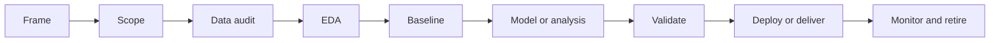

# Data Science Workflow

## Beginner-Friendly Intuition

A data science workflow is the order of operations you follow so that a messy question
turns into a defensible answer. People who skip the order spend weeks training a model
that solved the wrong problem. People who follow the order often deliver a useful answer
without training any model at all, because a clean baseline plus a chart is sometimes
the entire deliverable.

A useful mental picture is a funnel. At the top you have a vague business question. By
the bottom you have a number, a chart, or a model with a clear owner, a clear metric,
and a clear plan for what happens when it breaks. Every phase narrows the funnel.

## Formal Explanation

A workflow is a sequence of phases with explicit inputs, outputs, and decision gates. A
practical version has nine phases:

1. **Frame.** Translate the business request into a precise question with an estimand
   (the quantity you want to estimate or predict) and a decision the answer will drive.
2. **Scope.** Pick the smallest version of the problem that still has business value,
   write the success metric, and write the kill criteria.
3. **Data audit.** Find the data sources, check freshness, schema stability, ownership,
   join keys, missingness rates, and known logging bugs.
4. **EDA.** Explore distributions, outliers, segments, and pairwise relationships. The
   goal is to generate hypotheses, not to confirm them.
5. **Baseline.** Build the simplest reasonable answer first. For prediction this is
   often a constant, a rule, or logistic regression. For analysis it is a single
   weighted average.
6. **Model or analysis.** Iterate on the method. Each iteration must beat the previous
   on the success metric on a held-out evaluation, or be rejected.
7. **Validate.** Stress test on slices, on time-shifted data, on adversarial users, and
   on the segments the business cares about.
8. **Deploy or deliver.** Ship the model behind a feature flag, ship the analysis with
   a clear caveat slide, or ship the dashboard with an owner.
9. **Monitor and retire.** Track input drift, target drift, business metric, and the
   gap between offline and online evaluation. Retire the work when the cost of
   maintaining it exceeds its value.

## Why It Matters in Real Jobs

The workflow is the contract between data science and the rest of the business. Product
needs to know when the answer is coming. Engineering needs to know what to instrument.
Legal needs to know what data is touched. Skipping the framing phase is the most common
reason data work gets shelved: the answer is technically correct but solves a problem
nobody asked for. Skipping the monitoring phase is the most common reason a winning
model quietly becomes a losing model six months later.

A second reason workflows matter is that they reveal whether the question can be
answered at all. If the framing phase ends with "we do not have the data and cannot get
it in time," the right move is to stop, not to fit a model on what little is available.

## How It Works Step by Step

1. **Write the question on one line.** If the line has the words "somehow" or "better"
   in it, the question is not yet sharp.
2. **Decide whether the question is observational or experimental.** Observational
   answers tell you what is happening. Experimental answers tell you what would happen
   if you intervened. Causal claims need experiments or strong assumptions.
3. **Define one primary metric and at most two guardrails.** Add a kill criterion
   ("if guardrail X drops more than 1 percent we abandon").
4. **Audit the data before you analyze.** Pull row counts by day, missingness by
   column, and a few sanity checks (sums match what finance reports, user counts match
   what the product team knows).
5. **Build a baseline before a model.** A constant prediction or a single regression is
   often within a few points of a tuned model and forces the team to ask whether the
   complex method is worth the cost.
6. **Iterate with a held-out set.** Never tune on the test set. Never average across
   segments that should be reported separately.
7. **Write the result before deploying.** A short doc with the metric, the CI, the
   slices, the caveats, and the rollback plan saves a lot of reverse-engineering later.

## Real-World Example

A growth team asks "can we predict which trial users will convert?" The data scientist
reframes it as "we want to identify the top 10 percent of trial users so the customer
success team can call them within 24 hours, with the goal of lifting conversion by 2
percent." That reframing changes the project. The metric becomes precision at the top
10 percent rank, not AUC. The guardrail becomes time-to-contact, because if the model
ranks users that customer success cannot actually reach, it is useless. The baseline is
a rule that picks users who hit the activation event. The model is logistic regression
with a handful of behavioral features. The win is small, the deploy is a CSV uploaded
into the CRM, and the monitoring is a weekly check that the rule's lift over random is
still positive.

## Common Mistakes

- Starting with model selection before framing and baseline.
- Using "improve the metric" as the framing without naming the metric.
- Mixing the test set into early iteration and discovering on launch day that the
  reported gain was an illusion.
- Running EDA forever because no decision gate was set.
- Forgetting that a workflow includes shutting things down, not only building them.
- Ignoring the gap between the offline metric and the business metric. AUC can rise
  while revenue does not.

## Interview Angle

Interviewers use this topic to test whether you can lead a project, not just train a
model.

**Question:** Walk me through how you would tackle a new data science problem from
day one.

**Strong answer:** Start with framing. Translate the business request into a precise
estimand and a decision. Set a primary metric and a guardrail. Audit the data before
modeling. Build a baseline. Validate on slices and on time-shifted data. Ship behind
a flag. Set up monitoring for input drift and the business metric. Plan retirement
criteria. Throughout, be willing to abandon the project if the data audit shows the
question cannot be answered honestly.

**Weak answer:** "I would clean the data, do EDA, train a model, evaluate it, and
deploy." This skips framing, scoping, baselines, validation slices, monitoring, and
retirement.

**Follow-up questions:**

- How do you decide between an analysis and a model?
- What goes in your project doc before you write any code?
- When do you stop iterating?
- How do you tell if a deployed model has gone stale?

## Mini Exercise

Pick a real product (search ranker, fraud review, support routing). For each of the
nine phases, write one sentence describing the input, the output, and the decision
gate. Identify the phase where you have the most uncertainty.

## Diagram

---
## Navigation

[⬅ Previous](../statistics/12-statistics-for-interviews.md) | [🏠 Home](../README.md) | [➡ Next](02-data-cleaning.md)
