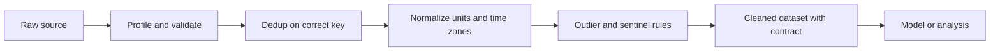

# Data Cleaning

## Beginner-Friendly Intuition

Data cleaning is the work of turning what your sources actually logged into what you
thought they logged. Real-world data has duplicates, wrong types, mixed units, broken
timestamps, ghost users, and entries that were truncated by a script three years ago.
None of this is glamorous. All of it changes the answer. A common rule of thumb is that
60 to 80 percent of a data project's time goes here, and the share grows with how new
the data source is.

The intuition to hold is that cleaning is not the same as preprocessing. Cleaning fixes
errors that exist independent of your model. Preprocessing transforms valid values into
the shape your model wants (scaling, encoding, splitting). Mixing the two leads to
confusion, because preprocessing decisions can be tuned on validation data, but cleaning
decisions cannot.

## Formal Explanation

Data cleaning is the set of operations that bring a dataset into agreement with its
declared schema and its real-world meaning. The main operation classes are:

- **Type coercion.** Strings that should be numbers, numbers that lost precision after
  a CSV round-trip, datetimes stored as strings.
- **Deduplication.** Exact duplicates, near duplicates (same user, two rows with
  different casing), and conceptual duplicates (two row IDs that refer to the same
  event).
- **Outlier handling.** Out-of-range values (age = 999), tail values that are real but
  rare, sentinel values (-1 or 9999 used to mean "missing").
- **Unit and encoding fixes.** Mixed currencies, mixed time zones, mixed encodings
  (UTF-8 vs Latin-1), mixed casing on join keys.
- **Reference integrity.** Foreign keys that point at deleted rows, joins that silently
  drop unmatched users.
- **Missing values.** Distinguish "actually unknown" from "logged as empty string."
  Detailed handling is in [05-handling-missing-values.md](05-handling-missing-values.md).
- **Schema validation.** A contract on column names, types, allowed ranges, and
  nullability that runs every time the dataset is rebuilt.

A clean dataset answers "yes" to four questions: do the columns mean what the schema
says, are the rows the unit of analysis you want, are the values in the ranges you
expect, and would the same query run yesterday give you the same answer.

## Why It Matters in Real Jobs

A model trained on dirty data is not just less accurate; it is wrong in patterned ways
that hide from the average metric and surface in the worst customer complaints. A
classic example: a fraud model trained on a join that silently dropped users without
profile photos appeared to hit 0.95 AUC offline. In production, recall on real fraud
collapsed because most fraudsters did not upload photos. The model never saw them
during training.

Cleaning also matters for trust. When the finance team's number does not match the
data team's number, the data team loses the argument. The fix is almost always a
cleaning bug (different time zone, different deduplication rule), not a modeling bug.

## How It Works Step by Step

1. **Profile.** For every column, count rows, distinct values, nulls, min, max, top
   values. This catches sentinel values and silent type drift.
2. **Validate the schema.** Run a tool (Pandera, Great Expectations, dbt tests) that
   asserts ranges, types, and nullability. Make the build fail when the contract
   breaks.
3. **Reconcile with sources of truth.** Cross-check totals against finance, against
   the product analytics tool, and against a manual count of a small sample.
4. **Deduplicate by the correct key.** "Same user" is rarely "same row." Decide whether
   the unit is user, session, request, or event, and dedupe on that key.
5. **Fix outliers with rules, not eyeballs.** Use IQR (anything outside Q1 minus 1.5
   times IQR or Q3 plus 1.5 times IQR), z-scores (|z| > 3), or domain rules ("age must
   be in [13, 110]"). Log every dropped row.
6. **Normalize units and time zones once, at ingest.** Currency to a single currency
   using the day's rate. All timestamps to UTC. All strings to a consistent case for
   join keys.
7. **Document the cleaning.** A short README that lists every rule, the count of rows
   it dropped, and the date the rule was added.

## Real-World Example

A subscription product's revenue dashboard suddenly drops 8 percent. The data team
investigates. The schema validator passes. The model is unchanged. The cause turns out
to be a cleaning rule added two weeks earlier: a deduplication step on user email that
lower-cased the address. A small set of paying users had been double-counted because
their email casing differed across two sign-up flows. The dedup did not lose revenue;
it revealed a count that had always been wrong. The fix was to update the historical
dashboard, not to remove the cleaning rule. The lesson is that cleaning often surfaces
inconvenient truths and the right response is to update downstream consumers, not to
hide the truth behind older rules.

## Common Mistakes

- Treating cleaning as a one-time script instead of a recurring pipeline with tests.
- Coercing types silently (`pd.to_numeric(..., errors='coerce')`) without logging how
  many rows were turned into NaN.
- Dropping outliers before checking whether they are real (a billion-dollar customer
  is not noise).
- Deduplicating on the wrong key and losing rows that meant different things.
- Mixing cleaning with preprocessing so that test-set rows are quietly transformed
  using statistics computed on themselves.
- Running cleaning in a notebook and forgetting which version of the data the report
  was built on.

## Interview Angle

**Question:** A teammate's analysis says revenue is up 12 percent and another says it
is flat. Both pulled from the same warehouse. What do you check?

**Strong answer:** First, ask each person for the exact query and the run timestamp.
Cleaning differences usually explain it. Likely culprits: different deduplication keys
(email vs user_id), different time-zone treatment (UTC vs local), different inclusion
of refunds, different handling of test accounts, different join semantics (inner vs
left). Reconcile with finance to identify which number matches the source of truth,
then write a shared cleaning step both queries call.

**Weak answer:** "Probably one of them has a bug." The interview wants the diagnostic
tree, not a guess.

**Follow-up questions:**

- How would you write a contract test that catches this in CI?
- How do you decide whether to drop or keep a row that fails a validation rule?
- What goes in a data quality dashboard?
- When does cleaning become preprocessing?

## Mini Exercise

Take any tabular dataset you have. Write a one-page profile: for each column, list
type, null rate, distinct count, min, max, and the five most frequent values. Mark
any column where the profile suggests a cleaning rule (sentinel values, type drift,
unbounded outliers).

## Diagram

---
## Navigation

[⬅ Previous](01-data-science-workflow.md) | [🏠 Home](../README.md) | [➡ Next](03-exploratory-data-analysis.md)
