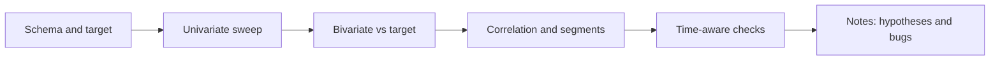

# Exploratory Data Analysis

## Beginner-Friendly Intuition

EDA is the part of a project where you look at the data and let it surprise you. The
goal is not to test a hypothesis. The goal is to generate hypotheses worth testing
later. A good EDA session ends with a list of questions a model could answer, not with
a model.

The classic motivating example is Anscombe's quartet: four datasets that have nearly
identical mean, variance, correlation, and regression line, but look completely
different when plotted. One is a clean line. One is a curve. One is a line with one
extreme outlier. One is a vertical stripe with a single horizontal point. Summary
statistics agree on all four. Plots disagree at a glance. The lesson is that you
cannot skip looking. The Datasaurus Dozen makes the same point with twelve datasets
that share mean, variance, and correlation but include a dinosaur, a star, and an X.

## Formal Explanation

EDA is a structured walk through three layers of the data:

- **Univariate.** One column at a time. Distribution shape (histogram, density, box
  plot), central tendency (mean, median), spread (IQR, std), skew, support (range),
  and missingness pattern.
- **Bivariate.** Two columns at a time. Scatter plot for two continuous variables.
  Box plot or violin for continuous-vs-categorical. Mosaic or grouped bar for
  categorical-vs-categorical. Correlation heatmap for many continuous columns.
- **Multivariate.** Three or more columns. Pair plots, faceted plots, dimensionality
  reduction (PCA, t-SNE, UMAP) for cluster discovery, and conditional summaries
  (group-by aggregates).

EDA is not a fixed sequence of plots. It is the conversation between what the data
shows and what the business expected. You write down every surprise.

## Why It Matters in Real Jobs

Three reasons EDA pays off. First, it catches data quality issues before they ruin a
model: a column that is 80 percent zeros, a categorical with thousands of rare levels,
a target that is leaking through a future-dated feature. Second, it tells you which
features will be useful, which removes weeks of model tuning. Third, it gives you the
charts you will need for the final report; charts produced for the analyst are usually
half of the charts produced for the executive.

Skipping EDA is the most common cause of "the model works offline but not online":
a feature was perfect on training data because it was computed at a moment when the
target was already known.

## How It Works Step by Step

1. **Audit the schema.** Print column types, null rates, and a sample of rows.
2. **Univariate sweep.** Histogram for every numeric column. Bar chart for every
   categorical with fewer than 30 levels. Note skew, multimodality, suspicious spikes
   at zero or at sentinel values like 999.
3. **Target distribution.** If you have a target, plot its distribution first. Class
   imbalance, heavy tails, and zero-inflation all change the modeling plan.
4. **Bivariate against the target.** For each feature, plot it against the target.
   Continuous-vs-continuous: scatter with a smoothing curve. Continuous-vs-categorical:
   box plot. The shape tells you whether the feature is informative and whether the
   relationship is monotonic.
5. **Correlation heatmap.** Spearman for monotone relations, Pearson for linear. Look
   for clusters of highly correlated features (multicollinearity) and for variables
   that correlate with the target.
6. **Segment slices.** Recompute the target distribution and key features within
   important segments (country, device, plan tier, time bucket). Differences between
   segments are usually the most interesting findings.
7. **Time-aware checks.** Plot every feature and the target by week or month. Look for
   step changes (logging bugs, product launches), seasonality, and drift.
8. **Write the surprises down.** Each surprise becomes either a hypothesis to test, a
   feature idea, a cleaning rule, or a data bug to file.

## Real-World Example

A team is asked to predict churn for a SaaS product. Univariate EDA shows that 30
percent of users have zero feature usage in their first week. The target distribution
shows that churn is 18 percent overall, but in the zero-usage segment it is 62 percent.
The bivariate plot of "days since last login" against churn is sharply monotonic. The
heatmap reveals that "days since last login" is highly correlated with three other
features that are all proxies for activity. A time-bucket plot shows that churn jumped
in March, lining up with a billing change. The findings before any modeling: build a
simple rule (predict churn if zero-usage week one) as a baseline, focus features on
recency rather than aggregate counts, and segment evaluation by signup month to avoid
the March artifact dominating the metric.

## Common Mistakes

- Trusting summary statistics without plotting (the Anscombe lesson).
- Using a Pearson correlation heatmap on heavily skewed data and missing the actual
  monotone relationship (use Spearman or log first).
- Plotting an aggregate that hides Simpson-style segment reversals.
- Computing pairwise correlations on thousands of features and chasing the top numbers
  without a multiple-comparison correction.
- Producing 200 plots and zero written observations. EDA without notes is browsing.
- Doing EDA on the test set and quietly leaking insight into modeling decisions.

## Interview Angle

**Question:** You have a new dataset and 24 hours to recommend whether the team should
invest in a model. What do you do?

**Strong answer:** Start with the schema and target. Run a univariate sweep to spot
data quality issues. Plot bivariate relationships against the target to identify
likely features. Build the simplest baseline (a rule or logistic regression) and
report its metric. Compare against business performance. The recommendation depends on
whether the baseline already meets the business need (no model needed), whether
features show signal (model worth trying), or whether the data is too dirty or too
small (more data work needed).

**Weak answer:** Train ten models and pick the best AUC. The interviewer is testing
whether you understand that EDA precedes modeling, not whether you can call sklearn.

**Follow-up questions:**

- What does Anscombe's quartet teach about summary statistics?
- How do you decide whether a correlation is meaningful?
- How would you do EDA on a dataset with 10,000 features?
- What is the difference between EDA and confirmatory analysis?

## Mini Exercise

Pick a public dataset (Titanic, Iris, NYC taxi). Spend 30 minutes producing a
univariate plot for every column, a bivariate plot of each feature against the
target, and a correlation heatmap. Write down the three biggest surprises and the
three features you would use in a baseline.

## Diagram

---
## Navigation

[⬅ Previous](02-data-cleaning.md) | [🏠 Home](../README.md) | [➡ Next](04-feature-engineering.md)
