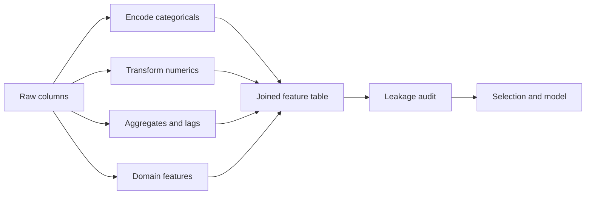

# Feature Engineering

## Beginner-Friendly Intuition

Feature engineering is the work of turning raw columns into the columns the model can
actually learn from. A model is only as good as the representation it sees. A linear
model with three good engineered features will often beat a deep network on raw
columns, especially on tabular data. On Kaggle and in production, the difference
between a winning solution and a mediocre one is almost always the features, not the
model class.

A useful intuition: think of each feature as an answer to a small question about the
row. Raw columns answer "what was logged." Good engineered features answer "what
matters." For a transaction, a raw column says "amount = 142." A good feature says
"amount minus the user's 90-day median," which encodes "is this transaction unusual
for this user."

## Formal Explanation

Feature engineering is distinct from feature selection. Engineering creates new columns
from existing ones. Selection drops or weights columns to control variance. The main
classes of engineered features:

- **Encoding categorical variables.** One-hot for low-cardinality categoricals (under
  about 50 levels). Target or mean encoding for high cardinality, with strict
  out-of-fold computation to avoid leakage. Embeddings for very high cardinality
  (user_id, product_id) when you have enough data.
- **Numeric transforms.** Log or `log1p` for right-skewed columns (income, counts).
  Box-Cox or Yeo-Johnson for general skew correction. Standardization (z-score) or
  min-max scaling for distance-based and gradient-based models. Winsorization to cap
  extreme values.
- **Binning.** Convert a continuous variable into ordered buckets. Equal-width,
  equal-frequency, or domain-driven (age groups). Useful when the relationship is
  non-linear and the model is linear.
- **Interactions and polynomials.** Pairwise products (`age * income`), ratios
  (`revenue / sessions`), and polynomial expansions (`age, age^2, age^3`). Tree models
  discover many interactions automatically; linear models often need them by hand.
- **Time features.** From a timestamp: hour-of-day, day-of-week, month, holiday flag,
  time-since-event, time-until-event. For seasonality, sine and cosine of the time
  index keep the model continuous.
- **Aggregates and lags.** For panel or time-series data: rolling mean over the last
  7, 30, or 90 days; lag-1 and lag-7 values; group-level aggregates ("user's average
  spend in the last month"). These features are powerful and the most common source
  of leakage.
- **Text features.** TF-IDF or hashing vectorizer for traditional models. Sentence
  embeddings (BERT, MiniLM) when context matters and you can afford the latency.
- **Domain features.** Anything that codifies expert knowledge ("ratio of failed logins
  to successful logins in the last hour" for fraud).

## Why It Matters in Real Jobs

Three reasons. First, on tabular data, the lift from a good feature is usually larger
than the lift from a more complex model. Going from logistic regression to gradient
boosting might add 1 to 3 points of AUC. Adding a single recency feature might add 5.
Second, engineered features make the model interpretable in the way the business cares
about. "Days since last login" is something a stakeholder can reason about. The 47th
column of an embedding is not. Third, engineered features are where leakage usually
hides. Knowing the patterns prevents the catastrophic offline-online gap.

## How It Works Step by Step

1. **Start with what the model can already learn.** A tree model handles non-linear
   thresholds, so binning a single column does not help. A linear model needs the
   binning. Pick features the model would not infer.
2. **Encode categoricals correctly.** Low cardinality: one-hot. High cardinality:
   target encoding computed only on out-of-fold data, or embeddings. Test categories
   that appeared in training must include an "unseen" bucket for inference.
3. **Transform skewed numerics.** Plot the distribution. If it is right-skewed and
   spans orders of magnitude, take `log1p`. Log of zero is undefined; `log1p`
   handles zeros.
4. **Add domain-driven aggregates.** For each entity (user, product, merchant),
   compute counts, means, ratios over rolling windows ending strictly before the
   prediction time.
5. **Add interactions when the model cannot.** For linear models, write the products
   and ratios by hand. For tree models, skip this step unless the interaction is
   sparse and rare.
6. **Add time features.** Hour, day of week, month, holiday flag, days since signup,
   days since last event. Use cyclic encoding for hour and day of week if the model
   is linear.
7. **Audit for leakage.** For every feature, ask "would I have known this value at
   the moment of prediction in production?" If the answer is no, the feature leaks.
8. **Hand off to feature selection.** Drop near-constant features, drop one of any
   pair with correlation above 0.95, then use a model-based importance to prune the
   rest.

## Real-World Example

A team predicting credit card fraud has raw columns: amount, merchant_id, timestamp,
country, user_id. Their first model with raw features gets 0.78 AUC. They engineer
features and the AUC jumps to 0.91. The added features:

- `amount_log = log1p(amount)` to handle the heavy tail.
- `amount_z_user_30d`: z-score of the amount against the user's last 30 days, computed
  on rows strictly before this transaction.
- `txn_count_user_1h`: number of transactions from this user in the previous hour.
- `country_mismatch`: 1 if `country` differs from the user's modal country in the
  last 90 days.
- `hour_sin, hour_cos`: cyclic encoding of hour of day.
- `merchant_target_encoded`: out-of-fold mean fraud rate for the merchant.

The lift comes almost entirely from the recency and z-score features. The merchant
target encoding helps but must be recomputed on every fold; an early version that
used the full-data mean leaked and showed a fake 0.97 AUC offline.

## Common Mistakes

- Computing target encoding on the full dataset and leaking the target into training.
  Always compute out-of-fold.
- Using a future-dated aggregate ("user's lifetime spend") as a feature for an event
  in the middle of the user's lifetime.
- One-hot encoding a column with 50,000 levels and creating a sparse matrix that
  crashes the model.
- Standardizing test data using statistics computed on test data instead of train.
- Building polynomial features on a tree model. Trees do not need them and you slow
  training for no gain.
- Dropping the original column after a transform when the model could have used both.

## Interview Angle

**Question:** You have a tabular dataset with user behavior over the last year and
your task is to predict whether a user will churn next month. What features would you
build?

**Strong answer:** Group features into recency, frequency, monetary, and demographics.
Recency: days since last login, days since last purchase. Frequency: sessions in the
last 7, 30, 90 days; ratio of recent to historical. Monetary: spend in the last 30
and 90 days; trend slope. Demographics: signup tenure, plan tier, country. All
aggregates must be computed on data strictly before the prediction time. Encode plan
tier with one-hot, country with target encoding (out-of-fold). Test for leakage by
checking that no feature uses information from the prediction window.

**Weak answer:** Use all the raw columns as features. The interviewer wants to see
recency-frequency-monetary thinking, the leakage discipline, and the encoding choices.

**Follow-up questions:**

- How do you decide between target encoding and embeddings for high-cardinality
  columns?
- What is the right window length for an aggregate feature?
- When does adding a feature hurt the model?
- How do you detect a leaky feature post hoc?

## Mini Exercise

Take any timestamped dataset. For each row, build five features computed only from
data strictly before the row's timestamp: a count, a mean, a recency, a ratio, and a
mismatch flag. Confirm that none of them peeks at the future.

## Diagram

---
## Navigation

[⬅ Previous](03-exploratory-data-analysis.md) | [🏠 Home](../README.md) | [➡ Next](05-handling-missing-values.md)
