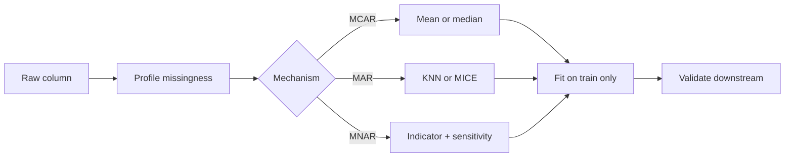

# Handling Missing Values

## Beginner-Friendly Intuition

A missing value is not just a hole; it is information. Why a value is missing usually
matters more than what number you fill it with. If income is missing because the user
chose not to answer, that "chose not to answer" might be the most predictive signal in
the dataset. If income is missing because the survey crashed for a few hours, the
missingness has nothing to do with income at all and you can safely impute. The same
NaN can mean two completely different things, and treating them the same way is the
mistake.

The first decision is therefore not "which imputer do I use" but "why is this value
missing." That decision drives everything else.

## Formal Explanation

Statisticians group missingness into three mechanisms:

- **MCAR (Missing Completely At Random).** The probability of a value being missing
  does not depend on any observed or unobserved variable. Example: a random subset of
  rows lost a column due to a logging bug. Any reasonable imputation works; complete
  case analysis is unbiased.
- **MAR (Missing At Random).** The probability of being missing depends on observed
  variables but not on the missing value itself, given those observed variables.
  Example: older users skip the income question more often. Once you condition on
  age, the missingness is random. Model-based imputation (regression, MICE) handles
  this if the model captures the dependency.
- **MNAR (Missing Not At Random).** The probability of being missing depends on the
  missing value itself, even after conditioning on observed variables. Example: high
  earners skip the income question more often than low earners at the same age and
  occupation. There is no clean fix. You need either external data or a model that
  jointly models the missingness and the value.

The taxonomy matters because every imputation method assumes a mechanism. Mean
imputation assumes MCAR. KNN and regression imputation assume MAR. Pattern-mixture
models try to handle MNAR. Pretending the data is MCAR when it is MNAR is the most
common silent bias in applied work.

## Why It Matters in Real Jobs

Naive imputation can flip the sign of an effect. A textbook case: a marketing model
that imputes missing income with the mean predicts that high earners convert at the
same rate as low earners. The reality is that high earners simply skipped the question
more often, and they actually convert at twice the rate. The model's recommendation,
"target everyone equally," is the opposite of the right answer.

Missingness also breaks pipelines silently. A categorical column that is rarely null
in training but 30 percent null in production crashes a model that one-hot encoded
without an "unknown" bucket. The fix is to design for missingness, not to hope it
disappears.

## How It Works Step by Step

1. **Profile the missingness.** For each column, compute the null rate. Plot a
   missingness heatmap (rows by columns, black if missing). Patterns reveal the
   mechanism. Block patterns suggest joins that lost rows. Random scatter suggests
   MCAR. Correlated missingness across columns often points to MAR.
2. **Add a missingness indicator.** For any feature with non-trivial missingness, add
   a binary `<column>_was_missing` flag before imputing. The flag itself is often
   predictive.
3. **Pick an imputation strategy per column.**
   - Numeric, low-skew, MCAR or weak MAR: mean.
   - Numeric, skewed: median.
   - Categorical: mode or a dedicated "Unknown" category.
   - Numeric, MAR with informative covariates: KNN or regression imputation.
   - Numeric, MAR with multiple correlated columns: MICE (Multivariate Imputation by
     Chained Equations).
   - Numeric, time-series: forward-fill or interpolation, never future-fill.
   - MNAR: model the missingness explicitly, or accept a sensitivity analysis.
4. **Fit the imputer on training data only.** Compute the mean, median, or KNN
   neighborhood from the training rows. Apply the saved imputer to validation and
   test. Refitting on the full dataset leaks.
5. **Decide whether to drop.** Drop a row only if the missingness is rare and the row
   is unbiased to remove. Drop a column only if its null rate is so high that no
   imputation is honest (a rough threshold is 60 to 80 percent, but it depends).
6. **Re-validate downstream.** After imputation, recompute the target distribution
   and the feature-target relationship to confirm the imputation did not distort the
   signal.

## Real-World Example

A health-insurance pricing team has a dataset where 22 percent of rows have a missing
`smoker` flag. The naive fix is to impute "no" because most people are non-smokers.
The team profiles the missingness: missing rate is 8 percent for users who answered
the rest of the form completely and 41 percent for users who skipped multiple
sensitive questions. Among the small set where smoker status was later confirmed, 35
percent of the "missing" group were actually smokers, far higher than the 14 percent
base rate. This is MNAR.

The team's solution: keep the missing category as its own value, add the missingness
indicator, and run a separate analysis treating "missing" as smoker, as non-smoker,
and as the base rate. The pricing decision uses the conservative bound. The lesson is
that the right answer for MNAR data is often to expose the uncertainty, not to hide
it behind an imputed number.

## Common Mistakes

- Imputing with the mean of the full dataset, leaking test statistics into train.
- Filling categoricals with the mode and dropping the signal that "missing" carried.
- Using forward-fill on a time series and accidentally future-filling at boundaries.
- Treating "0," "" "-1," and "999" as valid values when they are sentinels for
  missing.
- Running KNN imputation on a million-row dataset without a hash trick and waiting
  forever.
- Dropping all rows with any missing value (complete case analysis) when missingness
  is correlated with a key segment, biasing the result.
- Forgetting that a model that worked offline often crashes on the first production
  null because no "unknown" bucket was reserved.

## Interview Angle

**Question:** A column you rely on is 30 percent missing. How do you handle it?

**Strong answer:** First, classify the missingness. Profile the null rate against
other columns to spot MCAR vs MAR vs MNAR patterns. Add a missingness indicator
regardless. Choose imputation by mechanism: mean or median for MCAR-like, KNN or
MICE for MAR with informative covariates, and an explicit "Unknown" category plus a
sensitivity analysis for MNAR. Fit the imputer on train only, save it, apply to
validation and test. Re-check that the feature-target relationship survives.

**Weak answer:** Fill with the mean. The interviewer wants to hear that the mechanism
matters and that the indicator-flag trick is standard.

**Follow-up questions:**

- How do you tell MAR from MNAR in practice?
- When is dropping rows a defensible choice?
- What happens if the production data has a different missingness pattern than
  training?
- Why is the missingness indicator often more predictive than the imputed value?

## Mini Exercise

Take a dataset with at least one column that has 10 percent or more missing. Plot the
missingness heatmap. Try three imputation strategies (mean, KNN, indicator-only) and
compare downstream metric. Write three sentences explaining which mechanism is most
plausible and which method you would ship.

## Diagram

---
## Navigation

[⬅ Previous](04-feature-engineering.md) | [🏠 Home](../README.md) | [➡ Next](06-handling-imbalanced-data.md)
