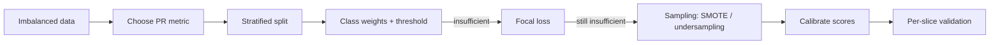

# Handling Imbalanced Data

## Beginner-Friendly Intuition

Imbalanced data is the case where one class shows up far more often than another.
Fraud transactions are 0.1 percent of all transactions. Click-throughs are a few
percent of impressions. Rare diseases are well below 1 percent of patients. A model
trained without care on imbalanced data learns the easy lesson first: predict the
majority class for everything and you will be right 99.9 percent of the time. That
model has zero business value, and accuracy will not warn you.

The right framing is not "the data is broken" but "accuracy is the wrong metric and
the loss is the wrong loss." Once you fix those two things, imbalance becomes much
less scary.

## Formal Explanation

Imbalance interventions live in three layers, in order of preference:

- **Metric and threshold layer.** Switch from accuracy to PR-AUC, recall at fixed
  precision, or F-beta with beta tuned to the cost ratio. Tune the decision threshold
  on validation data; the default 0.5 is rarely optimal under imbalance.
- **Loss layer.** Class weighting (`class_weight='balanced'` in sklearn, `pos_weight`
  in PyTorch BCE) scales the loss for the minority class. Focal loss
  `FL = -alpha (1 - p)^gamma log p` for the positive class adds a `(1 - p)^gamma`
  factor that down-weights easy examples and lets the model focus on hard ones.
  Cost-sensitive learning makes the asymmetric cost explicit (false negative costs
  100 dollars, false positive costs 1).
- **Data layer.** Oversampling duplicates minority rows. SMOTE generates synthetic
  minority rows by interpolating between a minority example and one of its
  k-nearest minority neighbors. Undersampling drops majority rows. NearMiss and Tomek
  links are smarter undersampling. Hybrid methods combine both.

A rough rule of thumb on when to reach for each: ratio up to about 1:10, often only
class weights and threshold tuning are needed. Ratio 1:10 to 1:100, add focal loss
or moderate oversampling. Ratio worse than 1:100, reframe the problem (anomaly
detection, two-stage pipelines, hard-negative mining).

## Why It Matters in Real Jobs

Three production traps. First, accuracy on imbalanced data is uninformative and
seductive: 99 percent accuracy on a 1 percent positive class can mean the model never
predicts positive. Second, oversampling and SMOTE distort the predicted probability;
if you need calibrated scores (pricing, ranking, expected-value decisions), you must
calibrate after rebalancing or skip rebalancing entirely. Third, naive SMOTE on
high-dimensional or sparse data interpolates between rare points and creates
synthetic rows that no real example resembles, which can hurt rather than help.

## How It Works Step by Step

1. **Check the imbalance ratio.** Compute positives / negatives. Decide whether the
   problem is mildly, moderately, or severely imbalanced.
2. **Pick a metric that does not lie.** PR-AUC, recall at fixed precision (e.g.,
   recall at precision >= 0.9), or F-beta. Plot the precision-recall curve.
3. **Stratify the splits.** Use stratified k-fold so every fold has the right
   proportion of minorities. With time-series, stratify within time windows.
4. **Try the cheap fixes first.** Class weights and threshold tuning. These do not
   distort the data and often are enough.
5. **Move to focal loss or sampling if needed.** Focal loss for deep models. SMOTE for
   small tabular datasets, applied only to the training fold (never the validation or
   test fold). Undersampling when the majority class is so large that training is
   slow.
6. **Calibrate.** If you sampled or weighted in a way that distorts scores, fit
   Platt scaling or isotonic regression on a held-out, naturally-distributed slice to
   recover calibrated probabilities.
7. **Validate per slice.** A model can be fine on average and broken in the
   highest-cost segment. Compute the metric for each segment and the worst-case
   number is often the one that matters.

## Real-World Example

A fraud team has a 1:500 imbalance. Their first model with default settings gets 99.8
percent accuracy and 0.05 recall (it misses almost everything). They make four
changes. First, they switch the metric to recall at precision 0.9. Second, they tune
the decision threshold to 0.05 instead of 0.5. Third, they add `pos_weight = 500`
in BCE. Fourth, they switch to focal loss with `gamma = 2` to push the model toward
hard fraud cases. Recall at precision 0.9 goes from 0.04 to 0.31. They try SMOTE on
top and recall stays roughly flat but the predicted probabilities become miscalibrated
(the average predicted fraud rate jumps from 0.2 percent to 12 percent). They drop
SMOTE because the downstream rules engine relied on calibrated scores.

## Common Mistakes

- Reporting accuracy on imbalanced data and concluding the model works.
- Resampling before splitting, leaking minority examples across train and test.
- Applying SMOTE on the validation or test fold.
- Forgetting to calibrate after class weights or sampling distort scores.
- Using SMOTE on high-dimensional or sparse data and creating synthetic noise.
- Tuning the threshold on the test set instead of validation.
- Treating imbalance ratio as the only thing that matters; with enough data, even
  1:1000 can be modeled well, and with too little data, even 1:10 can fail.

## Interview Angle

**Question:** You are building a fraud model with 1 percent positive class. Walk me
through your approach.

**Strong answer:** First, switch the metric. Accuracy is meaningless here. Use PR-AUC
and recall at a fixed precision matched to the business cost ratio. Stratify the
splits. Start with class weights and threshold tuning, both cheap. If that is not
enough, try focal loss with gamma 2. Sampling methods like SMOTE come last because
they distort the score distribution and can hurt calibration. Validate per slice;
the metric on rare segments often drives the business decision. If scores need to be
calibrated for downstream consumers, fit isotonic regression on a held-out,
naturally-distributed sample.

**Weak answer:** "Apply SMOTE." That is one tool of many, has known failure modes,
and on its own does not address metric or threshold issues.

**Follow-up questions:**

- Why does class weighting affect calibration?
- When would you reframe the problem as anomaly detection?
- How do you decide the decision threshold?
- What is the difference between focal loss and class weights?

## Mini Exercise

Take any binary dataset. Make it imbalanced by downsampling the positive class to 1
percent. Train logistic regression three ways: default, with `class_weight='balanced'`,
and with focal loss. Report PR-AUC and recall at precision 0.8 for each. Plot the
precision-recall curves on one axis.

## Diagram

---
## Navigation

[⬅ Previous](05-handling-missing-values.md) | [🏠 Home](../README.md) | [➡ Next](07-data-visualization.md)
