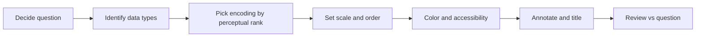

# Data Visualization

## Beginner-Friendly Intuition

A chart is a translator. Numbers in a table say "here are some values." A chart says
"here is the shape of the world those values describe." A good chart removes work for
the reader; a bad chart adds work, and a misleading chart causes a wrong decision. The
first thing to internalize is that the goal of a chart is not to be pretty. The goal is
to make the most important comparison the easiest one to see.

A second piece of intuition: charts are not optional even when you have summary
statistics. Anscombe's quartet is four datasets with nearly identical mean, variance,
correlation, and regression line, but each dataset is shaped completely differently
when plotted. The Datasaurus Dozen makes the same point with twelve datasets that all
share the same first and second moments but that, when plotted, include a dinosaur, a
star, and an X. If summary statistics were enough, these examples would be impossible.

## Formal Explanation

There are two questions a visualization choice has to answer: what is the data type,
and what comparison do you want the reader to make.

Chart-type-by-data-type guide:

- **One numeric column.** Histogram, density plot, box plot, violin plot.
- **One categorical column.** Bar chart with counts, ordered by count or by domain
  meaning.
- **Two numeric columns.** Scatter plot. Add a smoothing curve (LOESS) when there is
  noise. Use hexbin or 2D density when there are too many points to read.
- **Numeric vs categorical.** Box, violin, or strip plot grouped by category. Use
  bar with error bars only when you trust the symmetry assumption.
- **Two categoricals.** Mosaic plot, grouped bar, or heatmap of counts.
- **Many numeric columns.** Pair plot, correlation heatmap, parallel coordinates,
  or PCA scatter.
- **Time on the x-axis.** Line chart for one or two series, small multiples for many,
  area chart for stacked totals.

Perceptual ranking of visual encodings (Cleveland and McGill, roughly best to worst
for accurate comparison): position on a common scale, position on aligned scales,
length, angle, area, color hue, color saturation, volume. The ordering matters: a bar
chart (length) is more accurately read than a pie chart (angle and area) for the same
data.

## Why It Matters in Real Jobs

Three reasons. First, decisions get made off charts more than off tables, especially
above the engineering layer. A chart that misleads moves money in the wrong direction.
Second, your own analysis depends on plots. The Anscombe lesson is not abstract: many
data quality bugs are invisible in summary statistics and immediate in a histogram.
Third, accessibility matters. Roughly 8 percent of men and 0.5 percent of women have
some form of color vision deficiency, so a red-vs-green encoding loses a fraction of
your audience.

## How It Works Step by Step

1. **Decide the question first.** "How much did revenue grow?" "Which segment is
   churning?" "Is this distribution normal?" The chart answers one question at a time.
2. **Pick the encoding from the data type.** Use the table above. Default to the most
   accurately read encoding (position over angle, length over area).
3. **Order categories meaningfully.** Sort bars by value unless there is a domain
   order (months, day-of-week, severity). Alphabetical order is almost always wrong.
4. **Choose scale carefully.** Linear for additive comparisons. Log for ratios and
   for data that spans orders of magnitude. Never use a truncated y-axis on a bar
   chart; it visually exaggerates differences.
5. **Use color for meaning, not decoration.** A single accent color for the highlight,
   gray for context. Avoid red-green pairs alone; use ColorBrewer or viridis for
   sequential and diverging palettes.
6. **Avoid dual-axis charts.** They invite false correlations. Use small multiples
   instead.
7. **Annotate the chart.** A clear title that states the conclusion ("Revenue up 12
   percent in March"), the unit on the axis, and one or two callouts on the most
   important point.
8. **Audit the chart against the question.** If the most important comparison is not
   the easiest one to see, redesign.

## Real-World Example

A data team is asked to show that a new pricing tier is performing well. The first
draft is a stacked bar chart of revenue per month, split by tier, on a y-axis that
starts at 80 percent of the total. The chart looks dramatic and the new tier looks
huge. The reviewer rejects it for two reasons: the truncated y-axis exaggerates change,
and the stacking makes the new tier hard to compare against the old. The redesign is
small multiples: one panel per tier, all on the same y-axis, with a horizontal line at
the previous quarter's average. The new chart is less dramatic and far more honest.
The pricing tier turns out to be growing meaningfully but not enormously, and the team
makes a more measured launch decision.

## Common Mistakes

- Truncating the y-axis on a bar chart and visually exaggerating differences.
- Using a pie chart for more than three categories. Length comparisons in a bar chart
  are easier to read than angle comparisons in a pie.
- Stacking when the comparison the reader needs is across stacks.
- Dual y-axes. They invite false correlations and are almost always replaced by small
  multiples.
- Using rainbow color schemes that are not perceptually uniform. Viridis or ColorBrewer
  are safer.
- Forgetting to label units, sample size, and date range.
- Showing a single aggregate that hides Simpson-style segment reversals.

## Interview Angle

**Question:** You need to communicate that a model improved a key metric by 3 percent.
The audience is a non-technical executive. What chart do you use?

**Strong answer:** Build a small-multiples chart showing the metric over time for
treatment and control. Same y-axis. Start the y-axis at zero or at a defensible
baseline. Add a callout for the launch date and the average lift with a confidence
interval. Title states the conclusion: "Metric X up 3 percent (95% CI 1.5% - 4.5%)
post-launch." Avoid pie charts, dual axes, and color-only encodings.

**Weak answer:** A pie chart of "treatment vs control." Pie charts compare angles,
they hide the time dimension, and they cannot show uncertainty.

**Follow-up questions:**

- Why are dual y-axes a problem?
- When is a log scale appropriate?
- How do you visualize uncertainty?
- How would you adapt your chart for a colorblind audience?

## Mini Exercise

Take a chart you have made recently. Identify the question it is answering. Identify
the comparison the reader has to make. Redraw the chart with the most-accurate encoding
for that comparison. Compare the two and write three sentences on why one is clearer.

## Diagram

---
## Navigation

[⬅ Previous](06-handling-imbalanced-data.md) | [🏠 Home](../README.md) | [➡ Next](08-experimentation-and-ab-testing.md)
