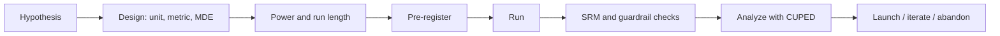

# Experimentation and A/B Testing

## Beginner-Friendly Intuition

An experiment is the only clean way to answer "would this change cause that outcome."
Observational data tells you what happened. Experiments tell you what would happen if
you intervened. The difference is the entire reason A/B testing exists in product and
data science work.

This file covers the practitioner's view of running experiments well: design choices,
power, guardrails, novelty, switchback, variance reduction, and the most common
operational failures. The statistical math (hypothesis testing, p-values, confidence
intervals) lives in [statistics/10-ab-testing.md](../statistics/10-ab-testing.md).
This file points there for the math and focuses on running the system.

## Formal Explanation

A well-designed experiment specifies seven things up front:

- **Unit of randomization.** User, session, request, page, store, region. The unit
  must match the unit on which the metric is computed and the unit on which the
  treatment is applied.
- **Population.** Who is eligible and who is excluded. Eligibility filters that
  depend on post-treatment behavior bias the result.
- **Allocation.** Percentage in treatment vs control. Even 50/50 splits are not
  required but they minimize variance.
- **Primary metric.** One number that decides the launch. Pre-registered.
- **Guardrail metrics.** Two to four metrics that must not regress (latency, error
  rate, retention).
- **Sample size.** Computed from a minimum detectable effect (MDE), expected variance,
  desired power (typically 80 percent), and significance level (typically 5 percent).
- **Stopping rule.** A pre-registered duration or a sequential testing procedure.
  Peeking at p-values without correction inflates the false-positive rate.

Variance reduction techniques to know:

- **CUPED.** Subtract a pre-experiment covariate (the user's pre-treatment metric)
  from the metric. Often cuts variance by 30 to 60 percent for free, with no bias.
- **Stratification.** Pre-segment users (by country, plan, device) and randomize
  within each stratum. Reduces variance from imbalanced splits.
- **Trigger analysis.** Restrict the analysis to users who could actually be affected
  by the change. A dialog only seen by 3 percent of users should be analyzed on those
  3 percent, not the whole population.

## Why It Matters in Real Jobs

Most product decisions at scale are made through experiments. The cost of a bad
experiment is real: a launch that looks like a win can be a loss in disguise (novelty
effect, peeking bias, insufficient power, biased trigger). The cost of a missed
experiment is also real: shipping changes without measurement is how products silently
degrade. The discipline of running an experiment correctly, end to end, is one of the
most-tested skills in data science interviews and one of the most-asked-for in
practice.

## How It Works Step by Step

1. **Frame the change as an intervention.** Write the change, the expected mechanism,
   and the directional hypothesis. "Adding the recommendation widget will increase
   sessions per user, by reducing friction to discovery."
2. **Choose the unit.** Almost always user-level if the metric is per-user. Session
   or request level only when the user-level effect is implausible (latency tweaks).
3. **Compute sample size.** From the variance of the primary metric, the MDE, and the
   desired power. Underpowered experiments are the leading cause of "we shipped a
   neutral change because the test could not detect anything."
4. **Set the run length.** Long enough to capture the metric horizon (purchases that
   take a week to mature, retention that takes a month). Long enough to absorb day-of-
   week and seasonality cycles, typically a minimum of one full week.
5. **Pre-register.** Write the metric, the MDE, the run length, the analysis plan, and
   the stopping rule before the experiment starts.
6. **Validate the randomization.** A/A test or sample ratio mismatch (SRM) check; if
   the treatment and control sizes differ from the assigned ratio more than chance
   allows, the assignment is broken and the result is not trustworthy.
7. **Monitor guardrails daily.** Stop the experiment if a guardrail breaks the
   pre-registered threshold.
8. **Analyze.** Apply CUPED if applicable. Compute the primary metric, the CI, and
   the per-segment breakdown. Report the effect, not only the p-value.
9. **Decide.** Launch, iterate, or abandon. Document the decision.

Special designs:

- **Switchback.** When users see effects of both arms (marketplace, ride-hailing
  pricing), randomize the arm by time window per region instead of per user. Each
  region alternates treatment and control on, say, hour-long blocks.
- **Cluster randomization.** When the unit of randomization has to be a group (school,
  city) because of network effects between members.
- **Holdback.** Keep a small permanent control to measure the long-term cumulative
  impact of many launches.
- **Quasi-experiment.** When a true RCT is impossible, rely on diff-in-diff,
  regression discontinuity, or synthetic control. Weaker assumptions, weaker claims.

## Real-World Example

A team launches a new recommendation widget. Pre-experiment power analysis says they
need 200,000 users per arm to detect a 1 percent lift on sessions per user with 80
percent power. They run for one week and get 350,000 per arm. Day-one results show a
5 percent lift; the team is excited. The data scientist insists on running the full
two weeks because of novelty effects. By day fourteen the lift has settled at 1.4
percent with a CI of [0.6 percent, 2.2 percent]. CUPED tightens the CI to [0.9
percent, 1.9 percent]. Latency is unchanged. Retention is unchanged. The experiment
ships. Six months later, a holdback analysis shows the cumulative impact across all
launches is smaller than the sum of individual lifts, a sign that some launches were
substituting for each other. The team adjusts the prioritization framework as a
result.

## Common Mistakes

- Peeking at the p-value daily and stopping when it crosses 0.05. Without sequential
  testing this inflates the false-positive rate.
- Picking a primary metric after seeing the data. Pre-registration matters.
- Ignoring novelty and primacy effects. Day-one results often differ from day-fourteen
  results.
- Running a 50/50 test on a feature that affects only 5 percent of users and reporting
  a diluted effect. Use trigger analysis.
- Forgetting the SRM check; broken assignment is silent until you look for it.
- Running the experiment for the duration that fits your sprint instead of the
  duration that fits the metric horizon.
- Treating "p > 0.05" as "no effect." It often means "the test was underpowered for
  the effect you actually have."

## Interview Angle

**Question:** A PM tells you they ran an A/B test, the lift on the primary metric is
4 percent with p = 0.03, and they want to launch. What do you ask?

**Strong answer:** Ask what unit was randomized and confirm SRM is clean. Ask what
the primary metric and guardrails were and whether they were pre-registered. Ask the
sample size and whether the test was underpowered, which would make a 4 percent lift
suspiciously large. Ask the run length and whether novelty effects could explain the
day-one number. Ask for the per-segment breakdown to confirm the lift is not driven
by one segment. Ask whether CUPED or stratification was applied. Ask whether any
guardrail was close to a regression. Then decide.

**Weak answer:** "Launch it; p < 0.05." That is the answer that ships novelty and
peeking artifacts.

**Follow-up questions:**

- What is sample ratio mismatch and how do you check it?
- When do you use a switchback test?
- What is CUPED?
- How do you handle long-term metrics that take weeks to mature?

## Mini Exercise

Pick a feature change you would actually run. Write the seven design specs (unit,
population, allocation, primary, guardrails, sample size, stopping rule). Compute the
sample size by hand for a 1 percent MDE on a metric with a known variance. Identify
the biggest risk to validity.

## Diagram

---
## Navigation

[⬅ Previous](07-data-visualization.md) | [🏠 Home](../README.md) | [➡ Next](09-business-metrics.md)
