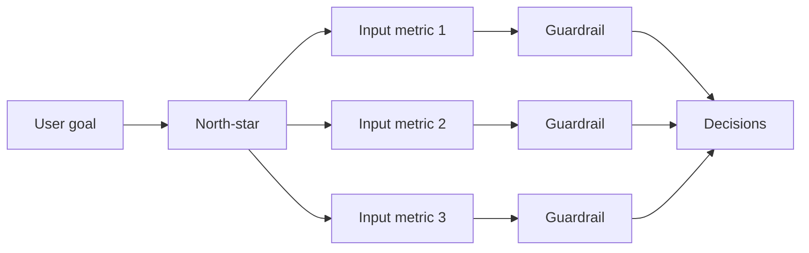

# Business Metrics

## Beginner-Friendly Intuition

Business metrics are the numbers an organization uses to decide whether work was worth
doing. They are not the same as model metrics. AUC, RMSE, and F1 are model metrics:
they tell you how well the model predicts. Conversion rate, retention, revenue per
user, and net promoter score are business metrics: they tell you whether the model
helped the business. The ML team's job is to connect the two with a chain of evidence.

The intuition to internalize is that metrics are not neutral. Picking a metric is
picking a goal, and people optimize what is measured. A metric that does not match the
goal will be hit while the goal is missed. This is Goodhart's law: "When a measure
becomes a target, it ceases to be a good measure." A retention metric defined as
"opened the app at least once in 30 days" rewards push-notification spam, even though
spam reduces long-term retention. The metric was hit; the goal was missed.

## Formal Explanation

A useful organization of metrics into three layers:

- **North-star metric.** One number that captures long-term value. For a marketplace,
  this might be "transactions per active user per quarter." For a content platform,
  "weekly active hours." North-stars are slow to move and slow to corrupt.
- **Primary or input metrics.** Metrics that drive the north-star and that individual
  teams can move. For the same marketplace, "search-to-transaction conversion rate"
  is an input. The team owns it. Improvements should plausibly transfer to the
  north-star.
- **Guardrail metrics.** Metrics that must not regress when the team chases the
  primary. Latency, error rate, complaint rate, and retention are common guardrails.

Other metric concepts worth knowing:

- **Additive decomposition.** Many business metrics decompose into a product of
  smaller metrics: `revenue = users * sessions_per_user * conversion_rate * AOV`.
  Decomposing tells you which factor is moving.
- **Cohort metric.** A metric computed for a group defined at a moment in time
  (e.g., users who signed up in March), tracked forward. Cohort retention curves
  reveal long-term effects that aggregate metrics hide.
- **Leading vs lagging.** A leading metric moves before the goal does (engagement
  precedes retention precedes revenue). A lagging metric is the goal itself but
  responds slowly. Teams need both.
- **Proxy metrics.** Stand-in metrics for goals that are too slow or too noisy to
  measure directly. "Time-to-first-value" as a proxy for "lifetime value." Use with
  care; a bad proxy invites Goodhart.

Common metric families by domain:

- **Acquisition.** Sign-ups, activations, sign-up-to-activation rate.
- **Engagement.** DAU, WAU, MAU, DAU/MAU ratio (sometimes called L7 or stickiness),
  sessions per user, session length.
- **Conversion.** Funnel rates, cart abandonment, time-to-conversion.
- **Retention.** Day-N retention, cohort curves, churn rate.
- **Monetization.** Revenue per user, ARPU, ARPPU, AOV, LTV, payback period.
- **Quality.** NPS, CSAT, complaint rate, refund rate, latency, error rate.

## Why It Matters in Real Jobs

A model is judged by the business metric, not the offline AUC. The most common reason
a winning model is rolled back is that the business metric did not move, or moved in
the wrong direction, while the offline metric improved. Three frequent causes: the
offline metric was a poor proxy, the model improved a slice that was already
saturated, or the model's recommendations created an undesired second-order effect
(more clicks but lower trust). Knowing the metric chain in advance prevents months of
work being wasted.

A second reason: metric design is a leadership skill. Teams that can articulate the
trade-off between primary and guardrail, between leading and lagging, between cohort
and aggregate, get listened to. Teams that cannot are stuck arguing about absolute
numbers in board meetings.

## How It Works Step by Step

1. **Start with the goal.** The customer outcome the business cares about. "Users find
   value quickly and come back." Avoid jumping straight to a metric.
2. **Map to a north-star.** One metric that captures long-term value. Sanity check by
   asking "if this number doubled, would the business clearly be better off?"
3. **Decompose to inputs.** What does the north-star factor into? Each input should
   be ownable by a specific team.
4. **Pick guardrails.** Latency, retention, complaints, churn. The set of metrics that
   must not regress.
5. **Define each metric precisely.** Which users count, which time window, which
   events, how to handle test accounts and refunds. Ambiguity here is where two teams
   end up reporting different numbers from the same warehouse.
6. **Set targets and thresholds.** Use historical baselines and segment averages.
   Document the source of every target.
7. **Instrument and monitor.** Build the dashboard, set alerts, write the runbook for
   when a metric drifts.
8. **Review and revise.** Quarterly, reread every metric definition and ask whether it
   still matches the goal. Goodhart effects accumulate; metric definitions must
   evolve.

## Real-World Example

A streaming product picks "weekly active hours per user" as the north-star. It
decomposes into `sessions_per_user * average_session_length`. The personalization team
owns the recommendation surface and picks `clicks_per_session` as their input metric.
Six months later, clicks per session are up 18 percent and weekly active hours are
flat. Investigation shows the recommendations encouraged more frequent but shorter
sessions, with users hopping between titles. The proxy was wrong; the team adopts
"completion rate of long-form titles" as a better input. They keep clicks per session
as a leading indicator but no longer optimize against it. The lesson: the offline
proxy and the north-star must be tested empirically; assumptions about how they connect
do not always survive contact with users.

## Common Mistakes

- Picking a metric because it is easy to measure rather than because it captures the
  goal.
- One number with no guardrails. Teams will move the one number at the cost of
  everything else.
- Defining metrics inconsistently across teams (with vs without bots, with vs without
  refunds), and arguing about numbers instead of fixing the definitions.
- Using only aggregate metrics and missing cohort effects. Aggregate revenue can rise
  while every cohort's retention falls, if new users are arriving fast enough.
- Treating a leading indicator as a goal. Sessions are a leading indicator for
  retention; they are not retention.
- Ignoring Goodhart. As soon as a metric becomes a target, expect optimization that
  breaks the underlying goal.

## Interview Angle

**Question:** You join a team with no defined success metric for a feature. How do
you propose one?

**Strong answer:** Start with the user outcome the feature is supposed to deliver, in
plain language. Map to a north-star metric the business already tracks; the new
metric should plausibly move the north-star. Decompose the metric into ownable inputs.
Pick two or three guardrails that must not regress. Define each metric precisely
(unit, window, eligibility). Validate the metric by checking whether moving it in the
past would have moved the business outcome. Pre-register the metric before launching
or experimenting; ad-hoc metric selection invites bias.

**Weak answer:** "Increase clicks." Clicks are a leading proxy at best, easy to game,
and have no built-in guardrail.

**Follow-up questions:**

- What is Goodhart's law and how does it apply?
- How do you reconcile two teams that report different revenue numbers?
- What is a cohort metric and when do you need one?
- When do you change a metric definition vs change the metric itself?

## Mini Exercise

Pick a product you know well. Write its plausible north-star metric. Decompose it
into three input metrics. Pick two guardrails. Define each precisely. Identify the
metric most at risk of being gamed by Goodhart.

## Diagram

---
## Navigation

[⬅ Previous](08-experimentation-and-ab-testing.md) | [🏠 Home](../README.md) | [➡ Next](10-communicating-results.md)
