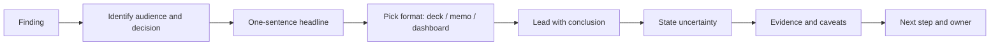

# Communicating Results

## Beginner-Friendly Intuition

Communicating results is the part of data science that decides whether the work
mattered. A correct analysis that nobody acts on is worth zero. A correct analysis
explained well, with the right audience and the right level of confidence, can move a
company. The skill is not writing more or making prettier charts. It is matching the
shape of the message to the shape of the decision.

A useful frame: every data communication is answering one of three questions. "What
should we do?" (decision support). "What is happening?" (status). "What did we learn?"
(insight). The shape of the deliverable, the level of detail, and the tone differ for
each.

## Formal Explanation

Three structural choices that drive most of the variance in communication quality:

- **Audience.** An executive cares about the decision. A product manager cares about
  the trade-off. A data scientist cares about the method. An engineer cares about
  what changes in the code. Same finding, four different deliverables. Failing to
  segment audience is the most common reason a stakeholder says "I do not understand
  why this matters."
- **Structure.** The pyramid principle: lead with the conclusion, then the supporting
  three points, then the evidence under each. The opposite (build up to the
  conclusion) wastes the executive's first 30 seconds, which is often all you have.
  Inside an analytical write-up, BLUF (bottom line up front) is the same idea.
- **Uncertainty.** Every estimate has a confidence interval. Communicating without
  the interval reads as overconfident; communicating only the interval reads as
  evasive. Lead with the point estimate, then state the CI, then state what would
  change the conclusion.

Format choices by goal:

- **Decision deck.** A short slide deck (5 to 10 slides). Slide 1 is the
  recommendation. Slide 2 is the headline number with CI. Following slides are
  evidence, caveats, and proposed next steps.
- **Memo or doc.** A one-to-three page document with the BLUF on top, the method, the
  evidence, the caveats, and the appendix. Better than a deck for an analytical
  audience or for asynchronous review.
- **Dashboard.** Live numbers, ongoing monitoring. One screen, no scroll, with a date
  range, the primary metric, the guardrails, and the segment toggles. Updated
  automatically. Designed for "what is happening" not "what should we do."
- **Notebook.** Method and code, for handoff to another data scientist. Audiences
  outside the team rarely read it.
- **Verbal walk-through.** A 5-minute summary in a meeting. The most undervalued
  format. Force yourself to say the answer in one sentence.

Uncertainty communication, in increasing order of formality:

- "About a 3 percent lift, plus or minus 1 percent."
- "3 percent lift with a 95 percent confidence interval of [2 percent, 4 percent]."
- "We estimate a 3 percent lift; the data is consistent with anything from 2 percent
  to 4 percent. If the lift is at the low end, the launch still pays back the cost
  in three quarters. If at the high end, in one quarter."

## Why It Matters in Real Jobs

A surprising amount of senior data science is communication, not analysis. The mid-level
practitioner produces correct answers. The senior practitioner produces correct answers
that get acted on. Three concrete payoffs. First, decisions move faster, because the
audience does not have to reconstruct the argument. Second, mistakes get caught earlier,
because clear communication exposes the assumptions to challenge. Third, you build
trust over time; a track record of clear, calibrated, well-caveated communication
compounds.

Conversely, miscommunication has costs. An exaggerated finding leads to a launch that
disappoints. A buried caveat leads to a metric drift that nobody saw coming. A
notebook with no narrative gets ignored, and the work goes to waste.

## How It Works Step by Step

1. **Identify the audience and the decision.** "I am writing this for the head of
   product, who needs to decide whether to ship the change next week." If you cannot
   write that sentence, you are not ready to write the deliverable.
2. **Write the one-sentence answer.** Not the question, the answer. "We recommend
   shipping; the lift is 3 percent on the primary metric with no guardrail
   regressions."
3. **Pick the format.** Deck for executives, memo for analytical reviewers, dashboard
   for ongoing monitoring, notebook for technical handoff.
4. **Lead with the conclusion.** First slide, first paragraph, first sentence of the
   verbal walk-through.
5. **State the uncertainty.** A point estimate without a CI is a lie of omission.
6. **Show the evidence with the right chart.** See
   [07-data-visualization.md](07-data-visualization.md) for chart choice. Lead with
   the chart that most directly supports the conclusion.
7. **List the caveats and the alternatives.** What would change the recommendation?
   What did you not test? What slice does this not cover? Caveats build trust.
8. **State the next step.** Even when the answer is "ship," there is an action: who
   owns rollout, what monitoring, what rollback criterion.
9. **Rehearse the 30-second version.** If you cannot say the headline in 30 seconds,
   the audience will not get there either.

## Real-World Example

A team finishes a churn model. The 80-page notebook is technically correct. The first
deliverable to the executive team is an 80-page email that gets glanced at. The data
scientist rewrites for audience. The executive deck is five slides: the recommendation
(deploy a retention campaign on the top decile of predicted churn), the expected lift
(2 percent retention, 95 percent CI [0.8 percent, 3.2 percent]), the cost (50,000
dollars in campaign costs, breakeven at 0.4 percent lift), the risk (segments where
the model is uncalibrated), and the next step (a one-month pilot in two regions). A
separate two-page memo for the marketing director gets the segmentation detail. The
notebook is the appendix and gets handed off only to the engineer who will deploy. The
executive approves the pilot in one meeting. The 80-page version would have died.

## Common Mistakes

- Writing for yourself instead of the audience. The executive does not want the
  derivation.
- Burying the conclusion at the end. Pyramid principle exists for a reason.
- Reporting without uncertainty. "AUC is 0.85" should be "AUC is 0.85 with a 95
  percent CI of [0.81, 0.89]."
- Hiding negative results. A null finding is information; presenting it well is a
  test of intellectual honesty.
- Using charts that mislead (truncated y-axis, rainbow palettes, dual axes). See
  [07-data-visualization.md](07-data-visualization.md).
- Producing one deliverable for all audiences. The executive deck and the analyst
  memo are different documents.
- Forgetting the "so what." A finding is not a conclusion. The conclusion is the
  recommended action.
- Ignoring the assumptions challenge. Strong analyses get challenged; weak ones get
  ignored. Welcome the challenge.

## Interview Angle

**Question:** Your model improved offline AUC from 0.78 to 0.85. The PM is excited
and wants to launch immediately. What do you tell them?

**Strong answer:** Translate the offline number into a business outcome with
uncertainty. AUC is a model metric; what matters is the lift on the business metric.
Estimate the expected lift on the primary metric, with a CI, and the conditions under
which it would not transfer (distribution shift, calibration drift, segment effects).
Recommend a controlled rollout with a guardrail check before full launch. Be honest
about what you do not know. Lead with the recommendation, not the AUC.

**Weak answer:** Forward the AUC table. The interview is testing whether you can
translate technical results into business decisions and communicate uncertainty.

**Follow-up questions:**

- How do you communicate a null result?
- What goes on slide 1 of an executive deck?
- How do you handle a stakeholder who wants more certainty than the data supports?
- What is the difference between a dashboard and a report?

## Mini Exercise

Take a recent analysis. Write three versions of the headline: one for an executive
(one sentence, conclusion-first), one for a peer data scientist (two sentences with
method), and one for an engineer (one sentence describing the change to ship). Note
where each version emphasizes different facts.

## Diagram

---
## Navigation

[⬅ Previous](09-business-metrics.md) | [🏠 Home](../README.md) | [➡ Next](../classical-ml/01-linear-regression.md)
