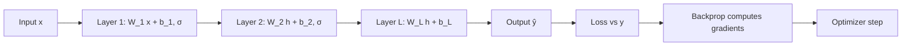

# What Is a Neural Network

## Beginner-Friendly Intuition

A neural network is a stack of simple math operations chained together so the
whole thing can learn complicated patterns from data. Each operation is small
and unimpressive on its own (a weighted sum, a non-linearity); together they
compose into a function that can recognize faces, translate languages, or
generate text. The "learning" part is gradient descent on the weights of those
operations: you measure how wrong the network is on training data, compute how
each weight contributed to the wrongness, and nudge each weight a tiny bit in
the direction that reduces the wrongness. Repeat a million times.

The practical intuition: a neural network is a **function approximator**. Give
it enough capacity, enough data, and a smooth enough loss landscape, and it
can fit almost any input-output mapping. The hard part is not the network; it
is the data, the loss, and the training process.

## Formal Explanation

A neural network with `L` layers computes:

```
h_0 = x                                    # input
h_l = σ_l(W_l h_{l-1} + b_l)               # for l = 1 .. L
ŷ   = h_L
```

where `W_l` are weight matrices, `b_l` are bias vectors, and `σ_l` is a
non-linear activation (ReLU, GELU, sigmoid, softmax). Training minimizes a
loss `L(ŷ, y)` averaged over training examples by gradient descent. Gradients
are computed by **reverse-mode automatic differentiation** (backpropagation,
covered in [05-backpropagation.md](05-backpropagation.md)).

Three points worth internalizing.

- **Compositionality.** Stacking linear and non-linear layers is what makes
  neural networks expressive. A stack of pure linear layers collapses into a
  single linear layer; without non-linearities you have logistic regression
  with extra steps.
- **Universal approximation.** A single hidden layer with enough units can
  approximate any continuous function on a compact domain (Cybenko, 1989;
  Hornik, 1991). This guarantees expressivity in principle. It does not say
  the function is easy to find by gradient descent, that the required width
  is reasonable, or that the result will generalize.
- **Why depth helps.** Empirically, deeper networks generalize better than
  shallower ones with the same parameter count, despite both having universal
  approximation. The leading explanations: depth captures hierarchical
  features, depth interacts well with implicit regularization from SGD, and
  depth fits modern architectures (residual connections, attention) that
  themselves have inductive biases.

The practical loss is almost always cross-entropy (classification) or squared
error (regression). The optimizer is almost always SGD with momentum, Adam,
or AdamW. The training loop is the same across applications: forward pass,
loss, backward pass, optimizer step.

## Why It Matters in Real Jobs

Neural networks dominate every domain with **unstructured input**: images,
audio, text, video, sensor streams. They have largely replaced hand-crafted
features in vision, NLP, and speech. They have also entered structured-data
problems where there is enough data and enough heterogeneity to justify them
(ad ranking, recommendation, sequence modeling). In 2026, when an interviewer
asks "what model would you use?", neural networks are the right answer for
unstructured data and the wrong answer for small or simple tabular problems
(use a GBM).

The reason to understand the foundation rather than just call APIs: every
deployment is a debugging session. The network does not converge. The loss is
NaN. Validation accuracy is 60 percent when training accuracy is 99 percent.
Each of these has a specific cause, and you cannot diagnose without
understanding what the layers compute and what the gradients flow through.

## How It Works Step by Step

1. **Frame the task.** Input shape, output shape, loss function. A
   classification head with 10 classes is `softmax(W h_{L-1} + b)` with
   cross-entropy loss; a regression head is `W h_{L-1} + b` with MSE.
2. **Choose an architecture by data type.** MLP for small tabular, CNN for
   images, RNN/LSTM or transformer for sequences, transformer for text.
3. **Pick activations.** ReLU is the safe default. GELU or SiLU for
   transformers.
4. **Initialize weights.** Xavier for tanh/sigmoid networks, He for ReLU. Bad
   init makes gradients explode or vanish.
5. **Train with mini-batch SGD or Adam.** Watch the training loss curve. If it
   plateaus, lower the learning rate or change the schedule.
6. **Regularize.** Weight decay, dropout, data augmentation, early stopping.
7. **Evaluate.** Hold-out validation; per-segment metrics; calibration check.
8. **Deploy with care.** Quantize to int8 if size matters; profile latency on
   the target hardware.

## Real-World Example

A team builds a defect classifier for circuit boards. Their classical baseline
(handcrafted edge features + random forest) reaches 0.81 F1. They train a
ResNet-18 from a pretrained ImageNet checkpoint, replacing the last layer
with a 5-class head. After 30 epochs with augmentation (random crops, color
jitter, horizontal flip), validation F1 is 0.93. They quantize to int8 for
inference, latency drops from 12 ms to 4 ms per image, and F1 drops to 0.92.
They ship. The lesson: pretraining is what made it work; from-scratch
training on their few thousand labeled images would have been nowhere near
0.93. Neural networks shine when you can leverage representations learned
from a much larger dataset.

## Common Mistakes

- Starting with the deepest network you can afford. Start small; verify the
  loss decreases on a tiny subset (overfit-one-batch test); scale up.
- Treating "more capacity" as the cure for poor generalization. The cure is
  usually data, augmentation, regularization, or correct loss.
- Ignoring data quality. A network trained on mislabeled data will memorize
  the labels.
- Using a network for a problem where a GBM would do (small tabular, mostly
  numeric, no obvious unstructured signal).
- Forgetting that "universal approximation" is a property of the model class,
  not a guarantee about gradient descent finding the right approximation.
- Comparing training loss to validation loss without inspecting examples.
  Aggregate metrics hide where the model is broken.
- Reaching for fancy architectures before getting a basic MLP or CNN to
  train cleanly.

## Interview Angle

**Question:** What does the universal approximation theorem say, and what
does it not say?

**Strong answer:** The universal approximation theorem (Cybenko 1989, Hornik
1991) states that a feedforward neural network with a single hidden layer
containing finitely many units, using a non-polynomial activation function,
can approximate any continuous function on a compact subset of `R^n` to
arbitrary accuracy, given sufficiently many hidden units. It is an
existence result.

What it does not say is significant. It does not bound the width of the
required hidden layer; for some functions the width must grow exponentially
with input dimension. It does not guarantee that gradient descent finds the
approximating weights; the loss landscape is non-convex and the optimal
weights might be unreachable. It does not say anything about generalization
to unseen data. And it does not explain why deep networks work in practice;
empirically, depth with reasonable width beats shallow networks of similar
parameter count, and the explanations involve implicit regularization from
SGD, hierarchical feature learning, and architectural inductive biases that
the theorem does not address. So universal approximation is the answer to
"can a network represent this function?" It is not the answer to "will my
network learn it?"

**Weak answer:** "Networks can fit anything" without naming the caveats.

**Follow-up questions:**

- Why do we use non-linear activation functions?
- Why does depth typically beat width?
- How does universal approximation relate to overfitting?
- When would you NOT use a neural network?

## Mini Exercise

Pick a small tabular dataset. Fit a logistic regression and a 2-layer MLP
with the same number of effective parameters. Compare validation accuracy.
Note which wins and by how much. The result is often less dramatic than
beginners expect.

## Diagram



---
## Navigation

[⬅ Previous](../classical-ml/20-classical-ml-interview-patterns.md) | [🏠 Home](../README.md) | [➡ Next](02-perceptrons-and-mlps.md)
