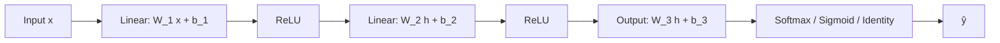

# Perceptrons and MLPs

## Beginner-Friendly Intuition

A perceptron is the smallest neural network: one weighted sum, one threshold.
It can learn to separate two classes only if those classes are **linearly
separable**, i.e., a single straight line (or hyperplane) divides them. That
limitation is what stalled neural networks for over a decade after Rosenblatt
introduced the perceptron in 1958: Minsky and Papert showed in 1969 that a
single perceptron cannot learn XOR.

A multilayer perceptron (MLP) stacks perceptrons with **non-linear
activations** between them. The non-linearities are what unlock arbitrary
classification boundaries. An MLP with one hidden layer can already represent
XOR, and with enough hidden units can approximate any continuous function.
The MLP is the simplest deep architecture and the building block underneath
every fancier one (CNN, RNN, transformer all contain MLP layers).

## Formal Explanation

A **single-layer perceptron** computes

```
ŷ = σ(w · x + b)
```

where `σ` is a step function (classical) or sigmoid (smoother). It can
learn any linear decision boundary. Rosenblatt's perceptron learning rule
updates weights only when the prediction is wrong:

```
if ŷ != y:  w <- w + η y x
```

The rule converges to a separating hyperplane in finite steps **if** the
data is linearly separable. If not, it oscillates forever.

A **multilayer perceptron (MLP)** has at least one hidden layer:

```
h = σ(W_1 x + b_1)              # hidden layer
ŷ = W_2 h + b_2                  # output layer (with optional softmax/sigmoid)
```

For binary classification, the output is sigmoid; for multiclass, softmax;
for regression, identity. With one hidden layer and a non-polynomial
activation, an MLP is a universal approximator.

**Width vs depth.** Both increase capacity. Width adds parallel features at
the same level of abstraction; depth adds layers of abstraction. Empirically,
on most problems beyond toy datasets, depth pays better than width per
parameter. Stacking 5 layers of width 128 typically beats 1 layer of width
640.

**MLP vs other architectures.** MLPs treat input features as a flat vector;
they have **no inductive bias** about structure. CNNs add the bias of local
spatial structure (translation equivariance). RNNs and transformers add
sequence structure. Use an MLP when the input is a flat vector with no
spatial or sequential meaning, like tabular data, dense embeddings from
another model, or fixed-size feature vectors.

**Computational cost.** A linear layer of input size `d_in` and output size
`d_out` has `d_in · d_out + d_out` parameters and `O(d_in · d_out)` FLOPs
per example. The dense parts of every modern network (the projection layers
in a transformer, the classification head on a CNN) are MLP layers.

## Why It Matters in Real Jobs

Three production roles. First, the **head on top of a learned representation**:
freeze a pretrained CNN or transformer, attach a small MLP to its output, fine
tune the MLP for your specific task. This is how transfer learning is
typically done. Second, the **tabular deep learning fallback**: a 3- to 6-layer
MLP with batch norm and dropout sometimes beats a GBM when data is large or
when categorical embeddings matter (TabNet, NODE, and similar architectures
extend this). Third, the **expressive computation block** inside larger
architectures: every transformer has MLP layers (often called "feed-forward")
between attention layers; every CNN ends with one or more dense layers.

For most pure tabular problems, GBMs still win. Use an MLP for tabular data
when you have rich categoricals (use embeddings instead of one-hot), large
data, or structured architectures designed for tabular (TabNet, FT-Transformer).

## How It Works Step by Step

1. **Frame the task.** Output shape, loss function. Binary classification:
   sigmoid + BCE. Multiclass: softmax + cross-entropy. Regression: linear +
   MSE.
2. **Standardize inputs.** Subtract mean, divide by std per feature. Critical
   for MLPs.
3. **Choose width and depth.** Start with 2-3 hidden layers of 128-512 units.
   Sweep on validation if needed.
4. **Pick activations.** ReLU is the default. Try GELU or SiLU if ReLU has
   dead-unit problems.
5. **Initialize weights.** He for ReLU, Xavier for tanh/sigmoid.
6. **Train with Adam or AdamW.** Learning rate around `1e-3`, with cosine
   decay or step schedule.
7. **Regularize.** Dropout 0.1-0.3 on hidden layers, weight decay 1e-4 to
   1e-2. Early stopping on validation.
8. **Diagnose with the loss curve.** Train loss decreasing, validation loss
   plateauing or rising means overfitting. Both flat means underfitting or
   bad lr.

## Real-World Example

A team has 800K user records with 60 numeric features and 12 categoricals
(some with 100K cardinality). LightGBM with one-hot encoding takes 8 hours to
train and lands at AUC 0.79. They build a 4-layer MLP: the categoricals get
trainable embeddings (cardinality-1024 -> dim-32, etc.), embeddings are
concatenated with normalized numerics, fed through layers of width 512, 256,
128, 64 with ReLU and 0.2 dropout. AdamW with `lr = 1e-3` and 20 epochs.
Training takes 25 minutes on a single GPU. Validation AUC is 0.81. The MLP
wins because the categorical embeddings compress the high-cardinality
information far better than one-hot, which the GBM cannot do efficiently.
The team ships the MLP for real-time scoring (3 ms per inference on a CPU).

## Common Mistakes

- Forgetting to standardize inputs. MLPs train poorly on raw features with
  very different scales.
- Using a single hidden layer because of the universal approximation theorem.
  In practice, 2-5 layers usually wins per parameter count.
- Using sigmoid or tanh in deep MLPs. Saturation kills gradients. ReLU and
  variants are the default.
- One-hot encoding huge-cardinality categoricals; use embeddings instead.
- Setting the learning rate too high (loss explodes) or too low (training
  takes forever). Sweep or use a learning-rate finder.
- Comparing MLP to GBM on small tabular data and concluding deep learning
  is overrated. The right comparison is on tasks where categorical
  embeddings, multi-task learning, or non-tabular signal matter.
- Forgetting dropout or weight decay; an unregularized MLP with thousands of
  parameters per training example will memorize.

## Interview Angle

**Question:** Why does adding non-linear activations between MLP layers
matter, and what happens if you remove them?

**Strong answer:** A linear function composed with another linear function
is itself a linear function. Specifically, if every layer is `h = W x + b`,
the entire network reduces to a single matrix multiplication: `ŷ = W_L W_{L-1}
... W_1 x + (terms with biases)`, which is equivalent to a single linear
layer. So a deep network without non-linearities has exactly the
representational power of logistic regression (with sigmoid output) or
linear regression (without). Non-linear activations break this collapse:
each layer applies a non-linear transformation that linear layers cannot
undo, so the composition is genuinely more expressive than any single linear
layer. This is what makes "depth" meaningful. Specifically, ReLU networks can
represent piecewise-linear functions with exponentially many pieces in the
depth, while a single linear layer represents only one piece. Without the
non-linearity, depth is wasted.

**Weak answer:** "Non-linearities make the network more expressive" without
the linear-collapse argument.

**Follow-up questions:**

- Why does ReLU dominate over sigmoid and tanh in modern networks?
- How would you choose the width of a hidden layer?
- When would you prefer width over depth?
- What is the difference between an MLP and a fully-connected layer?

## Mini Exercise

Implement an MLP from scratch (2 hidden layers, ReLU, softmax output) on
MNIST with NumPy. Compare validation accuracy with and without the ReLU.
Without it, the network should perform like logistic regression.

## Diagram



---
## Navigation

[⬅ Previous](01-what-is-a-neural-network.md) | [🏠 Home](../README.md) | [➡ Next](03-activation-functions.md)
