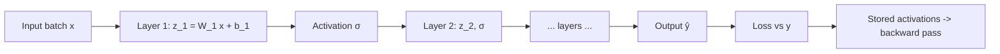

# Forward Propagation

## Beginner-Friendly Intuition

Forward propagation is the part of the training loop where you actually
compute the network's prediction. You take your input batch, run it through
each layer in sequence, and produce an output. That output is then compared
to the target by the loss function. Forward prop is what happens **before**
the gradients flow back; it sets up everything backpropagation needs to
update the weights.

The reason to understand it carefully is that 90 percent of training bugs
show up here, not in the optimizer. Wrong tensor shapes, broken
broadcasting, missing reshape, type mismatch, NaN outputs, off-by-one
indices in batch dimensions. The forward pass is where you read shapes,
print intermediate activations, and make sure the math is what you think
it is.

## Formal Explanation

For a neural network with `L` layers, forward propagation computes:

```
h_0 = x
for l in 1 .. L:
    z_l = W_l h_{l-1} + b_l
    h_l = σ_l(z_l)
ŷ = h_L
```

`z_l` is the **pre-activation** (linear part), `h_l` is the **activation**.
Both are stored in memory because backpropagation needs them. This is why
a forward pass uses memory proportional to (batch size × activation size ×
number of layers).

### Tensor shapes

A forward pass is a sequence of shape transformations. The most common
patterns:

- **Linear layer:** `(B, d_in) -> (B, d_out)`. Cost: `O(B · d_in · d_out)`.
- **Convolution:** `(B, C_in, H, W) -> (B, C_out, H', W')`, where `H', W'`
  depend on stride, padding, and kernel size.
- **Self-attention:** `(B, T, d) -> (B, T, d)`. Cost: `O(B · T² · d)`.
- **MLP block in a transformer:** `(B, T, d) -> (B, T, d_ff) -> (B, T, d)`.

Reading the shapes in a forward pass is how you spot bugs. Many frameworks
print shapes when you do `print(tensor.shape)` or `model.summary()`. Use
them.

### Broadcasting

NumPy and PyTorch broadcast operations across compatible dimensions. When a
shape mismatch happens silently, the model runs but produces wrong outputs.
Common pitfall: a target of shape `(B,)` and a prediction of shape `(B, 1)`
broadcast to `(B, B)` in subtraction, producing a quadratic memory blowup
and wrong gradients. Always check shapes when results look wrong.

### Numerical stability

Two activations need careful handling:

- **Softmax** can overflow when logits are large. Standard trick: subtract
  the max before exponentiating: `softmax(z) = exp(z - max(z)) / sum(...)`.
  All modern frameworks do this internally.
- **Log-sum-exp** appears in cross-entropy from logits. Use the fused
  `CrossEntropyLoss` (PyTorch) or `tf.nn.softmax_cross_entropy_with_logits`
  (TensorFlow) which combine softmax and the log into one numerically
  stable operation.

### Mixed precision

Modern training uses **mixed-precision** (FP16 or BF16 for forward and
backward, FP32 for parameter updates). Forward pass runs in low precision,
which is faster and uses less memory; loss is scaled to avoid underflow
during backprop. Frameworks handle this with `torch.cuda.amp.autocast` or
similar. The forward pass code does not change; the dtype management
happens behind the scenes.

### Eval mode vs train mode

Two operations behave differently in train and eval mode:

- **Dropout** drops units during training; passes through in eval.
- **Batch normalization** computes batch statistics during training; uses
  running statistics during eval.

Forgetting to call `model.eval()` before evaluation is one of the most
common training-vs-inference bugs. The model still runs but the metrics
are wrong because dropout is still active.

## Why It Matters in Real Jobs

Three concrete reasons. First, debugging: most "the model does not learn"
bugs are forward-pass bugs (wrong shape, wrong activation, wrong dtype),
not optimizer bugs. Knowing how to print shapes, inspect activations, and
trace tensors through the network is the most valuable debugging skill.
Second, performance: forward-pass throughput is what dominates inference
latency. Reading shapes, choosing batch sizes, picking precision, and using
the right kernels (FlashAttention, fused MLP) can change inference cost
by 10x. Third, deployment: the inference pipeline runs only the forward
pass. Understanding what is in the forward pass, in what order, with what
dependencies, is what lets you ship.

## How It Works Step by Step

1. **Move data to the device.** `x = x.to(device)`. CPU vs GPU mismatch is
   a common error.
2. **Set the model to the right mode.** `model.train()` for training,
   `model.eval()` for inference. Dropout and batchnorm depend on this.
3. **Optionally wrap in autocast** for mixed precision.
4. **Run the forward pass.** `output = model(x)`.
5. **Compute the loss.** `loss = criterion(output, y)`.
6. **Backward pass + optimizer step.** Covered in
   [05-backpropagation.md](05-backpropagation.md) and
   [06-optimizers-sgd-adam-rmsprop.md](06-optimizers-sgd-adam-rmsprop.md).
7. **At inference, wrap in `torch.no_grad()`** to skip the gradient
   bookkeeping. Cuts memory roughly in half.

## Real-World Example

A team is debugging a transformer that trains poorly. Loss decreases but
validation accuracy is stuck at random. Inspecting the forward pass: input
shape is `(B, T)`, embedding produces `(B, T, d)`, attention output is
`(B, T, d)`, but the reshape before the classification head is
`output.view(-1, d)`. This collapses the batch and time dimensions
together. The classification head then operates on `(B*T, num_classes)`,
predicting a class for every token, but the loss expects `(B,
num_classes)`. The "training" was actually averaging classifications across
positions in random ways. Fix: replace `.view` with proper pooling
(typically `output.mean(dim=1)` or `output[:, 0]` for a `[CLS]` token).
Validation accuracy jumps to 88 percent. The bug was entirely in the
forward pass; printing shapes after each layer would have caught it in
seconds.

## Common Mistakes

- Forgetting `model.eval()` before validation; dropout is still active.
- CPU/GPU mismatch on tensors; tensors must live on the same device.
- Wrong reshape collapsing batch and feature dimensions.
- Implementing softmax without the max-subtract trick; overflows with large
  logits.
- Storing intermediate activations in lists during inference; memory grows
  unbounded if you forget to `detach()`.
- Computing the loss with the wrong target shape; broadcasting silently
  produces wrong losses.
- Not using `torch.no_grad()` at inference; doubles memory and slows
  inference for no reason.
- Forgetting to handle the batch dimension when calling a model on a
  single example; many models expect `(1, d)`, not `(d,)`.

## Interview Angle

**Question:** What happens during a forward pass and what are the most
common bugs that hide there?

**Strong answer:** A forward pass propagates a batch through every layer,
producing both pre-activations and activations at each step. The
pre-activations are the linear-combination outputs `z_l = W_l h_{l-1} +
b_l`; the activations are the post-non-linearity outputs `h_l = σ_l(z_l)`.
Both must be stored in memory because backpropagation needs them to compute
gradients. So forward-pass memory is roughly batch size times sum of
activation sizes across layers.

Common bugs in the forward pass.

- **Shape errors.** A reshape that mixes batch and feature dimensions
  produces wrong predictions but does not raise an error. Print shapes after
  every layer.
- **Mode errors.** `model.eval()` not called before validation, so dropout
  is still active and metrics are wrong.
- **Broadcasting bugs.** Target shape `(B,)` and prediction shape `(B, 1)`
  produce a `(B, B)` outer product when subtracted. Memory blows up;
  gradients are wrong.
- **Numerical bugs.** Softmax without the max-subtract trick overflows
  with large logits; cross-entropy from probabilities (rather than logits)
  underflows when `log` is applied to small values.
- **Device bugs.** Tensors on CPU and model on GPU; one of them moves
  silently and copies become a bottleneck.

The fix is always the same: print shapes, print sample values, run on a
tiny batch, and confirm intermediate tensors have the structure you
expected.

**Weak answer:** "The forward pass computes the prediction" without
addressing memory or bugs.

**Follow-up questions:**

- Why are intermediate activations stored during the forward pass?
- What is the difference between `model.train()` and `model.eval()`?
- How does mixed precision affect the forward pass?
- What is the role of `torch.no_grad()` at inference?

## Mini Exercise

Take any small CNN. Print the shape of the activation after every layer
during a forward pass on a random input batch. Verify the shapes match
your expected computation. Try with a wrong reshape and observe how the
final shape changes.

## Diagram



---
## Navigation

[⬅ Previous](03-activation-functions.md) | [🏠 Home](../README.md) | [➡ Next](05-backpropagation.md)
