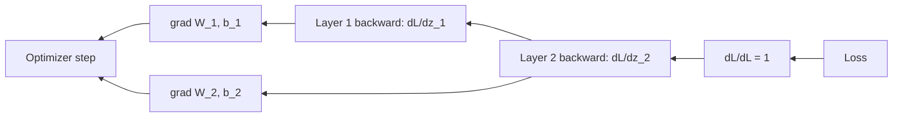

# Backpropagation

## Beginner-Friendly Intuition

Backpropagation is the chain rule, applied carefully, to a computational
graph. After the forward pass produces a loss, backprop walks the graph from
the loss back to each parameter and computes how much each parameter
contributed to the loss. Those contributions are the gradients that the
optimizer uses to update the weights.

The intuition is bookkeeping. Every operation in the forward pass has a
known local derivative: matrix multiplication's derivative is a matrix
multiplication, ReLU's derivative is a 0/1 mask, softmax's derivative is a
specific Jacobian. Backprop multiplies these local derivatives along every
path from a parameter to the loss, summed across paths, and that product is
the parameter's gradient. Modern autograd does this automatically; you write
the forward pass, the framework computes the backward pass.

## Formal Explanation

For a network with parameters `θ` and loss `L`, the gradient `∂L/∂θ_i` is
what the optimizer needs. By the chain rule, if `L` depends on `θ_i` through
intermediate computations, the gradient is a product of local Jacobians
along every dependency path.

### Reverse-mode autodiff

Modern deep learning uses **reverse-mode automatic differentiation**:

1. During the forward pass, the framework records every operation and
   stores its inputs.
2. The loss is a single scalar at the end of the graph.
3. The backward pass starts at the loss with `dL/dL = 1`.
4. For each operation in reverse order, the framework computes the
   operation's local Jacobian-vector product, multiplying the upstream
   gradient (already computed) by the local Jacobian. This produces the
   gradient at the operation's inputs.
5. By the time the traversal reaches a parameter, its gradient is the sum
   of contributions across all paths to the loss.

The cost of reverse-mode autodiff is roughly **2-3x the cost of the forward
pass**. The memory cost is roughly the size of all stored activations
(because each operation's local Jacobian needs the operation's inputs).

### Why reverse mode and not forward mode

Forward-mode autodiff propagates tangents from inputs to outputs. To
compute gradients of one output (the loss) with respect to many inputs
(the parameters), forward mode would require running the network once per
parameter. With millions of parameters, this is impossible.

Reverse mode propagates cotangents from one output to many inputs in a
single backward pass. One forward + one backward gives gradients of the
single scalar loss with respect to every parameter. This is why every deep
learning framework uses reverse mode.

### Per-layer derivatives

For a linear layer `z = W x + b`:

- `∂L/∂W = (∂L/∂z) x^T`
- `∂L/∂b = ∂L/∂z` (summed over the batch)
- `∂L/∂x = W^T (∂L/∂z)`

For ReLU `h = max(0, z)`:

- `∂L/∂z = ∂L/∂h · 1[z > 0]`

For softmax + cross-entropy combined (with target `y` as one-hot):

- `∂L/∂z = ŷ - y`

These three rules cover most of the gradients computed during backprop.
The framework knows them; you usually do not have to derive them. But
deriving them once by hand makes you good at debugging.

### Vanishing and exploding gradients

The chain rule multiplies many factors. If most factors are less than 1,
gradients vanish at deep layers; if most are greater than 1, they explode.

- **Vanishing** is the classical problem with sigmoid/tanh networks beyond
  a few layers. Solved by ReLU + careful initialization + batch
  normalization + residual connections.
- **Exploding** can be detected as NaN losses or unstable training. Solved
  by gradient clipping (`torch.nn.utils.clip_grad_norm_`) or smaller
  learning rates.

### Residual connections and gradient flow

A residual block computes `y = x + f(x)`. The gradient flowing back is
`∂L/∂x = ∂L/∂y · (I + ∂f/∂x)`. The identity term ensures gradients flow
back even if `∂f/∂x` is small. This is the single most important reason
ResNets and modern transformers can train at hundreds of layers.

### Non-differentiable ops and surrogates

Some operations have no useful gradient (argmax, sampling, hard rounding).
Two workarounds:

- **Straight-through estimator (STE).** Forward: discretize. Backward:
  pretend the operation was the identity. Used in VQ-VAE codebooks.
- **Gumbel-softmax.** Replace categorical sampling with a temperature-controlled
  soft approximation. Recovers discrete behavior at low temperature.

### Gradient checkpointing

Storing activations from every layer is memory-expensive. Checkpointing
saves activations only at a few "checkpoints" and recomputes the rest
during the backward pass. Memory drops by a factor of `sqrt(L)` for `L`
layers, at the cost of about 33 percent more compute. Used to fit very deep
or very wide models on a single GPU.

## Why It Matters in Real Jobs

Three reasons. First, **autograd is not magic**: when training fails, the
debug path is "what does the gradient look like?" Knowing reverse mode lets
you set hooks on intermediate gradients, log their norms, and find where
they vanish or explode. Second, **custom layers**: when you write a custom
operation (a new attention variant, a discrete sampling layer, a constraint
projection), you have to provide the backward yourself or use STE. Third,
**memory and speed**: gradient checkpointing, mixed precision, and
activation offloading all touch backprop directly. The team that
understands the backward pass ships large models that the team treating
autograd as a black box cannot.

## How It Works Step by Step

1. **Forward pass produces the loss.** The framework records the
   computational graph.
2. **Call `loss.backward()`.** The framework traverses the graph in
   reverse, computing gradients for every parameter.
3. **Optimizer reads the gradients.** `optimizer.step()` updates parameters
   using `param.grad`.
4. **Zero the gradients before the next forward.** `optimizer.zero_grad()`
   or `model.zero_grad()`. Gradients accumulate by default; forgetting this
   gives wrong updates.
5. **Optionally clip gradients.** `torch.nn.utils.clip_grad_norm_` for
   stability in transformers and RNNs.
6. **Optionally check gradient norms.** Log them as a diagnostic; sudden
   spikes indicate instability.
7. **For custom ops, use `torch.autograd.gradcheck`.** Compares analytic
   and numerical gradients on a tiny test case.

## Real-World Example

A team trains a 24-layer transformer. Loss is unstable: it decreases for
500 steps, then NaN. They add gradient norm logging. Norms are stable
around 1-2 for early steps, then spike to 10^4 right before NaN. The cause:
one of the attention layers has a single example with extreme activations
that produces huge gradients, which then propagate into other layers and
explode. Fix: gradient clipping with `clip_grad_norm_(1.0)`. Loss curve
becomes stable; training completes. Without the gradient norm logs, the
team would have changed the learning rate, the optimizer, the architecture,
and the data before finding the actual bug.

## Common Mistakes

- Forgetting `optimizer.zero_grad()`; gradients accumulate and updates are
  wrong.
- Calling `.backward()` twice without retaining the graph; the second call
  errors because intermediate values were freed.
- Using `.detach()` somewhere that breaks gradient flow into a part of the
  network you wanted to train.
- Implementing a custom layer's backward pass and getting the formula
  wrong; always verify with `torch.autograd.gradcheck`.
- Treating NaN loss as an optimizer bug rather than a gradient explosion;
  log gradient norms.
- Adding gradient checkpointing to a small model; the compute overhead is
  not worth the marginal memory savings.
- Forgetting that residual connections need additive shape match; a wrong
  reshape silently breaks gradient flow.
- Mixing `with torch.no_grad():` inside a training step; that branch
  produces no gradients.

## Interview Angle

**Question:** Walk through what `loss.backward()` does and why it can
compute gradients of all parameters in roughly the cost of one forward
pass.

**Strong answer:** When you call `loss.backward()`, the autograd engine
traverses the computational graph in reverse topological order, starting
from the loss. At each node, it computes the local Jacobian of the
operation evaluated at the inputs that were stored during the forward pass,
multiplies by the upstream gradient (already computed for downstream
nodes), and writes the result into the gradient slots of any leaf nodes
(parameters) and into intermediate buffers for further propagation. Because
the loss is a scalar, the upstream "gradient" at the loss is a single 1.
Each operation's contribution is a Jacobian-vector product, where the
vector is the upstream gradient and the Jacobian is determined by the
operation. JVPs are typically as cheap as the forward operation itself, so
the entire backward pass is roughly 2-3x the cost of the forward pass.

This is **reverse-mode automatic differentiation**. The reason it gives
gradients of all parameters in one pass: the loss is one scalar output, but
there are millions of parameter inputs. Forward-mode autodiff would need
one pass per parameter (impossible at scale). Reverse mode trades the
direction: one pass per output. With one output (the loss), one backward
pass suffices.

The cost paid is memory: every operation's inputs (its activations) must
be stored during the forward pass so the backward can compute Jacobians.
That is why activation memory dominates training memory in deep networks
and why gradient checkpointing exists.

**Weak answer:** "It computes gradients via the chain rule" without
explaining why reverse mode is the only practical choice.

**Follow-up questions:**

- Why is reverse-mode autodiff used instead of forward-mode in deep
  learning?
- What is gradient checkpointing?
- How do you handle non-differentiable operations?
- Why do residual connections help with gradient flow?

## Mini Exercise

Implement a 2-layer MLP with manual backward in NumPy: forward pass,
loss, then explicit gradient formulas for `W_1, b_1, W_2, b_2`. Compare
gradients to PyTorch's autograd on the same network. Verify they match
within `1e-5`.

## Diagram

---
## Navigation

[⬅ Previous](04-forward-propagation.md) | [🏠 Home](../README.md) | [➡ Next](06-optimizers-sgd-adam-rmsprop.md)
