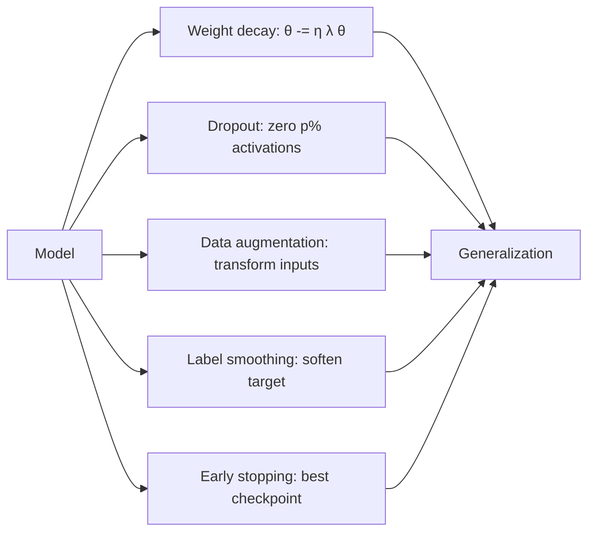

# Regularization, Dropout, and Weight Decay

## Beginner-Friendly Intuition

A deep network has more parameters than training examples in almost every
real problem. Without regularization, the network memorizes training data
and generalizes poorly. Regularization is the collection of tricks that
prevent memorization without crippling capacity. The big four: weight
decay, dropout, data augmentation, and early stopping. Modern training also
uses label smoothing, mixup, and stochastic depth. Each one biases the
optimizer toward simpler solutions in a different way.

The intuition: a regularizer is a budget. You give the network a budget on
how complex its learned function can be. Different regularizers spend that
budget differently. Weight decay says "smaller weights." Dropout says
"redundant features." Data augmentation says "respect these symmetries."
Early stopping says "stop before memorization peaks." Pick the
regularizers that match your problem.

## Formal Explanation

### L2 / Weight Decay

Add `λ ||θ||²` to the loss, or apply `θ <- (1 - η λ) θ` directly each step.
Penalizes large weights. Smooth, simple, and the most common regularizer.
In Adam, **always** use the decoupled form (AdamW); see
[06-optimizers-sgd-adam-rmsprop.md](06-optimizers-sgd-adam-rmsprop.md).
Typical `λ`: 1e-4 for vision, 0.01 to 0.1 for transformers.

### L1

Add `λ ||θ||₁`. Drives some weights to exactly zero, producing sparse
models. Useful when you want feature selection at the parameter level.
Rarely used in deep learning; common in linear models.

### Dropout

During training, each forward pass randomly zeros out a fraction `p` of
activations. At inference, dropout is disabled and activations are scaled
by `1 - p` (or equivalently, divided by `1 - p` during training). Common
`p`: 0.1 to 0.5 in MLPs, smaller (0.0 to 0.1) in transformers, often zero
in CNNs with batch norm.

The intuition is **ensemble averaging**: each forward pass is a different
random sub-network, and inference is approximately averaging over these
sub-networks. This forces the network to develop redundant representations
and prevents co-adaptation of features.

Apply dropout **after activation, before the next linear layer**. Do not
apply dropout to the output layer. In modern transformers, dropout is
applied to attention scores and to MLP outputs.

Variants:

- **Standard dropout** (Hinton et al., 2014).
- **DropPath / stochastic depth** (Huang et al., 2016): randomly drop
  entire residual blocks. Standard in modern vision transformers.
- **Spatial dropout** (Tompson et al.): drop entire feature maps in CNNs;
  more effective than per-pixel dropout for images.
- **DropConnect**: drop weights instead of activations. Less common.

### Early stopping

Stop training when validation loss stops decreasing. The simplest and
often the strongest regularizer. Implementation: monitor validation loss,
keep the best checkpoint, stop after `patience` epochs without
improvement.

### Data augmentation

Randomly transform training inputs to expand the effective training set.
Image: flips, crops, rotations, color jitter. Modern CV uses **mixup**
(linear combinations of two examples and their labels), **CutMix**
(replace a patch of one image with a patch from another), **RandAugment**
(random combinations of standard augmentations), and **AutoAugment**
(learned policies). Text: synonym replacement, back-translation, masking.
Speech: time stretching, pitch shifting.

Augmentation is the single most effective regularizer for image models.
Skipping it is one of the most common reasons a vision model overfits.

### Label smoothing

Soften the one-hot target: `y_smooth = (1 - ε) y + ε / K`, where `K` is
class count and `ε` is typically 0.1. Prevents the network from producing
overconfident logits, improving calibration and slightly improving
accuracy on most classification tasks.

### Stochastic depth

In a residual network, randomly skip the residual block:
`y = x` instead of `y = x + f(x)`, with some probability `p_l`. Standard
in modern vision transformers. Acts as an aggressive form of regularization
and improves training stability.

### Batch noise and gradient noise

Mini-batch SGD's gradient noise is itself a regularizer: it prevents the
optimizer from settling in sharp minima that generalize poorly. Implicit
regularization from SGD is one reason large overparameterized networks
generalize at all (see
[../fundamentals/09-generalization.md](../fundamentals/09-generalization.md)).

### Combining regularizers

Real recipes stack them: weight decay + dropout + data augmentation +
early stopping. Each adds a small amount of regularization. The right
total amount depends on data size: more data needs less regularization,
small data needs aggressive regularization.

## Why It Matters in Real Jobs

Regularization is the difference between a model that generalizes and one
that memorizes. Three production reasons. First, **small data**: most real
problems have less training data than the model has parameters; without
regularization, the network just memorizes. Second, **distribution
shift**: regularized models tend to be smoother and degrade less under
shift. Third, **calibration**: label smoothing produces probabilities that
match observed frequencies, which downstream systems expect.

The cost of skipping regularization is not always visible. Train accuracy
is higher than validation; the gap looks "expected." But the right
regularizer would have raised validation accuracy by a meaningful amount
without hurting train accuracy much.

## How It Works Step by Step

1. **Start with weight decay.** AdamW with `λ = 0.01` for transformers,
   `1e-4` for vision SGD.
2. **Add data augmentation matched to the data.** Random crop and flip for
   images; SpecAugment for audio; back-translation for low-resource text.
3. **Add dropout where capacity is high.** 0.1 in transformer attention
   and MLP, 0.3 in fully-connected heads on vision models.
4. **Add label smoothing.** `ε = 0.1` is standard.
5. **Use early stopping.** Validate every epoch, save best checkpoint,
   stop after 5-10 epochs of no improvement.
6. **For modern vision transformers, add stochastic depth.** Increasing
   drop rate with depth (`p_l = 0.1 · l / L`).
7. **Tune by ablation.** Remove one regularizer at a time; if it does not
   help validation, drop it. Stack only what helps.

## Real-World Example

A team trains a 50M-parameter image classifier on 200K labeled photos.
Without regularization, training accuracy hits 99 percent and validation
plateaus at 71 percent. They add: weight decay 1e-4, RandAugment, mixup
with `α = 0.2`, dropout 0.1 in the head, label smoothing 0.1, and early
stopping with patience 10. Validation accuracy rises to 85 percent;
training accuracy drops to 91 percent. The 14-point validation lift came
mostly from data augmentation and mixup, the rest from weight decay and
label smoothing. Dropout in this CNN added only 0.5 points and slowed
training; they kept it off in the convolutional stack.

## Common Mistakes

- Using L2 in the loss with Adam instead of AdamW; the regularization is
  gradient-dependent.
- Applying dropout in CNN convolutional layers with batch normalization;
  the two interact poorly. Use spatial dropout or skip dropout in convs.
- Setting dropout very high (0.5) in a small network; capacity drops too
  much.
- Forgetting to disable dropout at inference (`model.eval()`).
- Applying data augmentation only at training but evaluating on
  test-time-augmented inputs; report metrics on clean inputs unless TTA is
  intended.
- Using label smoothing on regression; it does not apply.
- Stacking many regularizers without ablation; you may have one that hurts
  and you cannot tell.
- Treating "more regularization" as the cure for "model is bad." If the
  model underfits, regularization makes it worse.

## Interview Angle

**Question:** Explain dropout, why it works, and what changes between
training and inference.

**Strong answer:** Dropout (Hinton et al., 2014) randomly zeros out a
fraction `p` of activations during each training forward pass. The
zeroed-out units contribute nothing to the loss for that batch, and they
receive no gradient on the backward pass. The remaining units are scaled
by `1 / (1 - p)` so the expected sum is preserved. At inference, dropout
is disabled and all units are active.

The reason it works is **implicit ensembling**. Each forward pass during
training operates on a randomly sampled sub-network. Across many batches,
the network is effectively training a huge ensemble of sub-networks that
share weights. At inference, the full network's predictions are
approximately the geometric mean of all the sub-networks' predictions.
Ensembling reduces variance, so dropout reduces overfitting.

A second mechanism: dropout breaks **co-adaptation** of features. If
several units always activate together to detect some pattern, dropout
forces them to detect the pattern more independently, making the
representation more robust.

The training-vs-inference distinction matters because forgetting
`model.eval()` before validation leaves dropout active and metrics are
underestimates. The framework's `eval()` mode also disables batch norm's
running statistics update; the same forgetting bug breaks both.

Modern transformers use small dropout rates (0.0-0.1) compared to the 0.5
that was popular in early MLP papers. Larger models with more data need
less dropout; the LayerNorm + residual structure of transformers reduces
the benefit of aggressive dropout.

**Weak answer:** "Dropout randomly zeros activations" without explaining
ensembling or train/inference behavior.

**Follow-up questions:**

- What is the difference between L1 and L2 regularization?
- Why does mixup help on images?
- What is label smoothing and when does it help?
- How would you tune the weight decay hyperparameter?

## Mini Exercise

Train a small CNN on CIFAR-10 with and without each of: weight decay,
dropout, RandAugment, label smoothing. Compare validation accuracy across
the 4 ablations and the full combination. Identify which regularizer
contributes most.

## Diagram

---
## Navigation

[⬅ Previous](06-optimizers-sgd-adam-rmsprop.md) | [🏠 Home](../README.md) | [➡ Next](08-batch-normalization-layer-normalization.md)
